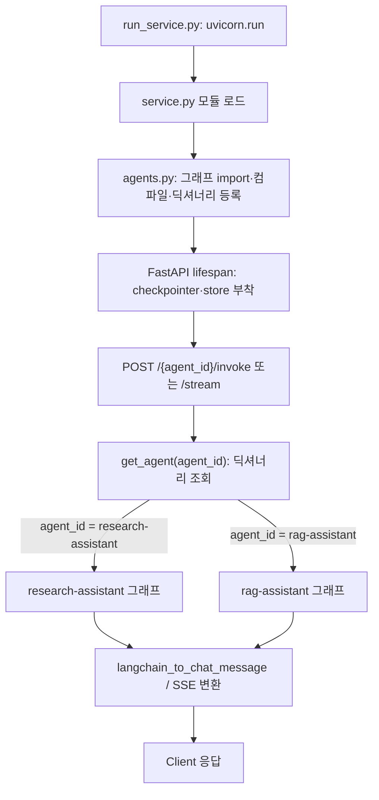
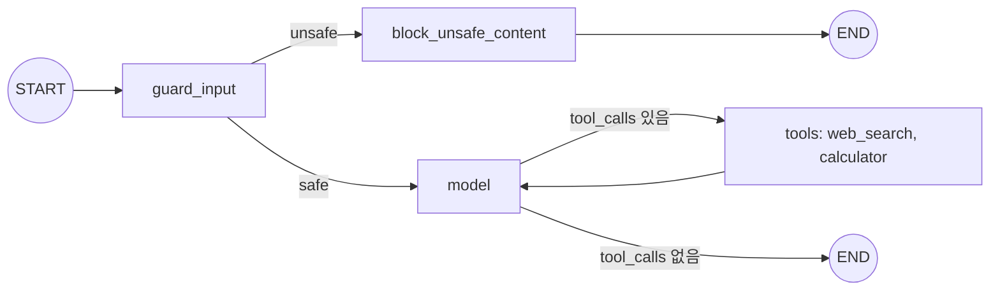
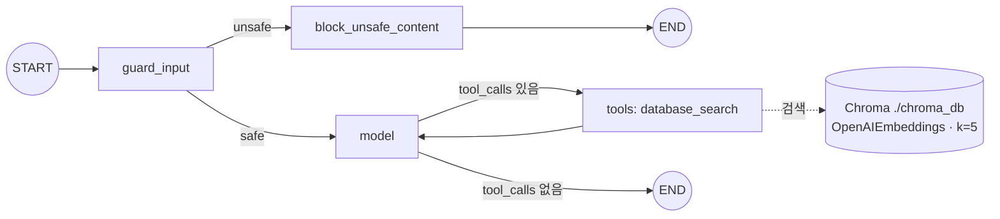
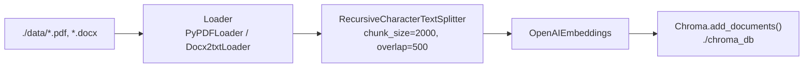
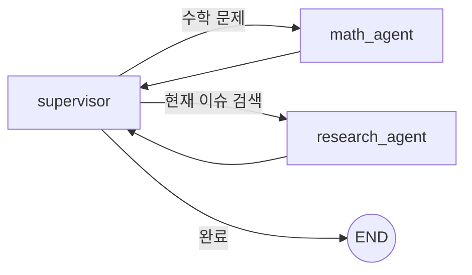

# LangGraph·LangChain 실전 코드 읽기: agent-service-toolkit 진입점부터 research·RAG 워크플로우까지

| 작성자 | 게시·수정일 | 읽는 시간 | 태그 |
|---|---|---|---|
| yjs000 | 2026-08-11 | 약 36분 | LangGraph · LangChain · RAG · Code Reading |

> "LangGraph를 쓴다"는 문장은 그래프 정의 하나만 보면 끝나는 이야기가 아니었다. 진입점부터 따라가 보면 그래프는 등록·조립·메모리 부착·스트리밍 변환까지 여러 파일에 걸쳐 조립되는 하나의 실행 파이프라인이었고, 같은 진입점 구조 위에 research-assistant와 rag-assistant처럼 성격이 다른 워크플로우가 나란히 얹혀 있었다.

## 목차

- [1. 질문: 실행 가능한 LangGraph 서비스는 실제로 어떻게 생겼나](#1-질문-실행-가능한-langgraph-서비스는-실제로-어떻게-생겼나)
- [2. 용어 정리: LangChain과 LangGraph는 다른 역할](#2-용어-정리-langchain과-langgraph는-다른-역할)
- [3. 초기 가설: 그래프 파일 하나만 읽으면 될 거라 생각했다](#3-초기-가설-그래프-파일-하나만-읽으면-될-거라-생각했다)
- [4. 진입점부터 요청 하나가 도달하기까지](#4-진입점부터-요청-하나가-도달하기까지)
- [5. 에이전트 워크플로우 해부](#5-에이전트-워크플로우-해부)
- [6. RAG 인제스천 파이프라인: 검색 이전에 존재하는 별도 흐름](#6-rag-인제스천-파이프라인-검색-이전에-존재하는-별도-흐름)
- [7. 네 가지 에이전트 패턴 비교](#7-네-가지-에이전트-패턴-비교)
- [8. 질문 정리: 이번 세션에서 다룬 판단들](#8-질문-정리-이번-세션에서-다룬-판단들)
- [9. 한계와 트레이드오프](#9-한계와-트레이드오프)
- [10. 결론과 다음 검증](#10-결론과-다음-검증)
- [참고 자료](#참고-자료)

## 1. 질문: 실행 가능한 LangGraph 서비스는 실제로 어떻게 생겼나

RAG 검색이나 에이전트 튜토리얼은 대부분 "그래프 하나를 정의하고 `invoke()`로 실행"하는 최소 예제로 끝난다. 그런데 실제로 서비스로 배포된 프로젝트는 다음 질문에 답해야 한다.

- 사용자가 화면에서 모델이나 에이전트를 고르면 그 선택이 그래프 어디까지 전달되는가
- 대화가 여러 턴 이어질 때 이전 맥락은 어디에 저장되고 어떻게 다시 불려오는가
- 답변이 한 글자씩 타이핑되듯 나오는 스트리밍은 그래프 실행과 어떻게 연결되는가
- RAG처럼 "DB에서 근거를 찾아 답한다"는 기능은 왜 파이프라인 코드가 아니라 LLM이 호출하는 tool로 구현되는가
- 사람에게 되묻고 기다리는 기능, 여러 에이전트가 협업하는 기능은 같은 그래프 문법으로 어디까지 표현되는가

[agent-service-toolkit](https://github.com/JoshuaC215/agent-service-toolkit)은 FastAPI 서비스, Streamlit 클라이언트, 여러 LangGraph 에이전트를 함께 담은 오픈소스 저장소다. 이 글은 이 저장소의 진입점부터 코드를 그대로 따라가며 위 질문에 답한다. `docs/ai-learning/README.md`의 학습 목표 3번(오픈소스의 진입점·상태·호출 흐름·실패 처리를 읽고 평가하기)에 대응하는 읽기 기록이며, 재구현이 아니라 **코드 추적과 설명** 수준의 학습이다.

## 2. 용어 정리: LangChain과 LangGraph는 다른 역할

두 라이브러리는 같은 회사(LangChain Inc.)가 만들지만 역할이 다르다. 이 구분을 먼저 하지 않으면 코드를 읽을 때 "이 줄이 어느 라이브러리 코드인지" 계속 헷갈린다.

- **LangChain**: 모델·도구·프롬프트를 동일한 인터페이스(`Runnable`)로 감싸는 도구상자다. `ChatOpenAI`, `ChatGroq`처럼 제공자가 달라도 같은 `invoke`/`ainvoke`/`stream` 메서드로 다룰 수 있게 한다. 벡터스토어(`Chroma`)나 임베딩(`OpenAIEmbeddings`) 같은 데이터 연동 컴포넌트도 이 계층에 속한다.
- **LangGraph**: 그 부품들을 어떤 순서·분기로 실행할지 그래프(노드·엣지)로 정의하는 오케스트레이션 레이어다. 대화 상태, 조건부 분기, 반복 루프, 사람의 개입, 다중 에이전트 협업을 그래프 문법으로 표현한다.

비유하면 LangChain은 레고 블록이고, LangGraph는 그 블록을 조립하는 순서를 그린 조립도다. `agent-service-toolkit`은 이 조립도를 웹 서비스로 감싸 배포하는 틀이다.

rag-assistant 코드를 줄 단위로 어느 계층인지 매핑하면 이 구분이 더 분명해진다.

| 구성 요소 | 담당 레이어 | rag-assistant에서 실제 쓰인 것 |
|---|---|---|
| 그래프 구조·분기·루프 | LangGraph | `StateGraph`, `add_conditional_edges`, `ToolNode`, `END` |
| 무한 루프 방지 카운터 | LangGraph | `RemainingSteps` (managed value) |
| 대화 지속성(체크포인터·스토어) | LangGraph | `agent.checkpointer`, `agent.store` |
| 모델 호출 공통 인터페이스 | LangChain | `BaseChatModel`, `model.bind_tools()` |
| 실행 파이프라인 합성 | LangChain | `RunnableLambda`, `RunnableConfig`, `preprocessor \| bound_model` |
| 메시지 타입 | LangChain | `SystemMessage`/`HumanMessage`/`AIMessage`/`ToolMessage` |
| 툴 정의 | LangChain | `@tool` 데코레이터 ([tools.py#L79](https://github.com/JoshuaC215/agent-service-toolkit/blob/935318f07cba8c50cace538f9cb349acc7e11ce1/src/agents/tools.py#L79)) |
| 벡터스토어·임베딩 연동 | LangChain | `langchain_chroma.Chroma`, `langchain_openai.OpenAIEmbeddings` |

**판단 규칙**: 객체가 `Runnable`(모델·프롬프트·툴·벡터스토어 wrapper)이면 LangChain, 그래프의 노드/엣지/managed value/체크포인터에 관여하면 LangGraph다. 하나의 노드 함수(`acall_model` 같은) 안에서도 두 레이어가 섞여 있을 수 있다 — "그래프의 어느 노드인가"는 LangGraph 질문, "그 노드 안에서 모델을 어떻게 부르는가"는 LangChain 질문이다.

## 3. 초기 가설: 그래프 파일 하나만 읽으면 될 거라 생각했다

처음에는 `src/agents/research_assistant.py`에 정의된 `StateGraph` 하나만 읽으면 "이 에이전트가 뭘 하는지" 알 수 있을 거라 가정했다. 실제로 노드·엣지 구조는 그 파일 안에서 대부분 확인된다.

```python
agent = StateGraph(AgentState)
agent.add_node("model", acall_model)
agent.add_node("tools", ToolNode(tools))
agent.add_node("guard_input", safeguard_input)
agent.add_node("block_unsafe_content", block_unsafe_content)
agent.set_entry_point("guard_input")
```
[research_assistant.py#L99-L105](https://github.com/JoshuaC215/agent-service-toolkit/blob/935318f07cba8c50cace538f9cb349acc7e11ce1/src/agents/research_assistant.py#L99-L105)

하지만 "이 그래프가 실제로 언제, 무슨 값을 받아, 어떻게 실행되는가"는 이 파일만으로는 답이 안 나왔다. `agent_id`로 여러 그래프 중 하나를 고르는 로직, `thread_id`로 대화를 이어가는 로직, 스트리밍으로 변환하는 로직은 모두 다른 파일에 있었다. 그래프 정의와 그래프 운영은 별개 관심사였다.

## 4. 진입점부터 요청 하나가 도달하기까지

프로세스 시작점은 `src/run_service.py`다.

```python
uvicorn.run(
    "service:app",
    host=settings.HOST,
    port=settings.PORT,
    reload=settings.is_dev(),
    timeout_graceful_shutdown=settings.GRACEFUL_SHUTDOWN_TIMEOUT,
)
```
[run_service.py#L31-L37](https://github.com/JoshuaC215/agent-service-toolkit/blob/935318f07cba8c50cace538f9cb349acc7e11ce1/src/run_service.py#L31-L37)

`service.py` 모듈이 로드되는 순간 `agents` 패키지 임포트가 연쇄적으로 각 그래프 모듈을 실행시키고, 컴파일된 그래프가 딕셔너리에 등록된다. research-assistant뿐 아니라 rag-assistant도 같은 방식으로, 같은 시점에 등록된다.

```python
from agents.research_assistant import research_assistant  # 이때 그래프가 컴파일됨
from agents.rag_assistant import rag_assistant             # 이것도 마찬가지

DEFAULT_AGENT = "research-assistant"
agents: dict[str, Agent] = {
    "research-assistant": Agent(
        description="A research assistant with web search and calculator.",
        graph_like=research_assistant,
    ),
    "rag-assistant": Agent(
        description="A RAG assistant with access to information in a database.",
        graph_like=rag_assistant,
    ),
    ...
}
```
[agents.py#L15-L43](https://github.com/JoshuaC215/agent-service-toolkit/blob/935318f07cba8c50cace538f9cb349acc7e11ce1/src/agents/agents.py#L15-L43)

FastAPI의 `lifespan`이 서버 부팅 시 한 번 돌면서 이 그래프들 전부에 체크포인터와 스토어를 붙인다. 이 시점 전까지는 그래프가 "만들어지기만" 했고 대화를 기억할 수 없는 상태다.

```python
async with initialize_database() as saver, initialize_store() as store:
    for a in get_all_agent_info():
        await load_agent(a.key)
        agent = get_agent(a.key)
        agent.checkpointer = saver   # 단기 기억(thread 단위)
        agent.store = store          # 장기 기억(user 단위)
```
[service.py#L79-L107](https://github.com/JoshuaC215/agent-service-toolkit/blob/935318f07cba8c50cace538f9cb349acc7e11ce1/src/service/service.py#L79-L107)

요청이 실제로 들어오면 라우터가 `agent_id`로 딕셔너리를 다시 조회하고, `thread_id`·`user_id`·선택된 모델명을 `RunnableConfig`로 포장한다. **어떤 그래프를 쓸지는 이 시점에 URL 경로 파라미터로 결정되며, 그래프 내부 로직이 사용자 입력을 보고 스스로 판단하는 게 아니다** — "누가 어떤 에이전트를 쓸지 고르는가"와 "그 에이전트가 무엇을 하는가"는 서로 다른 질문이다.

```python
configurable = {"thread_id": thread_id, "user_id": user_id}
if user_input.model is not None:
    configurable["model"] = user_input.model
...
state = await agent.aget_state(config=config)
if interrupted_tasks:
    input = Command(resume=user_input.message)   # 이전 턴이 interrupt로 멈춰 있었던 경우
else:
    input = {"messages": [HumanMessage(content=user_input.message)]}
```
[service.py#L143-L184](https://github.com/JoshuaC215/agent-service-toolkit/blob/935318f07cba8c50cace538f9cb349acc7e11ce1/src/service/service.py#L143-L184)

호출 스택과 에이전트 선택 지점을 함께 정리하면 다음과 같다.



**설계 해석:** 그래프 등록(모듈 임포트 시 1회)과 메모리 부착(서버 부팅 시 1회)과 실제 실행(요청마다)이 시점상 분리되어 있다. 이 분리 덕분에 그래프 자체는 순수 함수처럼 조립되고, "이 그래프가 어떤 저장소를 쓸지"는 배포 시점(`DATABASE_TYPE` 환경변수)에 결정된다. `agent_id`로 그래프를 갈아 끼우는 구조라, 서비스 계층(`service.py`)은 뒤에 붙는 그래프가 research-assistant인지 rag-assistant인지 몰라도 동작한다.

## 5. 에이전트 워크플로우 해부

research-assistant와 rag-assistant는 그래프 골격(`guard_input → model ⇄ tools → END`)이 사실상 동일하다. 차이는 **어떤 tool을 바인딩했는가** 하나뿐이다. 이 골격을 research-assistant로 먼저 확인하고, 같은 골격 위에서 rag-assistant가 무엇을 다르게 하는지 이어서 본다.

### 5.1 research-assistant: 안전성 게이트 + 범용 도구 루프



**안전성 게이트(`guard_input`)**는 답변 생성 모델과 별개인 Groq 호스팅 분류 모델(`openai/gpt-oss-safeguard-20b`)을 호출해 프롬프트 인젝션 여부를 판정한다.

```python
if model_name == GroqModelName.GPT_OSS_SAFEGUARD_20B:
    return ChatGroq(model=api_model_name, temperature=0.0)  # 분류는 결정론적이어야 함
return ChatGroq(model=api_model_name, temperature=0.5)      # 일반 대화는 다양성 허용
```
[llm.py#L119-L122](https://github.com/JoshuaC215/agent-service-toolkit/blob/935318f07cba8c50cace538f9cb349acc7e11ce1/src/core/llm.py#L119-L122)

이 모델의 판정은 `messages` 타입이 `"ai"`/`"human"`인 것만 대상으로 하고, `guard_input`은 매 턴 진입점을 통과하므로 대화가 길어져도 **그 시점까지의 전체 히스토리**를 다시 검사한다.

```python
messages_str = [
    f"{role_mapping[m.type]}: {m.content}" for m in messages if m.type in ["ai", "human"]
]
```
[safeguard.py#L104-L106](https://github.com/JoshuaC215/agent-service-toolkit/blob/935318f07cba8c50cace538f9cb349acc7e11ce1/src/agents/safeguard.py#L104-L106)

**도구 호출 루프(`model ⇄ tools`)**는 LangChain의 `bind_tools`로 모델에 웹검색·계산기 사용 권한을 주고, LangGraph의 `ToolNode`가 실제 호출을 실행한다. research-assistant가 바인딩하는 tool은 `DuckDuckGoSearchResults`, `calculator`, (API 키가 있으면) `OpenWeatherMapQueryRun` 세 종류다.

```python
web_search = DuckDuckGoSearchResults(name="WebSearch")
tools = [web_search, calculator]
if settings.OPENWEATHERMAP_API_KEY:
    tools.append(OpenWeatherMapQueryRun(name="Weather", api_wrapper=wrapper))
```
[research_assistant.py#L28-L37](https://github.com/JoshuaC215/agent-service-toolkit/blob/935318f07cba8c50cace538f9cb349acc7e11ce1/src/agents/research_assistant.py#L28-L37)

```python
bound_model = model.bind_tools(tools)
preprocessor = RunnableLambda(lambda state: [SystemMessage(content=instructions)] + state["messages"])
return preprocessor | bound_model
```
[research_assistant.py#L54-L60](https://github.com/JoshuaC215/agent-service-toolkit/blob/935318f07cba8c50cace538f9cb349acc7e11ce1/src/agents/research_assistant.py#L54-L60)

`preprocessor | bound_model`은 둘이 같은 타입이라서 연결되는 게 아니다. LangChain의 모든 컴포넌트가 `Runnable` 인터페이스(`invoke`/`ainvoke`/`stream`)를 구현하고, `|`가 두 컴포넌트를 잇는 `RunnableSequence`를 만들 뿐이다. 앞 단계(`preprocessor`)의 출력 타입(`list[BaseMessage]`)이 뒤 단계(`bound_model`)가 기대하는 입력 타입과 맞아떨어지기 때문에 값이 흐른다 — 함수 합성과 같은 원리다.

이 루프가 끝없이 돌 가능성을 막는 장치가 `RemainingSteps`다.

```python
if state["remaining_steps"] < 2 and response.tool_calls:
    return {"messages": [AIMessage(id=response.id, content="Sorry, need more steps to process this request.")]}
```
[research_assistant.py#L75-L83](https://github.com/JoshuaC215/agent-service-toolkit/blob/935318f07cba8c50cace538f9cb349acc7e11ce1/src/agents/research_assistant.py#L75-L83)

`RemainingSteps`는 LangGraph가 그래프 재귀 한도(기본 25스텝)를 기준으로 매 스텝 자동 감소시키는 managed value다. 남은 스텝이 2 미만인데 모델이 또 도구를 부르려 하면, 그 응답을 버리고 `tool_calls`가 없는 사과 메시지로 바꿔치기해 그래프가 예외 없이 `END`로 종료되게 한다. 재귀 한도를 그냥 넘기면 `GraphRecursionError`로 죽는데, 그 전에 선제적으로 정상 종료 경로로 유도하는 방식이다.

### 5.2 rag-assistant: 같은 골격, 도구 하나, 판단 기준이 다른 곳

rag-assistant는 그래프 정의(`agent.add_node`, `add_conditional_edges`, `check_safety`, `pending_tool_calls`)가 research-assistant와 함수 이름까지 동일한 패턴으로 반복된다 ([rag_assistant.py#L96-L135](https://github.com/JoshuaC215/agent-service-toolkit/blob/935318f07cba8c50cace538f9cb349acc7e11ce1/src/agents/rag_assistant.py#L96-L135)). 다른 건 바인딩하는 tool 하나뿐이다.



```python
tools = [database_search]
```
[rag_assistant.py#L30](https://github.com/JoshuaC215/agent-service-toolkit/blob/935318f07cba8c50cace538f9cb349acc7e11ce1/src/agents/rag_assistant.py#L30)

`database_search`는 벡터 유사도 검색을 감싼 tool이다.

```python
def load_chroma_db():
    embeddings = OpenAIEmbeddings()
    chroma_db = Chroma(persist_directory="./chroma_db", embedding_function=embeddings)
    retriever = chroma_db.as_retriever(search_kwargs={"k": 5})
    return retriever


def database_search_func(query: str) -> str:
    retriever = load_chroma_db()
    documents = retriever.invoke(query)
    return format_contexts(documents)


database_search: BaseTool = tool(database_search_func)
```
[tools.py#L50-L79](https://github.com/JoshuaC215/agent-service-toolkit/blob/935318f07cba8c50cace538f9cb349acc7e11ce1/src/agents/tools.py#L50-L79)

**"누가 검색을 반복할지 판단하는가"는 그래프 구조가 아니라 `model` 노드 안의 LLM이다.** `pending_tool_calls()`는 응답에 `tool_calls`가 있는지 없는지만 기계적으로 보고 라우팅할 뿐, "근거가 충분한가"를 별도로 채점하는 노드는 이 그래프에 없다.

```python
def pending_tool_calls(state: AgentState) -> Literal["tools", "done"]:
    last_message = state["messages"][-1]
    if last_message.tool_calls:
        return "tools"
    return "done"
```
[rag_assistant.py#L126-L132](https://github.com/JoshuaC215/agent-service-toolkit/blob/935318f07cba8c50cace538f9cb349acc7e11ce1/src/agents/rag_assistant.py#L126-L132)

즉 "근거가 부족하면 다시 검색한다"는 동작은 코드가 판정 로직을 갖고 있어서가 아니라, LLM이 매 턴 스스로 `tool_calls`를 또 낼지 말지 결정하고 그래프는 그 결과만 기계적으로 따라간다는 뜻이다. 시스템 프롬프트의 지시("다양한 출처에서 정보를 모아라", [rag_assistant.py#L34-L47](https://github.com/JoshuaC215/agent-service-toolkit/blob/935318f07cba8c50cace538f9cb349acc7e11ce1/src/agents/rag_assistant.py#L34-L47))가 그 판단에 영향을 줄 수 있는 유일한 외부 개입이다.

**DB 조회를 왜 굳이 tool로 감쌌는가**는 대안(질의마다 무조건 한 번 검색해 프롬프트에 미리 넣는 방식, 이른바 naive RAG)과 비교하면 드러난다.

| | naive RAG(고정 파이프라인) | agent-service-toolkit의 tool 방식 |
|---|---|---|
| 검색 여부 | 매 요청마다 무조건 1회 | LLM이 필요하다고 판단할 때만 |
| 검색어 | 사용자 원문 그대로 | LLM이 대화 맥락에서 재구성한 쿼리 |
| 검색 횟수 | 고정 1회 | 0~N회 (`RemainingSteps` 한도 내에서 LLM이 결정) |
| 코드 위치 | `model` 호출 이전의 파이프라인 단계 | `model`이 바인딩한 tool, 호출 여부를 LLM이 결정 |

tool로 만들지 않으면 "검색할지, 몇 번 할지, 무엇으로 검색할지"를 전부 코드가 미리 고정해야 한다. tool로 만들면 이 세 가지 결정이 그래프 구조가 아니라 LLM의 매 턴 판단으로 넘어가고, 그래프는 그 판단 결과(tool_calls 존재 여부)만 기계적으로 처리하면 된다 — 5.1의 `bind_tools` 패턴이 research-assistant의 웹검색·계산기에도 똑같이 적용되는 이유이기도 하다.

## 6. RAG 인제스천 파이프라인: 검색 이전에 존재하는 별도 흐름

5.2절의 `database_search`는 이미 만들어진 `./chroma_db`를 읽기만 한다. 그 DB를 만드는 과정은 런타임 그래프와 완전히 분리된 **오프라인 스크립트**, `scripts/create_chroma_db.py`다.



```python
if delete_chroma_db and os.path.exists(db_name):
    shutil.rmtree(db_name)   # 기본값 True: 실행할 때마다 전체 재구축

chroma = Chroma(embedding_function=embeddings, persist_directory=f"./{db_name}")
text_splitter = RecursiveCharacterTextSplitter(chunk_size=chunk_size, chunk_overlap=overlap)

for filename in os.listdir(folder_path):
    if filename.endswith(".pdf"):
        loader = PyPDFLoader(file_path)
    elif filename.endswith(".docx"):
        loader = Docx2txtLoader(file_path)
    else:
        continue  # 지원 안 하는 확장자는 스킵

    chunks = text_splitter.split_documents(loader.load())
    for chunk in chunks:
        chroma.add_documents([chunk])   # 청크 단위로 임베딩 API 호출
```
[create_chroma_db.py#L14-L61](https://github.com/JoshuaC215/agent-service-toolkit/blob/935318f07cba8c50cace538f9cb349acc7e11ce1/scripts/create_chroma_db.py#L14-L61)

이 파이프라인도 부품은 전부 LangChain이다(`PyPDFLoader`, `Docx2txtLoader`, `RecursiveCharacterTextSplitter`, `Chroma`, `OpenAIEmbeddings`). LangGraph는 여기 전혀 개입하지 않는다 — **인제스천은 LangChain 컴포넌트를 순서대로 호출하는 평범한 스크립트고, LangGraph가 다루는 대상은 "이미 만들어진 DB를 검색 시점에 어떻게 활용할지"뿐**이라는 점이 두 라이브러리 역할 구분을 다시 한 번 보여준다.

검색 자체의 정교함은 이 프로젝트 범위 밖이다. `load_chroma_db()`는 `search_type`을 지정하지 않아 Chroma 기본값인 순수 유사도(top-k) 검색만 쓰고, `k=5` 고정이다. MMR 재순위, 리랭커, BM25 하이브리드, 메타데이터 필터, 쿼리 재작성/확장, 유사도 임계값 컷 — 이 중 어느 것도 없다. "언제·무엇을 검색할지는 LLM이 agentic하게 판단한다"는 것과 "검색 자체가 정교하다"는 것은 서로 다른 축이며, 이 프로젝트는 전자만 구현하고 후자는 가장 기본형에 머물러 있다.

## 7. 네 가지 에이전트 패턴 비교

같은 저장소 안에 난이도가 다른 에이전트 예제가 나란히 있어서, 그래프 문법 하나로 표현되는 패턴의 폭을 비교하기 좋다.

| | research-assistant | rag-assistant | interrupt-agent | langgraph-supervisor-agent |
|---|---|---|---|---|
| 그래프 작성 방식 | `StateGraph`를 노드·엣지로 직접 조립 | `StateGraph`, research-assistant와 동일 골격 | `StateGraph` + `interrupt()` | `create_agent` + `create_supervisor`(라이브러리에 조립 위임) |
| 바인딩된 tool | `web_search`, `calculator`, (선택) `Weather` | `database_search`(Chroma 벡터 검색) 단일 | 없음(생일 질의 로직 자체가 노드) | `add`/`multiply`(수학), `web_search`(리서치) — 서브 에이전트별 분리 |
| 핵심 패턴 | 조건부 분기로 안전 게이트 + 범용 도구 루프 | 조건부 분기로 안전 게이트 + 단일 검색 도구 루프 | 실행을 멈췄다 재개하는 human-in-the-loop | 슈퍼바이저 1개가 서브 에이전트 2개에 작업 위임 |
| 사람 응답 대기(`interrupt`) | 없음 | 없음 | 있음 — `interrupt()`로 실행이 그 자리에서 멈춤 | 없음 |
| 상태 저장 범위 | thread 단위(checkpointer)만 사용 | thread 단위(checkpointer)만 사용 | thread(checkpointer) + user(store) 모두 사용 | thread 단위, 서브 에이전트 히스토리까지 포함 |
| 안전장치 | Safeguard + RemainingSteps | Safeguard + RemainingSteps | 없음(데모 목적) | 없음(데모 목적) |

**interrupt-agent**는 생일 정보가 없으면 `langgraph.types.interrupt()`로 실행을 그 자리에서 멈춘다.

```python
if response.birthdate is None:
    birthdate_input = interrupt(f"{response.reasoning}\nPlease tell me your birthdate?")
    state["messages"].append(HumanMessage(birthdate_input))
    return await determine_birthdate(state, config, store)
```
[interrupt_agent.py#L137-L142](https://github.com/JoshuaC215/agent-service-toolkit/blob/935318f07cba8c50cace538f9cb349acc7e11ce1/src/agents/interrupt_agent.py#L137-L142)

`interrupt()`는 예외처럼 그 지점에서 함수 실행을 끊는다. 사용자가 답하면 서비스가 이를 새 메시지가 아니라 `Command(resume=...)`로 감싸 재개시키는데, 이때 함수는 **처음부터 다시 실행**된다. `interrupt()` 이후 줄은 재개 시점에만 실행되므로, 그 이전 로직(스토어 조회 등)은 여러 번 실행돼도 안전하도록 짜여 있어야 한다. research-assistant와 rag-assistant에는 이런 지점이 전혀 없다 — 두 그래프는 `guard_input`부터 `END`까지 한 번의 요청 안에서 항상 끊김 없이 동기적으로 완주하며, 대화가 이어지는 느낌은 그래프 내부가 아니라 `thread_id` 체크포인터가 요청 간에 상태를 이어붙이는 데서 나온다.

**langgraph-supervisor-agent**는 `StateGraph`를 직접 쓰지 않고, LangChain의 `create_agent`로 서브 에이전트 두 개를 만든 뒤 `langgraph_supervisor` 패키지의 `create_supervisor`에 넘긴다.

```python
math_agent = create_agent(model=model, tools=[add, multiply], name="sub-agent-math_expert", ...)
research_agent = create_agent(model=model, tools=[web_search], name="sub-agent-research_expert", ...)

workflow = create_supervisor(
    [research_agent, math_agent],
    model=model,
    prompt="You are a team supervisor... For current events, use research_agent. For math problems, use math_agent.",
    add_handoff_back_messages=True,
    output_mode="full_history",
)
```
[langgraph_supervisor_agent.py#L33-L60](https://github.com/JoshuaC215/agent-service-toolkit/blob/935318f07cba8c50cace538f9cb349acc7e11ce1/src/agents/langgraph_supervisor_agent.py#L33-L60)

슈퍼바이저 모델이 자연어 프롬프트를 보고 어느 서브 에이전트에게 요청을 넘길지 즉석에서 판단한다. research-assistant·rag-assistant가 라우팅을 `add_conditional_edges`로 코드에 명시한 것과 달리, 이 패턴은 라우팅 자체를 LLM 판단에 맡긴다.



## 8. 질문 정리: 이번 세션에서 다룬 판단들

이 절은 이번 대화에서 실제로 던진 질문을 원문 그대로 남기고, 무엇이 맞았고 무엇을 새로 확인했는지 구분한다. **증거 수준: 개념 설명** — 실제 코드를 읽고 답을 확인한 상태이며, 별도 프로젝트에 적용하거나 실험으로 재현하지는 않았다.

### 8.1 호출 체인과 "사용자 입력에 따라 달라지는가"

> "rag-assistant를 파보자. run_service가 service를 호출하고 service가 agents를 호출하고 agents가 rag-assistant를 호출하는건가? rag-assistant는 사용자 입력에 따라 달라지는건가? 어디서주입하지?"

**판정**: 방향은 맞았고, 표현 두 곳을 정정했다(설계 해석).

- 호출 체인 방향(`run_service.py → service.py → agents.py → rag_assistant.py`)은 정확했다.
- "agents가 rag-assistant를 호출한다"는 "매 요청마다 호출"처럼 읽히지만, 실제로는 **서버 기동 시 1회 컴파일 후 딕셔너리에 등록**해두고 요청마다 `get_agent()`로 **조회(lookup)**만 하는 구조다. 호출과 조회는 다르다.
- "사용자 입력에 따라 달라지는가"는 두 층위가 섞여 있었다. 어떤 그래프를 쓸지는 사용자 입력이 아니라 **URL의 `agent_id`**(클라이언트가 명시적으로 선택)가 결정하고, 그래프 내부 동작(검색어·답변 내용)만 사용자 입력에 따라 동적으로 달라진다.

**기억할 기준**: "주입"이 가리키는 지점을 하나로 뭉치지 않는다 — 라우팅 시점의 `agent_id` 주입과, 실행 시점의 `state["messages"]` 주입은 서로 다른 코드 경로([agents.py#L74-L85](https://github.com/JoshuaC215/agent-service-toolkit/blob/935318f07cba8c50cace538f9cb349acc7e11ce1/src/agents/agents.py#L74-L85), [service.py#L179-L184](https://github.com/JoshuaC215/agent-service-toolkit/blob/935318f07cba8c50cace538f9cb349acc7e11ce1/src/service/service.py#L179-L184))다.

### 8.2 재검색 메커니즘 / 판단 주체 / tool로 만든 이유 / LangGraph·LangChain 구분

> "db에서 근거를 찾았는데 근거가 충분하지 않을경우, 한번더 db찾는 tool로 요청한다는거지? 근거가 충분한지 아닌지는 누가 판단해? db를 불러오는걸 굳이 tool로 할필요가 있어? langgraph를 쓴거야 langChain을 쓴거야? 구분을 명확히해."

**판정**: 재검색 동작에 대한 직관은 맞았고, 나머지 세 질문은 코드 확인 전까지 답이 없던 순수 질문이었다.

- 재검색 메커니즘: 맞다. `pending_tool_calls()`가 `tool_calls` 존재 여부만 기계적으로 라우팅하고, "다시 검색할지"는 매 턴 `model` 노드가 새로 결정한다.
- 판단 주체: 별도의 "근거 충분성 검증 노드"는 이 그래프에 없다. **LLM 자신이 다음 응답을 생성하면서 tool_call을 또 낼지 스스로 결정**한다. 시스템 프롬프트 지시문이 그 판단에 개입할 수 있는 유일한 외부 신호다(5.2절).
- tool로 만든 이유: naive RAG(고정 파이프라인)와 비교하면, 검색 여부·검색어·횟수 세 가지 결정을 코드가 미리 고정하지 않고 LLM 재량에 맡기기 위해서다(5.2절 비교표).
- LangGraph/LangChain 구분: 그래프 구조·분기·루프·managed value·체크포인터는 LangGraph, 모델 호출 인터페이스·메시지 타입·툴 정의·벡터스토어 연동은 LangChain이다(2절 매핑표).

**놓친 부분**: 기존 문서(2절)는 이 구분을 "레고 블록/조립도" 비유로만 설명하고 코드 줄과 직접 연결하지는 않았다. 이번 세션에서 rag-assistant 코드로 구성 요소별 매핑표를 만들어 보강했다.

**기억할 기준**: 객체가 `Runnable`이면 LangChain, 그래프의 노드/엣지/managed value/체크포인터에 관여하면 LangGraph — 이 기준으로 어떤 줄이든 즉시 분류할 수 있다.

### 8.3 tool 개수 / 실행 횟수 / 사람 응답 대기 로직

> "툴은 뭘사용하지? 툴이 몇번씩작동하고 사용자 응답을 기다리는 로직이 어덯게 되어있지/"

**판정**: 세 개의 하위 질문이 섞여 있었고, 확인 결과는 다음과 같다.

- tool 개수: rag-assistant는 `database_search` 하나만 바인딩한다. `tools.py`에 정의된 `calculator`는 research-assistant용이지 rag-assistant에는 없다.
- 실행 횟수: 고정되어 있지 않다. LLM이 `tool_calls` 없는 응답을 낼 때까지 반복되고, `RemainingSteps`가 기본 25스텝 한도를 강제한다.
- 사람 응답 대기: **없다.** rag-assistant 코드 어디에도 `interrupt()` 호출이 없다. 그래프는 `guard_input`부터 `END`까지 한 번의 요청 안에서 항상 끊김 없이 완주한다. "대화가 이어지는" 느낌은 그래프 안이 아니라 `thread_id` 체크포인터가 요청 간 상태를 이어붙이는 데서 온다.

**놓친 부분**: 이 질문은 rag-assistant를 같은 저장소의 interrupt-agent와 직접 비교하게 만든 질문이었다. 그 결과 7절 비교표에 "사람 응답 대기(`interrupt`)" 행을 추가했다.

**기억할 기준**: "몇 번 도는가"(그래프 구조 + managed value)와 "사람을 기다리는가"(`interrupt()` 존재 여부)는 서로 독립적인 질문이다 — 하나로 뭉쳐 물으면 답도 섞인다.

### 8.4 인제스천 파이프라인 존재 여부

> "rag pipeline도 구성되어있어?"

**판정**: 있다. `scripts/create_chroma_db.py`가 런타임 그래프와 완전히 분리된 오프라인 스크립트로 존재한다(6절).

**놓친 부분**: 질문을 받기 전까지는 "RAG 파이프라인"을 질의 시점 흐름(검색)으로만 생각하고 있었다. 실제로는 인제스천(문서 → 청크 → 임베딩 → 저장, 오프라인)과 검색(질의 → 유사도 검색, 온라인) 두 파이프라인이 분리되어 있고, LangGraph는 후자에만 관여한다.

**기억할 기준**: "RAG 파이프라인"이라는 말이 나오면 인제스천과 검색 중 어느 쪽을 묻는지부터 구분한다.

### 8.5 검색 방식이 단순 임베딩인지

> "단순 임베딩으로 되어있어?"

**판정**: 정확했다. `search_type` 미지정(Chroma 기본값인 순수 유사도 검색), `k=5` 고정, MMR·리랭커·하이브리드·메타데이터 필터·쿼리 재작성 모두 없다(6절).

**기억할 기준**: "언제·무엇을 검색할지 LLM이 agentic하게 판단한다"는 것과 "검색 자체가 정교하다"는 것은 서로 다른 축이다. 이 프로젝트는 전자만 구현했고 후자는 교과서적인 기본형에 머물러 있다.

**다음 검증(미검증 가설)**: 리랭커나 하이브리드 검색을 추가했을 때 답변 품질이 실제로 얼마나 개선되는지는 이번 읽기로 확인하지 못했다. 별도 실험이 필요하다.

## 9. 한계와 트레이드오프

`research-assistant`와 `rag-assistant`를 함께 읽으며 확인한 구조적 트레이드오프를 정리한다.

- **fail-open 안전장치:** Safeguard 호출이 실패하거나 JSON 파싱에 실패하면 `SafetyAssessment.ERROR`가 나오는데, 라우팅 함수는 이를 `UNSAFE`가 아닌 한 전부 `"safe"`로 처리한다. 안전 분류 모델이 죽으면 검열 없이 통과된다는 뜻이며, 이 구조는 research-assistant와 rag-assistant 모두 동일하다.
  ```python
  match safety.safety_assessment:
      case SafetyAssessment.UNSAFE:
          return "unsafe"
      case _:
          return "safe"
  ```
  [rag_assistant.py#L105-L116](https://github.com/JoshuaC215/agent-service-toolkit/blob/935318f07cba8c50cace538f9cb349acc7e11ce1/src/agents/rag_assistant.py#L105-L116)
- **도구 결과는 안전성 검사 대상이 아님:** Safeguard는 `"ai"`/`"human"` 타입 메시지만 검사하고 `"tool"` 타입은 건너뛴다. research-assistant의 웹검색 결과뿐 아니라 rag-assistant가 Chroma에서 가져온 문서 내용도 이 게이트를 통과하지 않는다 — 인덱싱된 문서에 프롬프트 인젝션 문구가 섞여 있어도 이 구조는 못 본다.
- **검색 품질 확장 지점이 비어 있음:** rag-assistant의 검색은 top-5 순수 유사도 검색뿐이라, 질문이 여러 문서에 걸쳐 있거나 표현이 문서와 어휘적으로 멀면 관련 청크를 놓치기 쉽다. 리랭킹·하이브리드 검색·쿼리 재작성 중 무엇도 구현돼 있지 않다.
- **매 턴 추가 지연·비용:** `guard_input`(Groq 호출)과 `model`(메인 LLM 호출)이 직렬로 실행되므로 첫 토큰이 나오기까지 안전성 검사 API 왕복 시간이 항상 더해진다.
- **재귀 한도 초과 방지가 응답 품질보다 우선:** `RemainingSteps < 2`에서 실제 모델 응답을 버리고 고정 사과 문구로 대체하는 방식은 예외로 죽는 것보다는 안전하지만, 사용자에게는 도구 호출이 실제로 왜 중단됐는지 설명하지 않는다.
- **인제스천이 전체 재구축 방식:** `create_chroma_db.py`는 `delete_chroma_db=True`가 기본값이라 실행할 때마다 기존 DB를 통째로 지우고 다시 만든다. 문서 하나만 추가·수정해도 전체를 재임베딩해야 해서, 문서량이 커지면 비용과 시간이 선형으로 늘어난다.

## 10. 결론과 다음 검증

그래프 문법(`StateGraph`, 조건부 엣지, `interrupt()`, managed value)은 하나인데, 이를 조합해 표현할 수 있는 범위는 넓었다. 안전 게이트가 있는 단일 에이전트가 research-assistant에서는 범용 웹검색·계산기로, rag-assistant에서는 단일 벡터 검색 tool로 그대로 재사용됐고, 실행을 멈췄다 재개하는 human-in-the-loop, LLM이 라우팅을 직접 판단하는 다중 에이전트도 모두 같은 `StateGraph`/`Runnable` 계약 위에서 조립됐다. 서비스 레이어(`service.py`, `agents.py`)는 이 차이를 몰라도 되게 설계되어 있어서, `agent_id`만 바꾸면 진입점부터 스트리밍까지 동일한 코드가 재사용된다.

DB 조회를 tool로 감싸는 설계는 "검색을 코드가 아니라 LLM의 판단 대상으로 만든다"는 목적 하나로 설명된다. `pending_tool_calls()`가 하는 일은 tool_calls 존재 여부를 보는 것뿐이고, "근거가 충분한가"라는 실질적 판단은 전부 LLM 안에 있다 — 이 프로젝트에는 그 판단을 검증하거나 감사하는 별도 장치가 없다.

**미검증 가설:** Safeguard의 fail-open 설계와 도구 결과(웹검색·벡터 검색 모두) 미검사가 실제 프로덕션 배포에서 얼마나 위험한지, 그리고 리랭커·하이브리드 검색을 rag-assistant에 추가했을 때 답변 품질이 실제로 얼마나 개선되는지는 이번 읽기로 확인하지 못했다. 프롬프트 인젝션 페이로드를 검색 결과에 심어 게이트를 우회하는지, 검색 품질 개선안을 실제로 붙여 답변을 비교하는 실험이 다음 단계로 필요하다.

**추천 — 다음 학습 순서:** 지원 포지션이 LangChain·LangGraph를 직접 언급하고 있어, Function Calling → LangChain Agent → LangGraph → Agentic RAG 직접 구현 → Multi-Agent → CrewAI/OpenAI Agents SDK/ADK 비교 순으로 이어간다. 그중 LangGraph를 가장 깊게 볼 우선순위를 둔 이유는, 이 문서에서 읽은 rag-assistant의 검색·안전성 검사 구조를 참고해 법령 RAG의 `retrieve → rerank → 검증 → generation → verification → retry` 흐름을 그래프로 옮겨볼 수 있기 때문이다. 세부 항목은 `TODO.md`의 "에이전트 프레임워크 학습 순서"에 둔다.

## 참고 자료

- [JoshuaC215/agent-service-toolkit](https://github.com/JoshuaC215/agent-service-toolkit) — 이 글이 분석한 저장소, 커밋 `935318f`
- [LangGraph 공식 문서](https://langchain-ai.github.io/langgraph/) — `StateGraph`, `interrupt`, managed value 개념
- [LangChain Runnable 인터페이스](https://python.langchain.com/docs/concepts/runnables/) — `invoke`/`ainvoke`/`stream`과 LCEL 파이프 연산자
- [langgraph-supervisor](https://github.com/langchain-ai/langgraph-supervisor-py) — `create_supervisor` 다중 에이전트 패턴
- [agent-service-toolkit docs/RAG_Assistant.md](https://github.com/JoshuaC215/agent-service-toolkit/blob/935318f07cba8c50cace538f9cb349acc7e11ce1/docs/RAG_Assistant.md) — 저장소가 제공하는 RAG 구성 가이드
