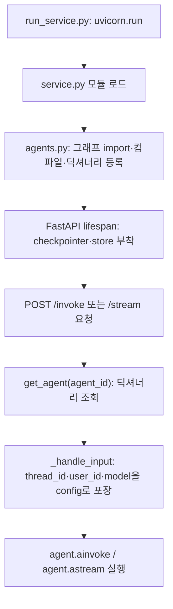
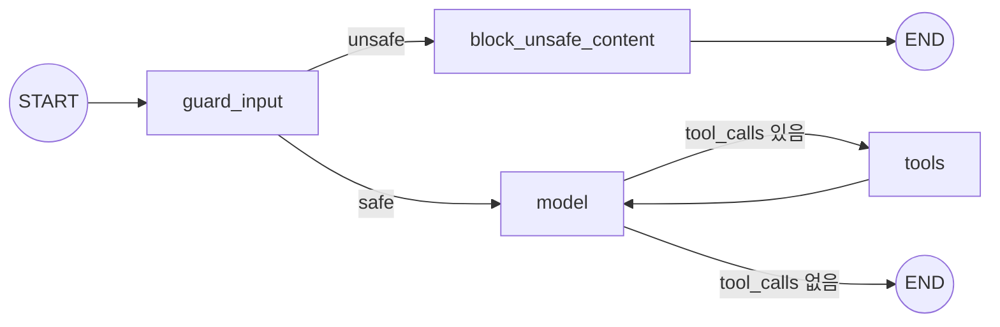
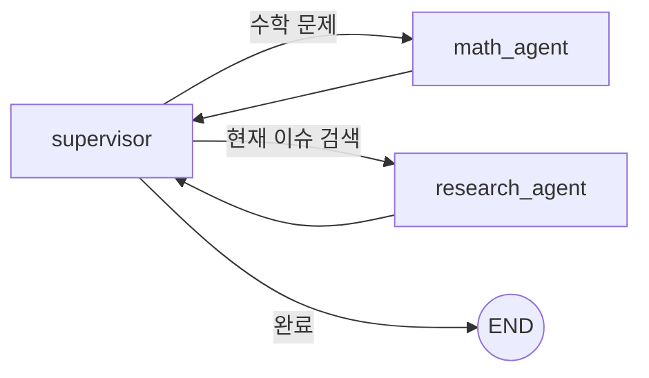

# LangGraph·LangChain 실전 코드 읽기: agent-service-toolkit 진입점부터 에이전트 3종까지

| 작성자 | 게시·수정일 | 읽는 시간 | 태그 |
|---|---|---|---|
| yjs000 | 2026-08-11 | 약 17분 | LangGraph · LangChain · Code Reading |

> "LangGraph를 쓴다"는 문장은 그래프 정의 하나만 보면 끝나는 이야기가 아니었다. 진입점부터 따라가 보면 그래프는 등록·조립·메모리 부착·스트리밍 변환까지 여러 파일에 걸쳐 조립되는 하나의 실행 파이프라인이었다.

## 목차

- [1. 질문: 실행 가능한 LangGraph 서비스는 실제로 어떻게 생겼나](#1-질문-실행-가능한-langgraph-서비스는-실제로-어떻게-생겼나)
- [2. 용어 정리: LangChain과 LangGraph는 다른 역할](#2-용어-정리-langchain과-langgraph는-다른-역할)
- [3. 초기 가설: 그래프 파일 하나만 읽으면 될 거라 생각했다](#3-초기-가설-그래프-파일-하나만-읽으면-될-거라-생각했다)
- [4. 진입점부터 요청 하나가 도달하기까지](#4-진입점부터-요청-하나가-도달하기까지)
- [5. research-assistant 그래프 해부](#5-research-assistant-그래프-해부)
- [6. 세 가지 에이전트 패턴 비교](#6-세-가지-에이전트-패턴-비교)
- [7. 한계와 트레이드오프](#7-한계와-트레이드오프)
- [8. 결론과 다음 검증](#8-결론과-다음-검증)
- [참고 자료](#참고-자료)

## 1. 질문: 실행 가능한 LangGraph 서비스는 실제로 어떻게 생겼나

RAG 검색이나 에이전트 튜토리얼은 대부분 "그래프 하나를 정의하고 `invoke()`로 실행"하는 최소 예제로 끝난다. 그런데 실제로 서비스로 배포된 프로젝트는 다음 질문에 답해야 한다.

- 사용자가 화면에서 모델을 고르면 그 선택이 그래프 어디까지 전달되는가
- 대화가 여러 턴 이어질 때 이전 맥락은 어디에 저장되고 어떻게 다시 불려오는가
- 답변이 한 글자씩 타이핑되듯 나오는 스트리밍은 그래프 실행과 어떻게 연결되는가
- 사람에게 되묻고 기다리는 기능, 여러 에이전트가 협업하는 기능은 같은 그래프 문법으로 어디까지 표현되는가

[agent-service-toolkit](https://github.com/JoshuaC215/agent-service-toolkit)은 FastAPI 서비스, Streamlit 클라이언트, 여러 LangGraph 에이전트를 함께 담은 오픈소스 저장소다. 이 글은 이 저장소의 진입점부터 코드를 그대로 따라가며 위 질문에 답한다. `docs/ai-learning/README.md`의 학습 목표 3번(오픈소스의 진입점·상태·호출 흐름·실패 처리를 읽고 평가하기)에 대응하는 읽기 기록이며, 재구현이 아니라 **코드 추적과 설명** 수준의 학습이다.

## 2. 용어 정리: LangChain과 LangGraph는 다른 역할

두 라이브러리는 같은 회사(LangChain Inc.)가 만들지만 역할이 다르다. 이 구분을 먼저 하지 않으면 코드를 읽을 때 "이 줄이 어느 라이브러리 코드인지" 계속 헷갈린다.

- **LangChain**: 모델·도구·프롬프트를 동일한 인터페이스(`Runnable`)로 감싸는 도구상자다. `ChatOpenAI`, `ChatAnthropic`처럼 제공자가 달라도 같은 `invoke`/`ainvoke`/`stream` 메서드로 다룰 수 있게 한다.
- **LangGraph**: 그 부품들을 어떤 순서·분기로 실행할지 그래프(노드·엣지)로 정의하는 오케스트레이션 레이어다. 대화 상태, 조건부 분기, 사람의 개입, 다중 에이전트 협업을 그래프 문법으로 표현한다.

비유하면 LangChain은 레고 블록이고, LangGraph는 그 블록을 조립하는 순서를 그린 조립도다. `agent-service-toolkit`은 이 조립도를 웹 서비스로 감싸 배포하는 틀이다.

## 3. 초기 가설: 그래프 파일 하나만 읽으면 될 거라 생각했다

처음에는 `src/agents/research_assistant.py`에 정의된 `StateGraph` 하나만 읽으면 "이 에이전트가 뭘 하는지" 알 수 있을 거라 가정했다. 실제로 노드·엣지 구조는 그 파일 안에서 대부분 확인된다.

```python
agent = StateGraph(AgentState)
agent.add_node("model", acall_model)
agent.add_node("tools", ToolNode(tools))
agent.add_node("guard_input", safeguard_input)
agent.add_node("block_unsafe_content", block_unsafe_content)
agent.set_entry_point("guard_input")
```
[research_assistant.py#L99-L105](https://github.com/JoshuaC215/agent-service-toolkit/blob/935318f07cba8c50cace538f9cb349acc7e11ce1/src/agents/research_assistant.py#L99-L105)

하지만 "이 그래프가 실제로 언제, 무슨 값을 받아, 어떻게 실행되는가"는 이 파일만으로는 답이 안 나왔다. `agent_id`로 여러 그래프 중 하나를 고르는 로직, `thread_id`로 대화를 이어가는 로직, 스트리밍으로 변환하는 로직은 모두 다른 파일에 있었다. 그래프 정의와 그래프 운영은 별개 관심사였다.

## 4. 진입점부터 요청 하나가 도달하기까지

프로세스 시작점은 `src/run_service.py`다.

```python
uvicorn.run(
    "service:app",
    host=settings.HOST,
    port=settings.PORT,
    reload=settings.is_dev(),
    timeout_graceful_shutdown=settings.GRACEFUL_SHUTDOWN_TIMEOUT,
)
```
[run_service.py#L31-L37](https://github.com/JoshuaC215/agent-service-toolkit/blob/935318f07cba8c50cace538f9cb349acc7e11ce1/src/run_service.py#L31-L37)

`service.py` 모듈이 로드되는 순간 `agents` 패키지 임포트가 연쇄적으로 각 그래프 모듈을 실행시키고, 컴파일된 그래프가 딕셔너리에 등록된다.

```python
from agents.research_assistant import research_assistant  # 이때 그래프가 컴파일됨

DEFAULT_AGENT = "research-assistant"
agents: dict[str, Agent] = {
    "research-assistant": Agent(
        description="A research assistant with web search and calculator.",
        graph_like=research_assistant,
    ),
    ...
}
```
[agents.py#L16-L39](https://github.com/JoshuaC215/agent-service-toolkit/blob/935318f07cba8c50cace538f9cb349acc7e11ce1/src/agents/agents.py#L16-L39)

FastAPI의 `lifespan`이 서버 부팅 시 한 번 돌면서 이 그래프들에 체크포인터와 스토어를 붙인다. 이 시점 전까지는 그래프가 "만들어지기만" 했고 대화를 기억할 수 없는 상태다.

```python
async with initialize_database() as saver, initialize_store() as store:
    for a in get_all_agent_info():
        await load_agent(a.key)
        agent = get_agent(a.key)
        agent.checkpointer = saver   # 단기 기억(thread 단위)
        agent.store = store          # 장기 기억(user 단위)
```
[service.py#L79-L107](https://github.com/JoshuaC215/agent-service-toolkit/blob/935318f07cba8c50cace538f9cb349acc7e11ce1/src/service/service.py#L79-L107)

요청이 실제로 들어오면 라우터가 다시 딕셔너리를 조회하고, `thread_id`·`user_id`·선택된 모델명을 `RunnableConfig`로 포장한다.

```python
configurable = {"thread_id": thread_id, "user_id": user_id}
if user_input.model is not None:
    configurable["model"] = user_input.model
...
state = await agent.aget_state(config=config)
if interrupted_tasks:
    input = Command(resume=user_input.message)   # 이전 턴이 interrupt로 멈춰 있었던 경우
else:
    input = {"messages": [HumanMessage(content=user_input.message)]}
```
[service.py#L143-L184](https://github.com/JoshuaC215/agent-service-toolkit/blob/935318f07cba8c50cace538f9cb349acc7e11ce1/src/service/service.py#L143-L184)

호출 스택을 정리하면 다음과 같다.



**설계 해석:** 그래프 등록(모듈 임포트 시 1회)과 메모리 부착(서버 부팅 시 1회)과 실제 실행(요청마다)이 시점상 분리되어 있다. 이 분리 덕분에 그래프 자체는 순수 함수처럼 조립되고, "이 그래프가 어떤 저장소를 쓸지"는 배포 시점(`DATABASE_TYPE` 환경변수)에 결정된다.

## 5. research-assistant 그래프 해부

기본 에이전트인 `research-assistant`의 실행 그래프는 안전성 검사 게이트와 도구 호출 루프 두 부분으로 나뉜다.



**안전성 게이트(`guard_input`)**는 답변 생성 모델과 별개인 Groq 호스팅 분류 모델(`openai/gpt-oss-safeguard-20b`)을 호출해 프롬프트 인젝션 여부를 판정한다.

```python
if model_name == GroqModelName.GPT_OSS_SAFEGUARD_20B:
    return ChatGroq(model=api_model_name, temperature=0.0)  # 분류는 결정론적이어야 함
return ChatGroq(model=api_model_name, temperature=0.5)      # 일반 대화는 다양성 허용
```
[llm.py#L119-L122](https://github.com/JoshuaC215/agent-service-toolkit/blob/935318f07cba8c50cace538f9cb349acc7e11ce1/src/core/llm.py#L119-L122)

이 모델의 판정은 `messages` 타입이 `"ai"`/`"human"`인 것만 대상으로 하고, `guard_input`은 매 턴 진입점을 통과하므로 대화가 길어져도 **그 시점까지의 전체 히스토리**를 다시 검사한다.

```python
messages_str = [
    f"{role_mapping[m.type]}: {m.content}" for m in messages if m.type in ["ai", "human"]
]
```
[safeguard.py#L104-L106](https://github.com/JoshuaC215/agent-service-toolkit/blob/935318f07cba8c50cace538f9cb349acc7e11ce1/src/agents/safeguard.py#L104-L106)

**도구 호출 루프(`model ⇄ tools`)**는 LangChain의 `bind_tools`로 모델에 웹검색·계산기 사용 권한을 주고, LangGraph의 `ToolNode`가 실제 호출을 실행한다.

```python
bound_model = model.bind_tools(tools)
preprocessor = RunnableLambda(lambda state: [SystemMessage(content=instructions)] + state["messages"])
return preprocessor | bound_model
```
[research_assistant.py#L54-L60](https://github.com/JoshuaC215/agent-service-toolkit/blob/935318f07cba8c50cace538f9cb349acc7e11ce1/src/agents/research_assistant.py#L54-L60)

`preprocessor | bound_model`은 둘이 같은 타입이라서 연결되는 게 아니다. LangChain의 모든 컴포넌트가 `Runnable` 인터페이스(`invoke`/`ainvoke`/`stream`)를 구현하고, `|`가 두 컴포넌트를 잇는 `RunnableSequence`를 만들 뿐이다. 앞 단계(`preprocessor`)의 출력 타입(`list[BaseMessage]`)이 뒤 단계(`bound_model`)가 기대하는 입력 타입과 맞아떨어지기 때문에 값이 흐른다 — 함수 합성과 같은 원리다.

이 루프가 끝없이 돌 가능성을 막는 장치가 `RemainingSteps`다.

```python
if state["remaining_steps"] < 2 and response.tool_calls:
    return {"messages": [AIMessage(id=response.id, content="Sorry, need more steps to process this request.")]}
```
[research_assistant.py#L75-L83](https://github.com/JoshuaC215/agent-service-toolkit/blob/935318f07cba8c50cace538f9cb349acc7e11ce1/src/agents/research_assistant.py#L75-L83)

`RemainingSteps`는 LangGraph가 그래프 재귀 한도(기본 25스텝)를 기준으로 매 스텝 자동 감소시키는 managed value다. 남은 스텝이 2 미만인데 모델이 또 도구를 부르려 하면, 그 응답을 버리고 `tool_calls`가 없는 사과 메시지로 바꿔치기해 그래프가 예외 없이 `END`로 종료되게 한다. 재귀 한도를 그냥 넘기면 `GraphRecursionError`로 죽는데, 그 전에 선제적으로 정상 종료 경로로 유도하는 방식이다.

## 6. 세 가지 에이전트 패턴 비교

같은 저장소 안에 난이도가 다른 에이전트 예제가 나란히 있어서, 그래프 문법 하나로 표현되는 패턴의 폭을 비교하기 좋다.

| | research-assistant | interrupt-agent | langgraph-supervisor-agent |
|---|---|---|---|
| 그래프 작성 방식 | `StateGraph`를 노드·엣지로 직접 조립 | `StateGraph` + `interrupt()` | `create_agent` + `create_supervisor`(라이브러리에 조립 위임) |
| 핵심 패턴 | 조건부 분기로 안전 게이트 + 도구 루프 | 실행을 멈췄다 재개하는 human-in-the-loop | 슈퍼바이저 1개가 서브 에이전트 2개에 작업 위임 |
| 상태 저장 범위 | thread 단위(checkpointer)만 사용 | thread(checkpointer) + user(store) 모두 사용 | thread 단위, 서브 에이전트 히스토리까지 포함 |
| 안전장치 | Safeguard + RemainingSteps | 없음(데모 목적) | 없음(데모 목적) |

**interrupt-agent**는 생일 정보가 없으면 `langgraph.types.interrupt()`로 실행을 그 자리에서 멈춘다.

```python
if response.birthdate is None:
    birthdate_input = interrupt(f"{response.reasoning}\nPlease tell me your birthdate?")
    state["messages"].append(HumanMessage(birthdate_input))
    return await determine_birthdate(state, config, store)
```
[interrupt_agent.py#L137-L142](https://github.com/JoshuaC215/agent-service-toolkit/blob/935318f07cba8c50cace538f9cb349acc7e11ce1/src/agents/interrupt_agent.py#L137-L142)

`interrupt()`는 예외처럼 그 지점에서 함수 실행을 끊는다. 사용자가 답하면 서비스가 이를 새 메시지가 아니라 `Command(resume=...)`로 감싸 재개시키는데, 이때 함수는 **처음부터 다시 실행**된다. `interrupt()` 이후 줄은 재개 시점에만 실행되므로, 그 이전 로직(스토어 조회 등)은 여러 번 실행돼도 안전하도록 짜여 있어야 한다. 생일은 `user_id` 네임스페이스로 장기 기억 스토어에 저장되어, 대화방(thread)이 바뀌어도 같은 사용자면 다시 묻지 않는다.

```python
namespace = (user_id,)
result = await store.aget(namespace, key="birthdate")
```
[interrupt_agent.py#L89-L95](https://github.com/JoshuaC215/agent-service-toolkit/blob/935318f07cba8c50cace538f9cb349acc7e11ce1/src/agents/interrupt_agent.py#L89-L95)

**langgraph-supervisor-agent**는 `StateGraph`를 직접 쓰지 않고, LangChain의 `create_agent`로 서브 에이전트 두 개를 만든 뒤 `langgraph_supervisor` 패키지의 `create_supervisor`에 넘긴다.

```python
math_agent = create_agent(model=model, tools=[add, multiply], name="sub-agent-math_expert", ...)
research_agent = create_agent(model=model, tools=[web_search], name="sub-agent-research_expert", ...)

workflow = create_supervisor(
    [research_agent, math_agent],
    model=model,
    prompt="You are a team supervisor... For current events, use research_agent. For math problems, use math_agent.",
    add_handoff_back_messages=True,
    output_mode="full_history",
)
```
[langgraph_supervisor_agent.py#L33-L60](https://github.com/JoshuaC215/agent-service-toolkit/blob/935318f07cba8c50cace538f9cb349acc7e11ce1/src/agents/langgraph_supervisor_agent.py#L33-L60)

슈퍼바이저 모델이 자연어 프롬프트를 보고 어느 서브 에이전트에게 요청을 넘길지 즉석에서 판단한다. `research-assistant`가 라우팅을 `add_conditional_edges`로 코드에 명시한 것과 달리, 이 패턴은 라우팅 자체를 LLM 판단에 맡긴다. `output_mode="full_history"`는 대화를 다시 불러올 때 서브 에이전트의 중간 작업까지 보이게 하기 위한 옵션으로, 코드 주석에 그 이유가 남아 있다.



## 7. 한계와 트레이드오프

`research-assistant`를 기준으로 코드를 읽으며 확인한 구조적 트레이드오프를 정리한다.

- **fail-open 안전장치:** Safeguard 호출이 실패하거나 JSON 파싱에 실패하면 `SafetyAssessment.ERROR`가 나오는데, 라우팅 함수는 이를 `UNSAFE`가 아닌 한 전부 `"safe"`로 처리한다. 안전 분류 모델이 죽으면 검열 없이 통과된다는 뜻이다.
  ```python
  match safety.safety_assessment:
      case SafetyAssessment.UNSAFE:
          return "unsafe"
      case _:
          return "safe"
  ```
  [research_assistant.py#L111-L115](https://github.com/JoshuaC215/agent-service-toolkit/blob/935318f07cba8c50cace538f9cb349acc7e11ce1/src/agents/research_assistant.py#L111-L115)
- **도구 결과는 안전성 검사 대상이 아님:** Safeguard는 `"ai"`/`"human"` 타입 메시지만 검사하고 `"tool"` 타입은 건너뛴다. 웹검색 결과 본문에 프롬프트 인젝션이 섞여 있어도 이 게이트는 못 본다 — 간접 프롬프트 인젝션에는 대응하지 않는 구조다.
- **매 턴 추가 지연·비용:** `guard_input`(Groq 호출)과 `model`(메인 LLM 호출)이 직렬로 실행되므로 첫 토큰이 나오기까지 안전성 검사 API 왕복 시간이 항상 더해진다.
- **재귀 한도 초과 방지가 응답 품질보다 우선:** `RemainingSteps < 2`에서 실제 모델 응답을 버리고 고정 사과 문구로 대체하는 방식은 예외로 죽는 것보다는 안전하지만, 사용자에게는 도구 호출이 실제로 왜 중단됐는지 설명하지 않는다.

## 8. 결론과 다음 검증

그래프 문법(`StateGraph`, 조건부 엣지, `interrupt()`, managed value)은 하나인데, 이를 조합해 표현할 수 있는 범위는 넓었다. 안전 게이트가 있는 단일 에이전트, 실행을 멈췄다 재개하는 human-in-the-loop, LLM이 라우팅을 직접 판단하는 다중 에이전트가 모두 같은 `StateGraph`/`Runnable` 계약 위에서 조립된다. 서비스 레이어(`service.py`, `agents.py`)는 이 차이를 몰라도 되게 설계되어 있어서, `agent_id`만 바꾸면 진입점부터 스트리밍까지 동일한 코드가 재사용된다.

**미검증 가설:** Safeguard의 fail-open 설계와 도구 결과 미검사가 실제 프로덕션 배포에서 얼마나 위험한지는 이번 읽기로 확인하지 못했다. 별도의 프롬프트 인젝션 페이로드를 웹검색 결과에 심어 실제로 게이트를 우회하는지 확인하는 실험이 다음 단계로 필요하다.

## 참고 자료

- [JoshuaC215/agent-service-toolkit](https://github.com/JoshuaC215/agent-service-toolkit) — 이 글이 분석한 저장소, 커밋 `935318f`
- [LangGraph 공식 문서](https://langchain-ai.github.io/langgraph/) — `StateGraph`, `interrupt`, managed value 개념
- [LangChain Runnable 인터페이스](https://python.langchain.com/docs/concepts/runnables/) — `invoke`/`ainvoke`/`stream`과 LCEL 파이프 연산자
- [langgraph-supervisor](https://github.com/langchain-ai/langgraph-supervisor-py) — `create_supervisor` 다중 에이전트 패턴
