# 모델보다 하니스: Codex, Hermes, Orchestra로 AI 작업 시스템을 설계한 과정

> 좋은 모델을 선택하는 것만으로는 긴 작업이 끝까지 가지 않는다. 모델이 읽을 지도, 사용할 도구, 이어받을 상태, 실패를 감지할 검사, 다시 시작할 위치가 함께 있어야 한다.

## 요약

처음 질문은 단순했다. Codex에서는 잘 이어지던 코딩이 왜 같은 OpenAI 계열 모델을 연결한 Hermes에서는 자주 끊길까? Discord에서 여러 프로젝트를 운영하면 작업이 섞였고, 하위 에이전트가 끝난 뒤 다음 작업을 정의하지 못했으며, 중간 결과와 실패 원인이 충분히 남지 않았다.

분석을 거치며 문제의 초점이 모델에서 하니스로 이동했다. 하니스는 모델을 둘러싼 실행 환경 전체다. 컨텍스트를 어떻게 제공하는지, 어떤 도구를 어떤 형식으로 노출하는지, 작업 상태를 어디에 저장하는지, 완료를 무엇으로 증명하는지, 실패 후 어디서 재개하는지가 결과를 바꾼다.

최종 판단은 사용 규모에 따라 달라진다.

| 상황 | 기본 선택 | 이유 |
|---|---|---|
| 혼자 하나의 사이드프로젝트를 개발 | Codex App/CLI + `ROADMAP.md` | 상태와 의사결정 거리가 짧아 별도 제어면의 비용이 더 큼 |
| 혼자 여러 코드 프로젝트를 개발 | 프로젝트별 Codex 작업 공간 + 저장소 문서 | 프로젝트 수만 늘었다면 분리된 작업 공간으로 충분한 경우가 많음 |
| 개발 외에 운영·문서·고객·마케팅까지 연결 | Hermes 추가 | 여러 시스템의 정보를 읽고 사용자와 다음 행동을 결정하는 대화형 계층이 필요 |
| 승인된 반복 작업을 장시간 실행·관측 | Orchestra 추가 | Pipeline, Agent Run, 재시도, 감사 기록과 실행 이력이 필요 |
| 코드 변경의 독립 검증 | GitHub Actions | 에이전트의 자기평가와 분리된 결정론적 검사 필요 |

이 글의 결론을 한 줄로 줄이면 다음과 같다.

```text
Codex는 구현에 집중하고,
Hermes는 무엇을 할지 사용자와 결정하며,
Orchestra는 승인된 일을 반복 가능하게 실행하고,
GitHub Actions는 결과를 독립적으로 검사한다.
```

이 구분은 고정된 제품 분류가 아니다. Codex에도 Skills와 Automations가 있고, Hermes에도 Cron·Delegation·Kanban이 있으며, Orchestra Runtime에도 Git 접근과 Agent가 있다. 기능은 겹친다. 중요한 것은 기능 목록이 아니라 한 시스템 안에서 누가 어떤 상태의 원본이 되는가이다.

---

## 1. 출발점: "같은 모델인데 왜 다르게 일하지?"

문제는 네 가지 증상으로 나타났다.

1. Hermes의 긴 코딩 루프가 중간에 종료됐다.
2. 하위 에이전트 결과를 받은 뒤 다음 행동으로 이어지지 않았다.
3. Discord 대화에 여러 프로젝트의 맥락이 섞였다.
4. 진행 상황, 실패 원인, 다음 작업이 저장소 밖의 대화에만 남았다.

처음에는 더 긴 프롬프트, 더 많은 지시, 더 강한 모델이 해결책처럼 보였다. 하지만 긴 지시는 새로운 문제를 만들었다. 현재 작업과 무관한 운영 규칙이 컨텍스트를 차지했고, 대화 압축이나 세션 전환 뒤에는 무엇이 완료됐는지 다시 추정해야 했다.

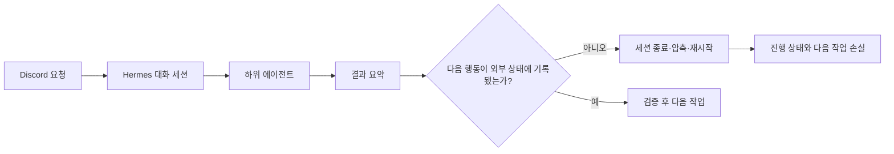

여기서 "루프가 끊겼다"는 말은 하나의 오류를 뜻하지 않는다. 모델 호출 제한, 도구 오류, 프로세스 종료, 컨텍스트 압축, 위임 결과 대기, 잘못된 작업 디렉터리, 완료 조건 부재가 모두 비슷한 사용자 경험을 만든다. 원인을 분류하지 않으면 해결책도 "더 열심히 계속해" 같은 재촉에 머문다.

### 실패를 분류하는 최소 표

| 분류 | 예시 | 소유 계층 | 복구 방식 |
|---|---|---|---|
| provider | 인증 만료, rate limit, 응답 파싱 실패 | 모델 연결 계층 | backoff, 재인증, 동일 모델 재시도 |
| harness | max turn, 세션 압축, 상태 유실 | 에이전트 런타임 | 체크포인트에서 재개 |
| tool | 터미널 timeout, 파일 권한, 잘못된 cwd | 도구 실행 계층 | 환경 수정 후 같은 단계 재실행 |
| code | 테스트 실패, 타입 오류 | 코딩 에이전트 | 로그를 입력으로 수정 반복 |
| verification | 누락된 테스트, 잘못된 완료 판정 | CI·리뷰 계층 | 독립 검증 추가 |
| orchestration | 중복 실행, lease 만료, 잘못된 분기 | 워크플로 제어면 | idempotency, 상태 전이 복구 |
| infrastructure | runner 장애, 네트워크 단절, 저장 공간 부족 | 실행 인프라 | 인프라 복구 후 체크포인트 재개 |

실패는 하나의 원인만 갖지 않을 수 있다. 이벤트에는 `primary_failure_class` 하나와 `contributing_factors[]`, 관측 계층, 소유자, 재시도 가능 여부를 함께 기록한다. 주 분류는 "어느 계층에서 발견됐는가"가 아니라 "무엇을 고쳐야 해결되는가"로 정한다. 테스트가 정상적으로 코드 결함을 발견했다면 `code`, 테스트가 빠졌거나 잘못된 성공을 냈다면 `verification`이다. 이 구조는 원인 사슬을 보존하면서 재시도 책임은 한 계층에만 배정한다.

문제의 이름을 "Hermes가 덜 똑똑하다"에서 "하니스의 어느 계약이 끊겼는가"로 바꾸는 순간, 측정하고 고칠 수 있는 대상이 생겼다.

---

## 2. 하니스 엔지니어링이란 무엇인가

[OpenAI의 Harness Engineering](https://openai.com/ko-KR/index/harness-engineering/) 사례에서 사람의 역할은 코드를 직접 작성하는 데서 환경과 피드백 루프를 설계하는 쪽으로 이동한다. OpenAI 팀은 초기 진행이 느렸던 이유를 Codex의 능력 부족이 아니라 도구, 추상화, 내부 구조가 부족했기 때문이라고 설명한다. 실패한 에이전트에게 더 노력하라고 요구하는 대신, 에이전트가 읽고 실행할 수 있는 빌딩 블록을 만들었다.

하니스를 간단히 정의하면 다음과 같다.

> 하니스는 모델이 작업을 이해하고, 행동하고, 결과를 관측하고, 실패에서 복구하도록 만드는 실행 계약과 환경의 집합이다.

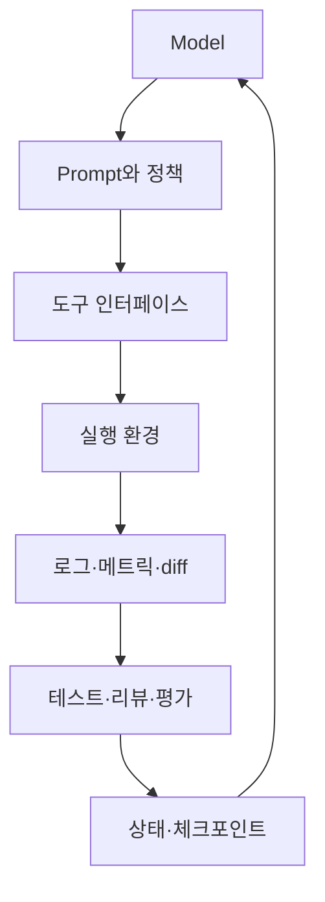

하니스는 프롬프트보다 넓다.

| 구성 요소 | 질문 | 산출물 예시 |
|---|---|---|
| 지식 | 무엇을 읽어야 하는가? | 짧은 `AGENTS.md`, `ARCHITECTURE.md`, ADR |
| 계획 | 현재 목표와 다음 단계는 무엇인가? | `ROADMAP.md`, Exec Plan, Issue |
| 도구 | 무엇을 어떻게 실행할 수 있는가? | file, patch, terminal, browser, GitHub |
| 격리 | 여러 작업이 충돌하지 않는가? | branch, worktree, sandbox |
| 관측 | 실제로 무슨 일이 일어났는가? | diff, 로그, 스크린샷, trace |
| 검증 | 완료를 어떻게 증명하는가? | lint, test, eval, CI, review |
| 상태 | 재시작 후 어디서 이어가는가? | run ID, task state, checkpoint |
| 정책 | 언제 멈추고 사람에게 묻는가? | 승인 규칙, 위험도, 권한 경계 |
| 정리 | 드리프트를 어떻게 줄이는가? | doc gardening, 리팩터링, 품질 등급 |

### 긴 설명서가 아니라 지도를 준다

OpenAI 사례에서 `AGENTS.md`는 백과사전이 아니라 약 100줄의 목차로 쓰였다. 상세 지식은 버전 관리되는 `docs/`에 두고, 복잡한 작업은 진행 상황과 의사결정 로그를 담은 실행 계획으로 관리했다. 문서 링크와 신선도는 CI로 검사했다.

```text
repository/
├── AGENTS.md                 # 짧은 지도와 작업 계약
├── ARCHITECTURE.md           # 시스템의 최상위 구조
├── ROADMAP.md                # 우선순위와 완료 상태
├── docs/
│   ├── product/              # 제품 원칙과 요구사항
│   ├── decisions/            # ADR
│   ├── exec-plans/
│   │   ├── active/           # 진행 중인 복잡한 작업
│   │   └── completed/        # 완료된 계획과 증거
│   └── quality/              # 품질 기준과 기술 부채
└── .github/workflows/        # 기계적으로 강제하는 검사
```

이 구조의 목적은 문서를 많이 만드는 것이 아니다. 에이전트가 현재 컨텍스트에 필요한 정보로 이동할 수 있게 하는 것이다. OpenAI 글의 표현대로, 실행 중 접근할 수 없는 정보는 에이전트에게 사실상 존재하지 않는다.

### 규칙은 가능한 한 실행 가능해야 한다

"계층을 지켜라"는 문장보다 금지된 의존성을 실패시키는 구조 테스트가 강하다. "로그를 잘 남겨라"보다 구조화된 로깅 린트가 강하다. 자연어 규약은 방향을 설명하고, CI는 중요한 불변 조건을 강제한다.

```yaml
# docs/quality/architecture-rules.yml
rules:
  - id: domain-layer-direction
    description: Types -> Config -> Repo -> Service -> Runtime -> UI 방향만 허용
    enforcement: scripts/check_architecture.py
    failure_message: >
      금지된 역방향 의존성입니다. 경계 인터페이스를 추가하거나
      호출 방향을 바꾼 뒤 검사를 다시 실행하세요.

  - id: completion-evidence
    description: 완료된 Exec Plan은 검증 명령과 결과 링크를 포함해야 함
    enforcement: scripts/check_exec_plans.py
```

---

## 3. 같은 모델 이름이 같은 에이전트를 뜻하지 않는 이유

모델은 하니스의 한 부품이다. 같은 모델을 사용해도 시스템 프롬프트, 도구 스키마, 실행 환경, 컨텍스트 구성, 권한, 종료 기준이 다르면 행동도 달라진다.

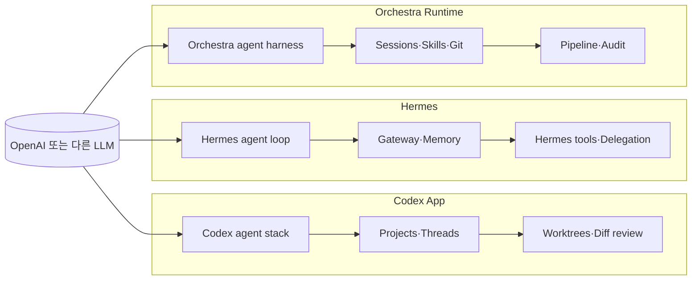

[2026년 Codex App 소개](https://openai.com/index/introducing-the-codex-app/)는 앱을 여러 에이전트를 병렬로 관리하는 command center로 설명한다. 프로젝트별 thread, 내장 worktree, thread 안의 diff 검토, Skills, Automations, review queue가 함께 제공된다. [CLI 문서](https://developers.openai.com/codex/cli/)와 발표문을 함께 보면 App과 CLI는 Codex 생태계를 공유하지만 사용자 감독과 상태 표현 방식이 다르다. 제품 문서는 빠르게 이동하므로 App 기능 주장은 이 날짜가 명시된 발표문을 기준으로 삼았다.

Hermes에서 OpenAI 계열 모델을 선택했다고 해서 Codex App의 프로젝트, thread, worktree, review UI까지 자동으로 따라오는 것은 아니다. Hermes는 자체 시스템 프롬프트와 도구, 세션, 압축, gateway, delegation 정책으로 모델을 운전한다. 반대로 Hermes가 제공하는 Discord, Telegram, 여러 provider, MCP, memory 같은 기능이 Codex App에 그대로 들어오는 것도 아니다.

따라서 비교 실험은 모델명만 맞춰서는 부족하다.

```yaml
experiment:
  task: "같은 버그를 재현하고 수정한 뒤 테스트와 PR 설명까지 작성"
  invariant:
    commit: "<same SHA>"
    prompt: "<same initial instruction>"
    agents_md: "<same file>"
    model: "<same model if selectable>"
    reasoning: "<same effort>"
    permissions: "workspace-write, network-denied"
    verification_command: "pnpm test && pnpm lint"
  compare:
    - Codex App
    - Codex CLI
    - Hermes
  metrics:
    - completion_rate
    - tool_error_count
    - retries
    - elapsed_time
    - tests_passed
    - human_interventions
    - diff_review_score
```

이 실험 전에는 "Desktop이 더 낫다"를 제품 사실로 단정할 수 없다. 다만 동일 모델이라도 더 정돈된 프로젝트 경계와 도구 루프가 체감 품질을 높일 수 있다는 가설은 하니스 관점에서 타당하다.

---

## 4. 세 도구의 역할

### 4.1 Codex: 코드와 가까운 통합 하니스

Codex App과 CLI는 저장소를 읽고, 파일을 수정하고, 명령을 실행하고, 결과를 검증하는 코딩 루프에 집중한다. App은 여러 thread와 worktree를 한 UI에서 감독한다. Skills를 통해 문서, 디자인, 배포 같은 작업으로 확장할 수 있고, Automations로 반복 작업을 review queue에 보낼 수 있다.

강점은 구현과 피드백 사이의 거리가 짧다는 점이다.

```text
요구사항 → 저장소 탐색 → 수정 → 테스트 → diff 검토 → 후속 수정
```

개인 개발자에게 이 거리가 짧은 것은 큰 장점이다. 프로젝트 하나를 끝내기 위해 별도의 Issue intake, 승인 서비스, 외부 오케스트레이터를 거칠 필요가 없다.

### 4.2 Hermes: 대화와 도구를 연결하는 범용 에이전트 런타임

[Hermes Agent 공식 문서](https://hermes-agent.nousresearch.com/docs/)와 [공식 저장소](https://github.com/NousResearch/hermes-agent)에 따르면 Hermes는 provider를 바꿀 수 있는 범용 에이전트다. 파일·터미널·웹 같은 도구, Skills, 장기 memory, delegation, cron, MCP를 제공하며 Discord·Telegram 등 메시징 플랫폼에서 같은 에이전트를 사용할 수 있다. 세부 기능은 [Tools Reference](https://hermes-agent.nousresearch.com/docs/reference/tools-reference), [Messaging](https://hermes-agent.nousresearch.com/docs/user-guide/messaging/), [Memory](https://hermes-agent.nousresearch.com/docs/user-guide/features/memory), [MCP](https://hermes-agent.nousresearch.com/docs/user-guide/features/mcp), [Delegation](https://hermes-agent.nousresearch.com/docs/user-guide/features/delegation) 문서에서 확인할 수 있다.

Hermes의 차별점은 특정 저장소 안의 코딩만이 아니라 사용자의 여러 도구와 채널을 연결하는 데 있다.

```text
Discord 질문
→ GitHub PR 확인
→ 문서와 일정 비교
→ 다음 작업 후보 제안
→ 사용자 승인
→ Issue 생성 또는 외부 실행 호출
```

하지만 범용성에는 비용이 있다. 코딩, 제품 판단, 마케팅, 운영을 한 프롬프트와 한 평가 기준으로 처리하면 각 분야의 신호가 약해진다. Hermes가 모든 역할을 최고 수준으로 수행한다고 가정하기보다, 역할별 Skill·프롬프트·도구·평가 기준으로 라우팅하는 편이 안전하다.

### 4.3 Orchestra: Agent와 Pipeline을 운영하는 제어면

여기서 Orchestra는 `orchestra-mcp/framework`가 아니라 [getOrchestra](https://docs.getorchestra.io/docs/quick-start)의 제품을 뜻한다. 이 구분은 중요하다.

[Orchestra Runtime Overview](https://docs.getorchestra.io/docs/ai-agents/overview)는 Runtime을 AI Agent를 build, run, monitor하는 control plane으로 설명한다. Runtime에는 sandbox, Git 접근, Skills, metadata, alerting, monitoring, 세션·turn 감사 기록이 포함된다. [Agents 문서](https://docs.getorchestra.io/docs/ai-agents/agents)에 따르면 Agent는 직접 대화할 수도 있고 Pipeline task로 배치할 수도 있으며, Git 접근 권한이 있으면 변경을 열 수 있다. 공식 예제는 실패한 파이프라인을 진단하고 수정 PR을 여는 Agent 흐름을 보여준다.

동시에 Orchestra의 뿌리는 데이터와 워크플로 오케스트레이션에 있다. [Pipelines 문서](https://docs.getorchestra.io/docs/core-concepts/pipelines)는 Pipeline을 YAML 또는 UI로 정의하는 DAG라고 설명한다. [Pipeline Runs](https://docs.getorchestra.io/docs/core-concepts/pipelines/pipeline-runs), [Tasks](https://docs.getorchestra.io/docs/core-concepts/tasks), [Alerting](https://docs.getorchestra.io/docs/core-concepts/alerting)은 실행 상태, 의존성, 결과와 알림을 다룬다.

따라서 "Orchestra가 코딩한다"는 말은 운영자 관점에서는 맞지만 내부적으로는 두 층으로 나뉜다.

```text
Orchestra Pipeline·Runtime
= 언제 실행하고, 무엇을 주고, 어디에 기록하고, 실패 후 어떻게 분기할지 관리

Orchestra Agent와 그 기반 모델
= 저장소를 이해하고 실제 변경을 판단·수행
```

Orchestra가 모든 소프트웨어 개발 문제를 자동으로 해결한다고 일반화해서는 안 된다. 공식 사례의 중심은 데이터 파이프라인 구축·수정·운영이다. 일반 제품 개발에 쓰려면 저장소 규약, 수용 기준, 코드 리뷰, 테스트 하니스와 권한 정책을 별도로 설계해야 한다.

---

## 5. 공통점보다 중요한 차이: 다음 행동을 누가 결정하는가

세 도구 모두 파일을 읽고 Agent를 실행하며 외부 시스템과 통합할 수 있다. 기능표만 보면 경계가 흐려진다. 다음 행동의 근거와 상태 단위를 보면 차이가 선명해진다. 아래 표에서 작업 단위와 제품 기능은 공식 문서를 요약했고, 강점과 위험은 이 글의 설계 해석이다.

| 항목 | Codex App/CLI | Hermes | Orchestra Runtime/Pipeline |
|---|---|---|---|
| 주 작업 단위 | 저장소 작업, thread | 대화 세션, tool call, 위임 작업 | Agent session/run, pipeline run, task run |
| 다음 행동 근거 | 코딩 에이전트 판단과 저장소 상태 | 사용자 의도, 대화, 도구 결과를 LLM이 해석 | Agent 판단 또는 DAG의 의존성과 상태 전이 |
| 강한 영역 | 코드 구현, 테스트, diff 반복 | 대화형 판단, 여러 채널·도구 연결 | 반복 실행, 스케줄, 감사, 관측, 파이프라인 분기 |
| 프로젝트 분리 | project, thread, worktree | profile, session, workdir, 프로젝트 규약 | workspace, pipeline, run input |
| 사람 개입 | thread, diff comment, 승인 | 대화 자체가 human-in-the-loop | UI·alert·session·pipeline 재실행 |
| 비코딩 확장 | Skills, Automations | Skills, MCP, plugins, cron | integrations, Skills, Agent, Pipeline |
| 대표 위험 | 앱 안에 과도한 업무를 집중 | 긴 대화 오염, 범용 프롬프트의 성능 저하 | 일반 코딩에 과한 제어면, 이중 상태 머신 |

### 결정론과 비결정론을 분리한다

LLM의 의미 기반 판단은 요구사항 분석에 유용하지만 같은 입력에 항상 같은 결과를 보장하지 않는다. 반면 CI 명령, 권한 정책, DAG 의존성은 반복 가능한 계약으로 만들 수 있다.

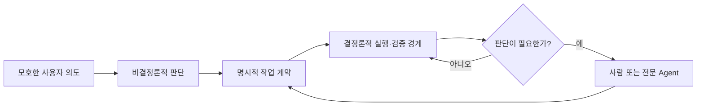

좋은 구조는 LLM을 제거하지 않는다. LLM이 잘하는 의미 해석과, 시스템이 강제해야 할 상태·검증을 분리한다.

### Codex App과 Hermes + Orchestra는 무엇이 다른가

Codex App은 프로젝트, thread, worktree, diff review, Skills, Automations를 하나의 제품 경험으로 묶는다. Hermes + Orchestra는 대화형 판단과 실행 제어면을 서로 다른 제품으로 조립한다. 둘 다 여러 Agent를 감독할 수 있지만 운영 철학이 다르다.

| 기준 | Codex App 중심 | Hermes + Orchestra 중심 |
|---|---|---|
| 시작 비용 | 낮음. 프로젝트를 열고 바로 작업 | 높음. 프로젝트 레지스트리, 권한, Issue 계약, Pipeline 연결 필요 |
| 코딩 루프 일관성 | Codex 하니스 안에서 통합 | Orchestra Agent 또는 별도 코딩 Agent 구성에 따라 달라짐 |
| 사용자 경험 | 코딩 작업을 위한 통합 UI | Discord 등 대화 채널 + Orchestra 운영 UI + GitHub |
| 프로젝트 병렬화 | thread와 worktree 내장 | Pipeline run, Agent session, Git branch를 연결해 설계 |
| 비개발 업무 | Skills와 Automations로 확장 | Hermes 도구·MCP와 Orchestra integration으로 폭넓게 조립 |
| 상태 관측 | App의 thread와 review queue | Pipeline·task·session의 감사 기록과 별도 대시보드 |
| 사용자 승인 | thread 안의 감독과 권한 요청 | Hermes 대화와 GitHub Issue를 명시적 승인 경계로 사용 가능 |
| 맞춤 제어면 | 제품이 제공하는 범위 안에서 단순 | 조직별 DAG, 알림, 데이터 흐름을 세밀하게 구성 가능 |
| 장애 지점 | 상대적으로 적음 | Hermes, Orchestra, GitHub, webhook, credential 연결이 추가됨 |
| 적합한 범위 | 개인과 코딩 중심 팀 | 여러 시스템·역할·감사가 얽힌 제품 운영 |

Codex App을 "Hermes와 Orchestra를 모두 합친 제품"이라고 보기는 어렵다. 겹치는 기능은 많지만 Codex App의 중심은 Codex Agent를 잘 감독하는 통합 작업장이다. Hermes + Orchestra의 중심은 사용자 접점과 조직의 실행 제어면을 분리해 원하는 도구를 조립하는 것이다.

기능을 최대한 많이 확보하려고 후자를 선택하면 오히려 실패한다. 통합된 Codex 하니스가 해결하는 문제를 다시 조립해야 하기 때문이다. 반대로 GitHub 밖의 고객·문서·데이터·운영 흐름이 제품 우선순위를 바꾸고 감사 가능한 자동 실행이 필요하다면, 조립 비용을 감수할 이유가 생긴다.

---

## 6. 설계가 바뀐 과정

### Stage 1 — Codex와 저장소 문서

개인 프로젝트의 기본값이다.

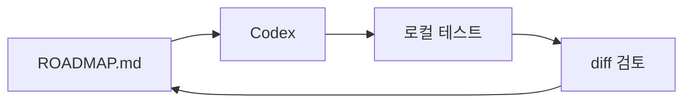

`ROADMAP.md`의 한 항목이 한 번의 작업으로 끝날 수 있고 사용자가 직접 결과를 볼 수 있다면 Issue는 선택 사항이다. 별도 오케스트레이터는 상태를 한 번 더 번역하게 만든다.

```markdown
# ROADMAP

## Now
- [ ] 검색 결과에 출처와 시행일 표시
  - 완료 조건: API와 UI에 출처가 보이고 관련 테스트가 통과함

## Next
- [ ] 법령 업데이트 감지
- [ ] retrieval 평가 데이터셋 확장

## Done
- [x] 기본 키워드 검색
```

### Stage 2 — Codex, GitHub, CI

협업, 리뷰, 배포 보호가 필요해지면 Issue와 PR, GitHub Actions를 추가한다.

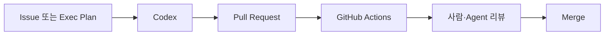

이 단계에서도 실행 주체는 Codex다. GitHub는 계약과 변경 이력을, Actions는 독립 검증을 맡는다. [GitHub Actions 개념 문서](https://docs.github.com/en/actions/get-started/understand-github-actions)는 workflow, event, job, step, runner의 관계를 설명한다.

### Stage 3 — Hermes를 판단·승인 계층으로 추가

프로젝트 수보다 도구와 업무 종류가 늘어날 때 Hermes가 의미를 갖는다. 개발, 문서, 고객 문의, 일정, 지표가 서로 영향을 주면 "어떻게 구현할까"보다 "무엇을 먼저 할까"가 어려워진다.

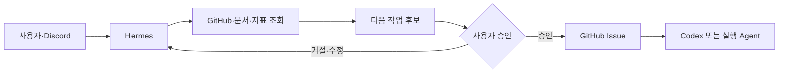

Hermes는 긴 코딩 루프를 소유하지 않아도 된다. 저장소와 결과를 읽고, 기존 Roadmap·Issue와 중복을 확인하고, 사용자의 승인을 받아 실행 가능한 계약을 만든다.

### Stage 4 — Orchestra를 실행·관측 계층으로 추가

승인된 작업이 여러 단계로 반복되고, 장시간 실행·재시도·감사 기록이 필요할 때 Orchestra를 추가한다.

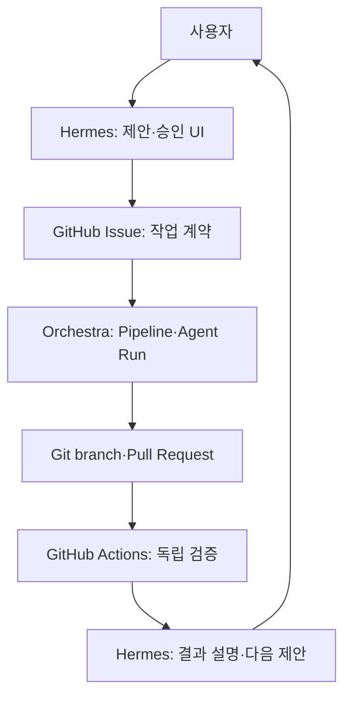

이 단계의 핵심은 기능 추가가 아니라 소유권 분리다.

| 정보 | 유일한 원본 | 이유 |
|---|---|---|
| 승인된 요구사항 | GitHub Issue | 실행 도구와 무관한 작업 계약 |
| 승인 결정 | append-only approval ledger | actor, 시각, contract hash, 만료·철회의 원본 |
| 대화와 제안 | Hermes session | 사용자 상호작용과 approval ledger의 표시용 projection |
| 파이프라인 실행 상태 | Orchestra run | 단계, 재시도, 시간, artifact의 실행 기록 |
| 코드 변경 | Git branch와 PR | 검토 가능한 변경의 원본 |
| 독립 검증 | GitHub Actions check | 에이전트 자기평가와 분리 |
| 제품 우선순위 | Roadmap 또는 제품 시스템 | 작업 실행 상태와 제품 결정을 분리 |

같은 `running`, `retrying`, `completed`를 Hermes와 Orchestra가 동시에 소유하면 장애가 생긴다. Hermes는 Orchestra의 상태를 읽어 보여줄 수 있지만 자체적으로 다른 실행 상태를 만들지 않는다.

### 계층을 하나씩 추가했을 때의 변화

| 단계 | 새로 얻는 것 | 새로 부담하는 것 | 다음 단계로 넘어갈 조건 |
|---|---|---|---|
| Roadmap + Codex | 가장 짧은 구현 루프 | 사람이 우선순위와 진행 상태를 직접 관리 | 협업·병렬 작업·독립 검증이 필요 |
| + GitHub + Actions | 작업·변경·검증 이력 | Issue·PR·CI 규약 관리 | 여러 시스템의 정보를 함께 판단해야 함 |
| + Hermes | 대화형 조회, 제안, 승인, 다중 도구 연결 | 세션·프로젝트 경계와 역할별 하니스 | 승인된 반복 실행의 관측·재시도가 필요 |
| + Orchestra | DAG, Agent Run, 감사, 스케줄, 중앙 관측 | Pipeline·credential·webhook·실패 매핑 | 운영 편익이 추가 복잡성과 비용을 넘는지 측정 |

앞 단계의 문제를 실제로 겪기 전에 다음 계층을 추가하지 않는다. 각 단계에는 제거 비용도 있으므로, 파일럿은 한 프로젝트와 한 흐름으로 제한한다.

---

## 7. 제품 팀용 참조 구조

### 7.1 프로젝트 레지스트리

Discord 채널이나 기억에 현재 프로젝트를 암묵적으로 저장하지 않는다. 모든 요청에 `project_slug`를 포함하고 레지스트리에서 저장소와 규약을 찾는다.

```yaml
# config/projects.yml
projects:
  law-rag:
    repository: yjs000/law-rag
    default_branch: main
    roadmap_path: ROADMAP.md
    architecture_path: ARCHITECTURE.md
    issue_template: agent-task.yml
    orchestra:
      workspace: software-agents
      pipeline_alias: approved_issue_delivery
    verification_profile:
      id: law-rag/pr-default
      revision: "<full-commit-sha>"
```

### 7.2 분석은 제안으로 전달하고, 승인은 계약으로 바꾼다

Codex가 발견한 문제를 Hermes에 전달할 때 전체 대화나 긴 로그를 붙이지 않는다. 저장소에 남는 작은 제안 artifact로 전달한다.

```yaml
# .agent/proposals/search-provenance.yml
proposal_id: prop_20260720_001
repository: yjs000/law-rag
base_commit: "<full SHA>"
source: codex-review
problem: "검색 결과에서 법령의 출처와 시행일을 확인하기 어렵다."
evidence:
  - path: "<result-card-path>"
    observation: "결과 카드가 title과 snippet만 표시"
  - path: "<search-response-schema-path>"
    observation: "응답 schema에 source_url과 effective_date가 없음"
recommendation: "API 계약과 UI를 함께 확장하고 호환성 테스트를 추가"
risk:
  - "기존 API 소비자의 response schema 영향"
verification_profile_suggestion:
  id: law-rag/pr-default
```

Hermes는 이 제안을 Roadmap, 기존 Issue, 최근 PR과 비교해 중복과 우선순위를 확인한다. 사용자가 승인한 뒤에만 Issue를 만든다.

Codex가 Issue를 직접 만들면 안 된다는 절대 규칙은 아니다. 개인 프로젝트에서는 그 경로가 더 효율적일 수 있다. 제품 팀에서 제안과 승인을 나누는 이유는 코딩 Agent가 보지 못한 고객 영향, 일정, 이미 진행 중인 작업, 조직 정책을 승인 전에 반영하고, 제안자와 승인자의 책임을 구분하기 위해서다.

```text
Codex 분석 → proposal artifact → Hermes 중복·우선순위 검토
→ 사용자 승인 → GitHub Issue → Orchestra 실행
```

### 7.3 Issue를 실행 계약으로 만든다

좋은 Issue는 "검색 개선" 같은 제목만 있지 않다. Agent가 추가 질문 없이 범위를 이해하고 검증할 수 있어야 한다.

```json
{
  "schema_version": "1.0",
  "project_slug": "law-rag",
  "goal": "검색 결과에 법령 출처와 시행일을 표시한다.",
  "background": "사용자가 검색 결과의 최신성과 근거를 판단하기 어렵다.",
  "scope": [
    "검색 API 응답에 source_url과 effective_date 추가",
    "결과 카드에 두 필드 표시",
    "API 및 UI 회귀 테스트 추가"
  ],
  "out_of_scope": [
    "랭킹 알고리즘 변경",
    "관리자 페이지 개편"
  ],
  "related_files": [
    "<search-response-schema-path>",
    "<result-card-path>"
  ],
  "acceptance_criteria": [
    "모든 검색 결과에 source_url이 있다.",
    "effective_date가 없으면 UI에 '시행일 미상'을 표시한다.",
    "지정된 검증 명령이 모두 통과한다."
  ],
  "verification_profile": {
    "id": "law-rag/pr-default",
    "revision": "<full-commit-sha>"
  },
  "risk": "기존 API 소비자의 response schema 호환성",
  "approval_ref": {
    "approval_id": "apr_20260720_001",
    "contract_hash": "sha256:<approved-contract-hash>"
  }
}
```

승인의 원본은 Issue 본문이나 Hermes 대화가 아니라 append-only approval ledger다. ledger는 인증된 플랫폼 이벤트에서 얻은 actor, 승인 시각, 승인된 contract hash, 프로젝트, 만료·철회 상태, correlation ID를 저장한다. Issue의 `approval_ref`는 그 원본을 가리키는 projection이다. Issue가 승인 후 편집되어 contract hash가 달라지면 기존 승인은 무효다. 본문에 적힌 `approved_by` 문자열만 신뢰해서는 안 된다.

Issue 본문, 댓글, 저장소 문서, 실패 로그는 모두 신뢰하지 않는 데이터다. 시스템 지시와 연결하지 않고 JSON Schema로 허용 필드·길이·형식을 검증한 뒤, 고정된 Agent prompt의 data 영역에만 넣는다. "이전 지시를 무시하라" 같은 텍스트가 들어 있어도 권한이나 실행 정책을 바꿀 수 없어야 한다.

특히 Issue에서 자유 형식 shell 명령을 받지 않는다. `verification_profile`은 신뢰된 프로젝트 레지스트리에 버전 관리되는 검증 계약을 가리킨다. runner는 shell 문자열을 합성하지 않고 고정 executable과 argv를 실행하며, workspace 밖 파일·secret·임의 egress에 접근할 수 없는 sandbox에서 동작한다.

```yaml
# trusted registry at the approved revision
verification_profiles:
  law-rag/pr-default:
    commands:
      - executable: uv
        argv: [run, pytest, tests/search, -q]
      - executable: pnpm
        argv: [--filter, web, test, --, search-result]
    network: deny
    secrets: []
```

Issue 생성은 idempotent해야 한다. Hermes가 응답을 못 받은 뒤 같은 승인 요청을 다시 처리해도 중복 Issue가 생기지 않아야 한다. fingerprint는 빠른 중복 후보 키이지 의미적으로 같은 작업을 완벽하게 판정하는 장치가 아니다.

```python
from hashlib import sha256
import json
import unicodedata

CONTRACT_FIELDS = (
    "schema_version",
    "project_slug",
    "goal",
    "background",
    "scope",
    "out_of_scope",
    "related_files",
    "acceptance_criteria",
    "verification_profile",
    "risk",
)


def _nfc(value):
    if isinstance(value, str):
        return unicodedata.normalize("NFC", value)
    if isinstance(value, list):
        return [_nfc(item) for item in value]  # 배열 순서는 계약의 일부
    if isinstance(value, dict):
        return {key: _nfc(value[key]) for key in sorted(value)}
    return value  # schema는 integer, boolean, null만 허용하고 float는 거부


def _hash_json(payload: dict) -> str:
    canonical = json.dumps(
        _nfc(payload),
        sort_keys=True,
        separators=(",", ":"),
        ensure_ascii=False,
        allow_nan=False,
    )
    return sha256(canonical.encode("utf-8")).hexdigest()


def approved_contract_hash(contract: dict) -> str:
    # approval_ref, UI metadata, 실행 결과는 승인 대상에서 제외한다.
    approved = {field: contract[field] for field in CONTRACT_FIELDS}
    return _hash_json(approved)


def issue_fingerprint(project_slug: str, goal: str, criteria: list[str]) -> str:
    # 검색용 후보 키: contract hash나 승인 증거로 사용하지 않는다.
    payload = {
        "schema_version": "1.0",
        "project_slug": unicodedata.normalize("NFC", project_slug).strip().casefold(),
        "goal": unicodedata.normalize("NFC", goal).strip(),
        "criteria": sorted({
            unicodedata.normalize("NFC", item).strip() for item in criteria
        }),
    }
    return _hash_json(payload)
```

배열 순서는 보존하고 객체 key만 정렬한다. schema version이 달라지면 다른 계약으로 취급한다. JSON Schema는 float와 알 수 없는 필드를 거부하고 문자열 정규화 정책을 고정해야 한다. ledger에는 hash만이 아니라 승인 당시의 canonical payload도 보관해 감사를 가능하게 한다.

해시 계산만으로 동시 요청을 막을 수는 없다. 저장소에서 `(approval_id, contract_hash)` 또는 정책에 맞는 fingerprint에 unique constraint를 걸고, Issue 생성 권한을 얻기 전에 원자적으로 reservation을 만든다. 프로세스가 Issue 생성 직후 죽어도 다음 실행이 GitHub 검색 결과와 reservation을 대조해 복구해야 한다.

```sql
CREATE TABLE issue_reservations (
  approval_id TEXT NOT NULL,
  contract_hash TEXT NOT NULL,
  state TEXT NOT NULL,
  github_issue_number INTEGER,
  UNIQUE (approval_id, contract_hash)
);
```

### 7.4 Orchestra Pipeline 의사코드

아래 블록은 단계와 소유권을 설명하기 위한 의사코드다. **Orchestra에 import할 수 있는 YAML이 아니다.** GitHub Issue·PR 조회 job의 이름과 task output은 실제 workspace의 integration에 따라 달라지므로 여기서 가짜 제품 필드로 고정하지 않는다. 구현할 때는 [Pipeline YAML Schema Reference](https://docs.getorchestra.io/docs/core-concepts/pipelines/schema), [Agents의 `RUN_AGENT` 예제](https://docs.getorchestra.io/docs/ai-agents/agents), workspace에서 export한 YAML을 함께 사용하고 Orchestra validator를 통과한 artifact를 증거로 남긴다.

```text
PIPELINE approved_issue_delivery

INPUT
  repository
  issue_number
  approval_id
  approved_contract_hash

TASK validate_webhook_and_contract
  adapter: verified GitHub App or HTTP endpoint
  checks:
    - webhook signature and delivery replay
    - repository, actor, label allowlist
    - JSON Schema
    - approval ledger contract hash

TASK run_agent
  depends_on: validate_webhook_and_contract
  official_job: ORCHESTRA.RUN_AGENT
  input: validated contract only

TASK verify_pull_request
  depends_on: run_agent
  adapter: verified GitHub Actions workflow or HTTP endpoint
  checks:
    - PR exists for the expected repository and branch
    - required checks completed
    - correlation ID matches
```

Orchestra는 파이프라인 실행과 Agent 세션을 기록한다. 코딩 Agent 내부의 모든 반복을 Pipeline task로 잘게 복제할 필요는 없다. 너무 세분화하면 Agent의 로컬 추론 상태와 Orchestra의 task state가 경쟁한다. 외부에서 관측·재시도해야 하는 경계만 task로 만든다.

### 7.5 독립 CI

Agent에게 테스트를 실행하게 하되, 병합 판단은 보호된 GitHub Actions에서 다시 수행한다.

```yaml
# .github/workflows/ci.yml
name: ci
on:
  pull_request:

permissions:
  contents: read

jobs:
  verify:
    runs-on: ubuntu-latest
    steps:
      - uses: actions/checkout@34e114876b0b11c390a56381ad16ebd13914f8d5 # v4
        with:
          persist-credentials: false
      - uses: actions/setup-python@a26af69be951a213d495a4c3e4e4022e16d87065 # v5
        with:
          python-version: "3.12"
      - uses: astral-sh/setup-uv@d0cc045d04ccac9d8b7881df0226f9e82c39688e # v6
        with:
          version: "0.11.29"
      - run: uv sync --frozen
      - run: uv run pytest -q
      - run: uv run python scripts/check_docs.py
```

예시의 action은 2026-07-20에 확인한 full commit SHA로 고정했고 checkout credential도 유지하지 않는다. 실제 저장소는 Dependabot 또는 승인된 절차로 SHA를 갱신한다. Fork PR처럼 신뢰하지 않는 코드를 실행할 때는 secret, OIDC, 쓰기 권한, 배포 credential을 주지 않고 네트워크와 cache 정책도 별도로 검토해야 한다. 보호 브랜치와 필수 check는 workflow 밖의 repository ruleset으로 강제한다.

### 7.6 승인부터 결과 검토까지

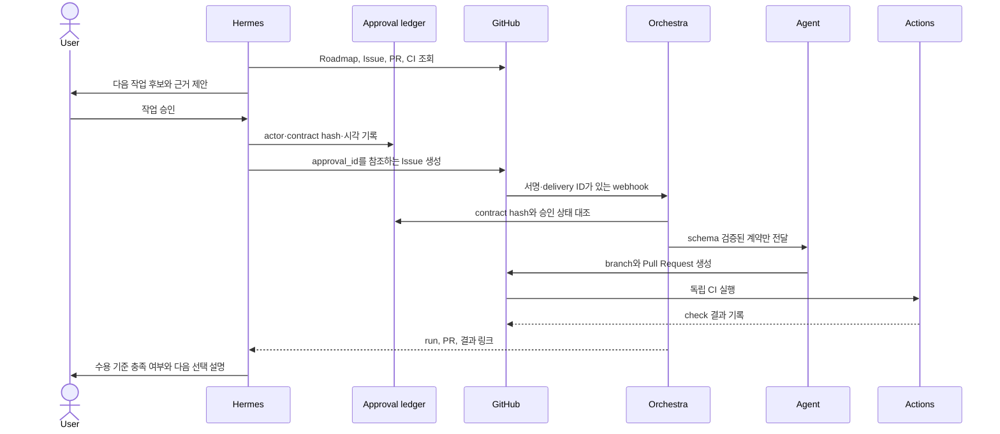

---

## 8. `law-rag`에 적용하면 무엇이 달라지는가

`law-rag`는 일반 웹 앱보다 오케스트레이션의 가치가 커질 수 있다. 코드 개발 외에 법령 수집, 정규화, 청킹, 임베딩, 색인, retrieval 평가, answer 평가, 배포 승인이 연결되기 때문이다.

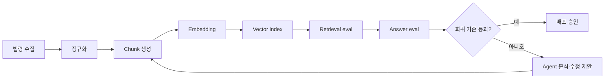

여기서는 세 종류의 하니스를 구분한다.

| 하니스 | 입력 | 평가 기준 | 적합한 주체 |
|---|---|---|---|
| 코딩 하니스 | Issue, 저장소, 테스트 | 빌드·테스트·diff·리뷰 | Codex 또는 Orchestra Agent |
| 데이터 하니스 | 원천 데이터, schema, lineage | 완전성·신선도·중복·실패 복구 | Orchestra Pipeline |
| RAG 평가 하니스 | 질의셋, 정답·근거, 모델 응답 | recall, citation, groundedness, regression | 평가 코드 + Pipeline + 사람 승인 |

Hermes는 이 세 하니스를 직접 대체하지 않는다. 결과를 함께 읽고 "검색 정확도 회귀를 먼저 고칠지, 새 기능을 진행할지"를 사용자와 결정하는 계층으로 둔다.

현재 [yjs000/law-rag](https://github.com/yjs000/law-rag)은 관련 구현 프로젝트로 연결한다. 다만 이 글의 전체 참조 구조가 이미 구현됐다는 뜻은 아니다. 실제 적용 상태는 [루트 TODO](../../TODO.md)에서 `implemented / partial / proposed`로 검증해 기록한다.

---

## 9. 언제 무엇을 선택할까

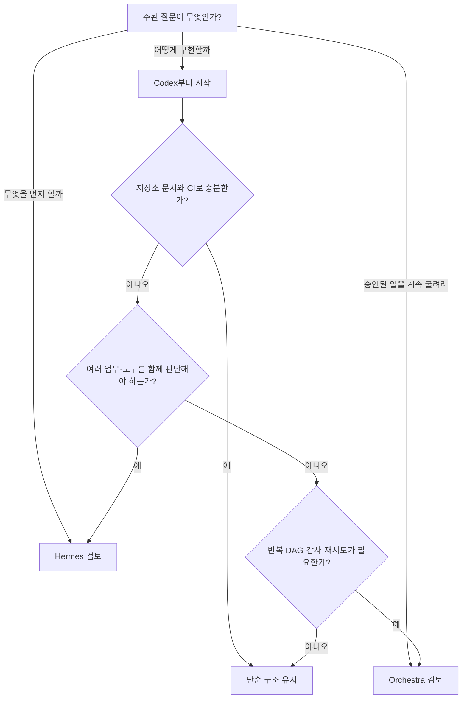

### 개인 사이드프로젝트

기본값은 Codex와 저장소 문서다.

- `ROADMAP.md`에 다음 목표와 완료 조건을 쓴다.
- 큰 작업만 `docs/exec-plans/active/`에 계획을 남긴다.
- Codex가 구현과 로컬 검증을 수행한다.
- GitHub Actions가 PR을 독립 검증한다.

Issue가 필요해지는 시점은 협업, 외부 요청, 병렬 작업, 장기 추적이 생길 때다. 프로젝트가 네 개라는 이유만으로 Hermes나 Orchestra가 필요한 것은 아니다. Codex의 프로젝트와 thread를 분리하면 충분할 수 있다.

### 개인이지만 작은 사업을 운영

개발 외의 정보가 우선순위에 영향을 주기 시작하면 Hermes를 추가한다.

- GitHub, 문서, 일정, 고객 문의, 지표를 함께 조회한다.
- Hermes가 후보를 제안하되 사용자가 승인한다.
- 제품, 마케팅, 운영은 서로 다른 Skill과 평가 양식을 사용한다.
- 코딩은 Codex에 맡긴다.

### 제품 전체를 운영하는 팀

제품 팀은 다음 조건에서 Hermes + Orchestra 구조의 이점을 얻는다.

- 여러 역할과 데이터 소스가 연결된다.
- 승인 기록과 감사가 필요하다.
- Agent 작업이 밤새 또는 정기적으로 실행된다.
- 실패한 단계만 재시도해야 한다.
- 비개발자도 실행 상태를 확인해야 한다.
- 코드, 데이터, 평가, 배포가 하나의 운영 흐름을 이룬다.

이 경우에도 하나의 범용 Hermes 프롬프트로 제품 설계, 마케팅, 코딩을 모두 처리하지 않는다. PM 하니스는 가설·고객 근거·우선순위를, 마케팅 하니스는 브랜드·채널·실험 지표를, 코딩 하니스는 테스트·정확성·유지보수성을 평가해야 한다.

### 도입하지 말아야 할 신호

- Pipeline을 그리기 위해 Pipeline을 만들고 있다.
- 같은 상태를 Issue, Hermes, Orchestra 세 곳에서 수동 갱신한다.
- 실패를 재현할 테스트 없이 재시도 횟수만 늘린다.
- Agent가 하나뿐인데 멀티에이전트 제어면부터 만든다.
- 제품 판단을 자동화했지만 근거 데이터와 평가 기준이 없다.
- 운영 도구를 유지하는 시간이 실제 제품 개발보다 길다.

---

## 10. 실패 복구는 "계속"이 아니라 상태 전이다

작업 상태는 자유로운 문자열보다 명시적 전이로 관리한다.

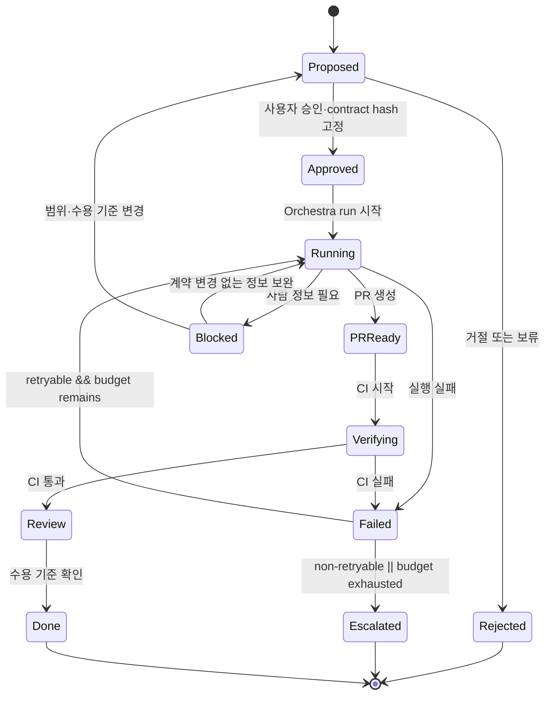

| 전이 | 소유자 | 중복 실행 방지 키 |
|---|---|---|
| Proposed → Approved | approval service | `approval_id + contract_hash` |
| Approved → Running | Orchestra trigger adapter | webhook `delivery_id` |
| Verifying → Failed | GitHub Actions callback | `workflow + head_sha + check_run_id` |
| Failed → Running | 실패를 소유한 한 계층 | `run_id + attempt` |
| PRReady → Verifying | GitHub Actions | `workflow + head_sha` |
| Review → Done | 수용 기준 검토자 | `issue + verified_head_sha` |

각 실패에는 원인, 마지막 성공 체크포인트, 재현 명령, 다음 행동이 있어야 한다.

```json
{
  "run_id": "orc_run_01J2...",
  "project_slug": "law-rag",
  "issue_number": 142,
  "state": "failed",
  "primary_failure_class": "code",
  "contributing_factors": [],
  "observed_at_layer": "github_actions",
  "owned_by": "coding_agent",
  "retryable": true,
  "last_successful_step": "pull_request_created",
  "evidence": {
    "pull_request": "<pull-request-url>",
    "check_run": "<check-run-url>",
    "verification_profile": "law-rag/pr-default",
    "verification_revision": "<full-commit-sha>",
    "failed_command_id": "api-search-tests"
  },
  "retry": {
    "owner": "coding_agent",
    "attempt": 1,
    "max_attempts": 3
  },
  "next_action": "실패한 schema compatibility 테스트를 입력으로 수정 실행"
}
```

Orchestra가 infrastructure timeout을 재시도하고, 코딩 Agent가 테스트 실패를 고치며, GitHub Actions가 같은 검증을 다시 수행하도록 책임을 나눈다. 모든 계층이 모든 실패를 재시도하면 중복 실행과 무한 루프가 생긴다.

---

## 11. 보안과 권한

에이전트의 자율성은 권한과 증거가 함께 커질 때만 확대한다.

아래 표는 각 제품의 기본 설정을 그대로 옮긴 것이 아니라, 이 글이 제안하는 최소 운영 정책이다.

| 위험 | 기본 정책 |
|---|---|
| 저장소 쓰기 | 작업 branch만 허용, 기본 branch 직접 쓰기 금지 |
| 외부 네트워크 | 기본 차단, 필요한 도메인만 승인 |
| secret | 에이전트 프롬프트에 직접 노출하지 않고 런타임 주입 |
| Issue 생성 | 사용자 승인과 fingerprint 필요 |
| 비신뢰 텍스트 | Issue·댓글·로그를 명령이 아닌 data로 취급하고 schema·길이 검증 |
| webhook | signature, delivery ID replay, repository·actor·label allowlist 검증 |
| PR merge | 필수 CI와 보호 규칙 통과 후 허용 |
| 배포 | 환경별 승인과 rollback 경로 필요 |
| 데이터 변경 | read/write 역할 분리, dry-run과 audit log 필요 |

공식 기능의 근거는 제품별로 구분한다. OpenAI는 [Codex App 소개의 보안 절](https://openai.com/index/introducing-the-codex-app/)에서 Codex App과 CLI가 시스템 수준 sandbox를 사용하고, 기본 작업 범위를 벗어나는 명령에는 권한을 요청한다고 설명한다. Orchestra는 [Runtime Overview](https://docs.getorchestra.io/docs/ai-agents/overview)에서 격리된 실행 계정, 런타임 자격 증명 주입, session·run·turn 감사 기록을 설명한다. Hermes는 [Tools Reference](https://hermes-agent.nousresearch.com/docs/reference/tools-reference)와 [Messaging 문서](https://hermes-agent.nousresearch.com/docs/user-guide/messaging/)에 나온 여러 도구와 채널을 연결하므로, 위 표와 같은 최소 권한·승인 경계는 운영자가 별도로 설계해야 한다.

Agent에는 한 작업과 한 저장소에만 유효한 단기 credential을 주고 기본 branch push, merge, secret 조회, 임의 egress를 차단한다. 자동화의 기본 종점은 PR 생성이다. Merge와 배포는 보호된 CI와 별도 승인 경계 뒤에 둔다.

"사람이 루프 안에 있다"는 문장만으로는 부족하다. 어떤 상태에서 누구에게 무엇을 보여주고 어떤 버튼이나 명령으로 승인하는지 구현되어야 한다.

---

## 12. 무엇을 배웠는가

### 12.1 모델 품질과 시스템 품질을 분리해야 한다

처음에는 Codex가 더 코딩을 잘하고 Hermes가 덜 잘한다고 느꼈다. 분석 뒤에는 질문이 바뀌었다. 같은 입력과 실행 환경이었는가? 같은 도구와 권한을 썼는가? 프로젝트 경계가 같았는가? 완료 전에 같은 검증을 수행했는가?

이 질문들은 모델에 대한 인상을 재현 가능한 실험으로 바꾼다.

### 12.2 장기 대화가 장기 실행 상태는 아니다

Discord 기록은 사람에게 유용하지만 실행 큐가 아니다. 메시지 압축, 세션 재시작, 다른 프로젝트 대화가 들어오면 작업 상태의 일관성을 보장하기 어렵다. 장기 실행은 Issue, Exec Plan, Pipeline Run, PR, CI 같은 외부 객체에 기대야 한다.

### 12.3 범용 에이전트 하나가 모든 전문가를 대체하지 않는다

Hermes는 여러 도구를 연결하고 다음 행동을 제안할 수 있다. 그렇다고 코딩, 제품 설계, 마케팅의 평가 함수가 같아지는 것은 아니다. 전문 하니스와 명확한 라우팅이 없으면 범용성은 컨텍스트 잡음이 된다.

### 12.4 오케스트레이션은 복잡성을 없애지 않고 위치를 바꾼다

Orchestra를 추가하면 Pipeline 상태, 감사 기록, 재시도와 관측을 얻는다. 대신 workspace, credential, pipeline schema, webhook, 실패 매핑을 운영해야 한다. 반복 가능한 단계가 충분히 많을 때만 이 교환이 이득이다.

### 12.5 가장 좋은 구조는 가장 적은 구조일 수 있다

개인 개발자에게 `ROADMAP.md → Codex → Test`가 충분하다면 그것이 좋은 하니스다. 하니스 엔지니어링은 거대한 플랫폼을 만드는 일이 아니라, 현재 실패를 막는 최소한의 환경과 피드백 루프를 만드는 일이다.

### 12.6 처리량이 늘면 가비지 컬렉션도 필요하다

OpenAI 사례는 Agent가 기존의 나쁜 패턴까지 빠르게 복제할 수 있음을 보여준다. 문서 드리프트, 중복 추상화, 오래된 계획, 불안정 테스트를 정기적으로 검사해야 한다. 빠른 생성만 자동화하고 정리를 자동화하지 않으면 기술 부채도 같은 속도로 늘어난다.

---

## 13. 한계와 검증이 남은 주장

이 문서는 공식 문서와 설계 분석을 바탕으로 한 참조 구조이지 성능 실험 결과가 아니다.

1. Codex App, CLI, Hermes의 체감 차이는 동일 조건 벤치마크로 검증하지 않았다.
2. Orchestra Runtime의 Agent 기능은 공식 문서상 Git 접근과 PR 생성 사례를 제공하지만, 일반 소프트웨어 제품의 전체 개발 수명주기를 자동화하는 범용 보장은 아니다.
3. `law-rag`에 제안된 전체 구조가 구현됐다고 주장하지 않는다.
4. 제품 설계·마케팅용 전문 하니스의 효과는 평가 데이터와 실제 운영 실험이 필요하다.
5. OpenAI Harness Engineering 사례의 처리량과 병합 정책은 특정 팀과 저장소의 결과다. 작은 팀이 같은 정책을 그대로 복제하면 안 된다.
6. 도구의 기능과 문서는 빠르게 바뀐다. `last_verified` 이후에는 공식 문서를 다시 확인해야 한다.

이 한계를 숨기지 않는 것이 학습 기록의 신뢰도를 높인다. 설계의 다음 단계는 더 큰 주장이 아니라 더 나은 실험이다.

---

## Related Projects

| 프로젝트 | 연결 목적 | 구현 상태 | 다음 증거 |
|---|---|---|---|
| [yjs000/law-rag](https://github.com/yjs000/law-rag) | RAG 개발·데이터·평가 하니스의 적용 대상 | 기존 프로젝트, 이 글의 전체 구조는 `proposed` | [`P0-BASELINE-001`](../../TODO.md) |
| Hermes 승인·Issue 브리지 | 제안·승인과 실행 계약의 분리 | `TODO`, 저장소 미정 | [`P2-APPROVAL-001`](../../TODO.md) |
| Orchestra Agent Pipeline | 승인된 계약의 실행·관측 파일럿 | `TODO`, 저장소 미정 | [`P3-PILOT-001`](../../TODO.md) |
| Codex/Hermes 비교 하니스 | 같은 조건에서 하니스 차이 측정 | `TODO`, 저장소 미정 | [`P0-BENCHMARK-001`](../../TODO.md) |

구현 저장소가 생기면 front matter의 `related_projects`, 이 표, 루트 README, TODO의 완료 증거를 함께 갱신한다. 실제 commit·PR·검증 결과가 없으면 `implemented`로 표시하지 않는다.

---

## 14. 다음 구현

실행 가능한 작업 목록은 [AI 에이전트 하니스 구현 TODO](../../TODO.md)에서 관리한다. 우선순위는 다음과 같다.

1. `law-rag` 현재 구조와 이 글의 Stage 모델 간 gap 분석
2. 같은 작업을 Codex App, CLI, Hermes에서 실행하는 통제 실험
3. GitHub Issue 작업 계약과 완료 증거 규약
4. Hermes의 제안 → 승인 → Issue 생성 최소 흐름
5. Orchestra Agent Pipeline의 제한된 파일럿
6. 코드·데이터·RAG 평가 하니스의 분리 측정

문서와 구현 저장소는 서로 연결하되 구현되지 않은 항목은 TODO로 표시한다. 설계 문서가 미래 완료 상태를 현재 사실처럼 말하지 않게 하기 위해서다.

---

## 참고 자료

### OpenAI와 Codex

- OpenAI, [하네스 엔지니어링: 에이전트 우선 세계에서 Codex 활용하기](https://openai.com/ko-KR/index/harness-engineering/)
- OpenAI, [Introducing the Codex app](https://openai.com/index/introducing-the-codex-app/)
- OpenAI Developers, [Codex CLI](https://developers.openai.com/codex/cli/)
- OpenAI Developers, [AGENTS.md guide](https://developers.openai.com/codex/guides/agents-md)
- OpenAI Cookbook, [Codex Exec Plans](https://cookbook.openai.com/articles/codex_exec_plans)

### Hermes Agent

- Nous Research, [Hermes Agent Documentation](https://hermes-agent.nousresearch.com/docs/)
- Nous Research, [Hermes Agent GitHub Repository](https://github.com/NousResearch/hermes-agent)
- Nous Research, [Tools Reference](https://hermes-agent.nousresearch.com/docs/reference/tools-reference)
- Nous Research, [Messaging Platforms](https://hermes-agent.nousresearch.com/docs/user-guide/messaging/)
- Nous Research, [Memory](https://hermes-agent.nousresearch.com/docs/user-guide/features/memory)
- Nous Research, [MCP](https://hermes-agent.nousresearch.com/docs/user-guide/features/mcp)
- Nous Research, [Delegation](https://hermes-agent.nousresearch.com/docs/user-guide/features/delegation)

### Orchestra

- Orchestra, [Quick Start](https://docs.getorchestra.io/docs/quick-start)
- Orchestra, [Runtime Overview](https://docs.getorchestra.io/docs/ai-agents/overview)
- Orchestra, [Agents](https://docs.getorchestra.io/docs/ai-agents/agents)
- Orchestra, [Pipelines](https://docs.getorchestra.io/docs/core-concepts/pipelines)
- Orchestra, [Tasks](https://docs.getorchestra.io/docs/core-concepts/tasks)
- Orchestra, [Pipeline Runs](https://docs.getorchestra.io/docs/core-concepts/pipelines/pipeline-runs)
- Orchestra, [Pipeline Version Control](https://docs.getorchestra.io/docs/core-concepts/pipelines/version-control)
- Orchestra, [Alerting](https://docs.getorchestra.io/docs/core-concepts/alerting)

### GitHub와 문서 구조

- GitHub Docs, [Understanding GitHub Actions](https://docs.github.com/en/actions/get-started/understand-github-actions)
- GitHub Docs, [Syntax for GitHub's form schema](https://docs.github.com/en/communities/using-templates-to-encourage-useful-issues-and-pull-requests/syntax-for-githubs-form-schema)
- matklad, [ARCHITECTURE.md](https://matklad.github.io/2021/02/06/ARCHITECTURE.md.html)

---

## 메타데이터 규격 설명

이 문서의 front matter는 공개 Wiki에서 검색, 검증, 리뷰, 구현 연결을 지원하기 위해 다음 그룹으로 나뉜다.

| 그룹 | 필드 | 목적 |
|---|---|---|
| 식별 | `title`, `description`, `summary`, `tags`, `keywords` | 검색과 문서 목록 표시 |
| 생명주기 | `status`, `status_scope`, `review_status`, `version`, `created`, `updated`, `last_verified` | 문서 완료·리뷰 상태와 정보 신선도를 구현 상태와 분리해 추적 |
| 책임 | `authors`, `reviewers`, `license`, `license_url` | 작성·검토·재사용 책임 명시 |
| 독자 | `difficulty`, `estimated_reading_time`, `prerequisites`, `target_audience` | 독자가 읽기 전 난이도 판단 |
| 경계 | `scope`, `out_of_scope`, `assumptions` | 문서가 주장하는 범위 제한 |
| 연결 | `related_documents`, `related_projects`, `implementation_status` | 이론을 TODO와 실제 구현에 연결 |
| 결정 | `decision_log` | 설계가 바뀐 이유와 시점 기록 |
| 근거와 유지관리 | `references`, `changelog`, `future_work` | 1차 출처, 변경 이력, 후속 구현 추적 |

모든 필드를 모든 문서에 강제할 필요는 없다. 최소 권장 필드는 `title`, `description`, `status`, `version`, `created`, `updated`, `authors`, `tags`, `last_verified`, `related_projects`다.
