# 모델보다 하니스: Codex, Hermes, Symphony로 살펴본 AI 작업 환경과 오케스트레이션

| 작성자 | 게시·수정일 | 읽는 시간 | 태그 |
|---|---|---|---|
| yjs000 | 게시 2026-07-20 · 수정 2026-07-23 | 약 24분 | Harness Engineering · AI Agents · Symphony |

좋은 모델만 고른다고 긴 작업이 끝까지 가는 것은 아니다. 모델이 읽을 지도, 사용할 도구, 이어받을 상태, 실패를 감지할 검사, 다시 시작할 위치를 함께 설계해야 한다.

## 목차

- [요약](#요약)
- [1. 출발점: 같은 모델인데 왜 다르게 일하지?](#1-출발점-같은-모델인데-왜-다르게-일하지)
- [2. 하니스 엔지니어링이란 무엇인가](#2-하니스-엔지니어링이란-무엇인가)
- [3. 같은 모델 이름이 같은 에이전트를 뜻하지 않는 이유](#3-같은-모델-이름이-같은-에이전트를-뜻하지-않는-이유)
- [4. 네 도구의 역할과 잘못 짚었던 이름](#4-네-도구의-역할과-잘못-짚었던-이름)
- [5. 공통점보다 중요한 차이: 다음 행동을 누가 결정하는가](#5-공통점보다-중요한-차이-다음-행동을-누가-결정하는가)
- [6. 관점이 바뀐 과정](#6-관점이-바뀐-과정)
- [7. 제품 팀용 참조 구조](#7-제품-팀용-참조-구조)
- [8. law-rag에 적용하면 무엇이 달라지는가](#8-law-rag에-적용하면-무엇이-달라지는가)
- [9. 언제 무엇을 선택할까](#9-언제-무엇을-선택할까)
- [10. 실패 복구는 계속이 아니라 상태 전이다](#10-실패-복구는-계속이-아니라-상태-전이다)
- [11. 보안과 권한](#11-보안과-권한)
- [12. 무엇을 배웠는가](#12-무엇을-배웠는가)
- [13. 한계와 검증이 남은 주장](#13-한계와-검증이-남은-주장)
- [Related Projects](#related-projects)
- [14. 다음 학습](#14-다음-학습)
- [참고 자료](#참고-자료)

## 요약

### 핵심 결론

GitHub Issue를 읽고 Codex가 코딩하도록 계속 배정하는 오픈소스 오케스트레이터의 이름은 **Orchestra가 아니라 OpenAI Symphony**다. 기존 글은 이 역할을 데이터·워크플로 플랫폼인 Orchestra에 잘못 연결했다.

```text
Codex는 저장소 안에서 구현하고 검증한다.
Hermes는 사용자와 대화하며 여러 도구·채널을 연결한다.
Symphony는 Issue를 읽고 격리된 작업공간에 Codex 실행을 배정·재시도한다.
GitHub Actions는 결과를 에이전트와 분리된 환경에서 다시 검사한다.
Orchestra는 별도의 상용 데이터·워크플로 및 AI Agent 제어면이다.
```

도구 선택은 기능 수보다 **누가 어떤 상태의 원본을 소유하는가**로 결정해야 한다.

| 필요한 일 | 먼저 선택할 도구 | 이유 |
|---|---|---|
| 저장소를 읽고 수정·테스트·PR 생성 | Codex | 코드와 검증 루프 사이의 거리가 짧다. |
| Discord에서 요구사항 정리, 조사, 승인, 알림 | Hermes | 대화·메모리·Skills·MCP·메시징 채널을 연결한다. |
| GitHub Issue를 계속 읽어 독립 작업으로 실행 | Symphony | tracker polling, 이슈별 workspace, 동시 실행, 재시도와 reconciliation을 담당한다. |
| PR의 독립 검증 | GitHub Actions | 코딩 에이전트의 자기평가와 분리된 결정론적 검사다. |
| 데이터 파이프라인과 조직용 Agent를 상용 제어면에서 운영 | Orchestra | serverless runtime, pipeline, credential, audit와 data-team integrations가 중심이다. |

### Symphony에서 공식적으로 확인한 경계

2026년 7월 23일 기준 공식 발표문, 저장소 README, `SPEC.md`, Elixir 참조 구현 문서에서 확인한 내용이다.

- **공식 기능:** Symphony는 issue tracker를 지속적으로 읽고 활성 이슈마다 격리된 workspace를 만들며 coding agent session을 실행하는 장기 실행 서비스다.
- **공식 기능:** 저장소의 `WORKFLOW.md`가 tracker, polling, workspace hook, 동시 실행 수, Codex App Server 설정과 이슈별 prompt를 정의한다.
- **공식 기능:** 언어 중립 사양과 Elixir 참조 구현이 공개되어 있다. 참조 구현에는 Linear, GitHub Issues, Jira Cloud, Asana, GitLab adapter가 포함된다.
- **공식 기능:** Codex를 `app-server` 모드로 실행하며, tracker 상태를 다시 읽어 중단·계속·재시도를 판단한다.
- **공식 경계:** Symphony는 일반 목적 workflow engine이나 distributed job scheduler가 아니다.
- **공식 경계:** 현재 scheduler state는 메모리에 있으며, 재시작 뒤에는 tracker와 보존된 workspace를 통해 유용한 작업을 복구한다. 실행 중 session과 retry timer가 그대로 복원되는 것은 아니다.
- **공식 경고:** 프로젝트는 trusted environment에서 시험하기 위한 engineering preview이고, Elixir 구현도 평가용 prototype이다. 자체 환경에 맞는 hardened implementation을 권장한다.

### 질문의 시작

처음 질문은 이랬다.

> Codex에서는 잘 이어지던 코딩이 왜 같은 OpenAI 계열 모델을 연결한 Hermes에서는 자주 끊길까?

관찰된 문제는 모델 이름보다 실행 환경에 가까웠다.

- **프로젝트 경계:** Discord의 한 대화에 여러 프로젝트 맥락이 섞였다.
- **다음 행동:** 하위 에이전트 결과를 받은 뒤 무엇을 이어서 할지 외부 상태에 없었다.
- **상태와 근거:** 진행 상황, 실패 원인, 검증 결과가 대화 안에만 남았다.
- **복구 위치:** 세션이 끝난 뒤 어느 단계에서 다시 시작해야 하는지 명시되지 않았다.

분석을 거치며 초점은 모델 비교에서 하니스와 오케스트레이션으로 이동했다. 이후 GitHub Issue 기반 코딩 오케스트레이터의 실제 이름이 Symphony라는 사실을 확인하면서 도구 경계도 다시 정정했다.

이 글은 제품을 구현했다는 보고서가 아니다. 공식 자료와 `law-rag`에서 Codex를 활용한 경험을 바탕으로 역할과 확장 순서를 정리한 학습 기록이다.

---

## 1. 출발점: "같은 모델인데 왜 다르게 일하지?"

"루프가 끊겼다"는 하나의 오류명이 아니다. 모델 호출 제한, tool timeout, 잘못된 작업 디렉터리, context compression, 위임 결과 대기, 완료 조건 부재가 모두 비슷한 사용자 경험을 만든다.

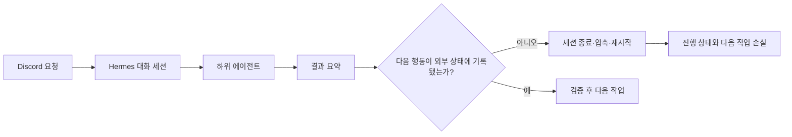

처음에는 더 긴 프롬프트와 더 강한 모델이 해결책처럼 보였다. 그러나 긴 지시는 현재 작업과 무관한 규칙까지 context를 차지하게 만들었다. 세션이 바뀌면 완료 상태도 다시 추정해야 했다.

### 실패를 분류하는 최소 표

| 분류 | 예시 | 고쳐야 하는 계층 | 복구 방식 |
|---|---|---|---|
| provider | 인증 만료, rate limit, 응답 파싱 실패 | 모델 연결 | backoff, 재인증, provider 전환 |
| harness | context 누락, 완료 기준 부재, 잘못된 도구 | 에이전트 실행 환경 | 지식·도구·검증 계약 보완 |
| tool | terminal timeout, 파일 권한, 잘못된 cwd | 도구 실행 | 환경 수정 후 같은 단계 재실행 |
| code | 테스트 실패, 타입 오류 | 구현 | 실패 로그를 입력으로 수정 반복 |
| verification | 빠진 테스트, 잘못된 성공 판정 | CI·리뷰 | 독립 검증 보완 |
| orchestration | 중복 dispatch, retry 폭주, 잘못된 상태 분기 | Symphony 등 조정 계층 | claim, reconciliation, retry 정책 수정 |
| infrastructure | worker 장애, 네트워크 단절, 저장 공간 부족 | 실행 인프라 | 인프라 복구 후 재배정 |

분류 기준은 오류가 발견된 위치가 아니라 **무엇을 고쳐야 해결되는가**다. GitHub Actions가 코드 결함을 정상적으로 발견했다면 주 원인은 `code`다. 검사 자체가 빠져 잘못된 성공을 냈다면 `verification`이다.

문제의 이름을 "Hermes가 덜 똑똑하다"에서 "어느 실행 계약이 끊겼는가"로 바꾸면 측정하고 고칠 수 있는 대상이 생긴다.

---

## 2. 하니스 엔지니어링이란 무엇인가

[OpenAI의 Harness Engineering](https://openai.com/ko-KR/index/harness-engineering/) 사례가 보여 주는 핵심은 에이전트가 실패할 때 모델에게 더 노력하라고 재촉하는 대신 환경과 피드백 루프를 개선해야 한다는 점이다.

> 하니스는 모델이 작업을 이해하고, 행동하고, 결과를 관측하고, 실패에서 복구하도록 만드는 실행 환경과 계약의 집합이다.

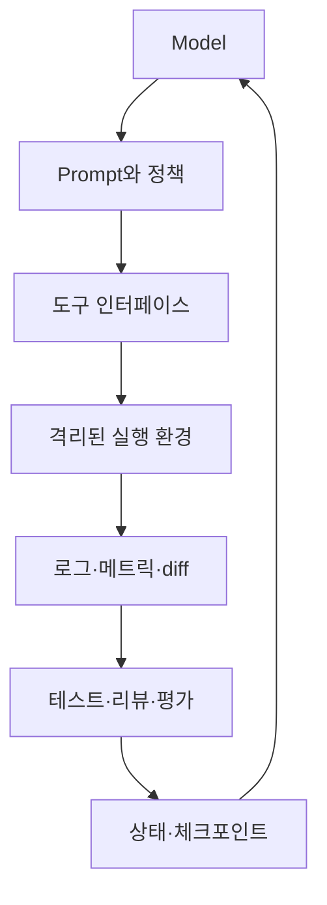

하니스는 프롬프트보다 넓다.

| 구성 요소 | 질문 | 산출물 예시 |
|---|---|---|
| 지식 | 무엇을 읽어야 하는가? | 짧은 `AGENTS.md`, `ARCHITECTURE.md`, ADR |
| 계획 | 현재 목표와 완료 조건은 무엇인가? | Issue, Exec Plan, Roadmap |
| 도구 | 무엇을 어떤 형식과 권한으로 실행하는가? | file, terminal, GitHub, browser |
| 격리 | 여러 실행이 충돌하지 않는가? | branch, worktree, per-issue workspace, sandbox |
| 관측 | 실제로 무슨 일이 일어났는가? | diff, log, screenshot, trace |
| 검증 | 완료를 무엇으로 증명하는가? | lint, test, eval, CI, review |
| 상태 | 중단 후 어디서 이어가는가? | tracker state, run state, checkpoint |
| 정책 | 언제 멈추고 사람에게 넘기는가? | approval, handoff state, 권한 경계 |
| 정리 | 드리프트를 어떻게 줄이는가? | doc gardening, 품질 검사, 리팩터링 |

### 긴 설명서 대신 지도를 준다

OpenAI 사례에서 `AGENTS.md`는 거대한 설명서가 아니라 약 100줄의 지도였다. 상세 지식은 버전 관리되는 `docs/`에 두고, 복잡한 작업은 진행 상황과 의사결정 기록을 가진 실행 계획으로 관리했다.

```text
repository/
├── AGENTS.md                 # 짧은 지도와 공통 작업 계약
├── ARCHITECTURE.md           # 시스템의 최상위 구조
├── WORKFLOW.md               # Symphony 실행 정책과 이슈별 prompt
├── docs/
│   ├── decisions/            # 설계 선택
│   ├── exec-plans/           # 복잡한 작업 계획
│   └── quality/              # 품질 기준과 기술 부채
├── scripts/                  # 에이전트가 직접 실행할 검사
└── .github/workflows/        # 독립 CI
```

이 구조의 목적은 문서를 많이 만드는 것이 아니다. 에이전트가 작은 시작점에서 현재 작업에 필요한 정보로 이동하게 하는 것이다.

### 자연어 규칙을 기계적 검사로 올린다

"계층을 지켜라"는 문장보다 금지된 의존성을 실패시키는 구조 테스트가 강하다. "출처를 표시하라"는 문장보다 citation field가 빠지면 실패하는 schema test가 강하다. 자연어는 방향을 설명하고 CI는 중요한 불변 조건을 강제한다.

---

## 3. 같은 모델 이름이 같은 에이전트를 뜻하지 않는 이유

모델은 하니스의 한 부품이다. 같은 모델을 사용해도 system prompt, tool schema, execution environment, context, permission, 종료 기준이 다르면 행동도 달라진다.

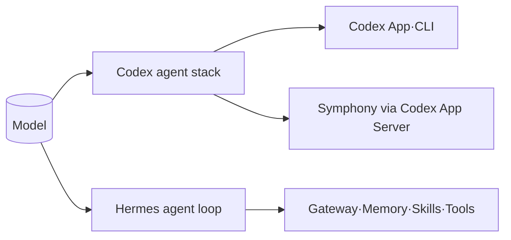

### Codex App과 CLI

[Codex App 소개](https://openai.com/index/introducing-the-codex-app/)와 [Codex CLI 문서](https://developers.openai.com/codex/cli/)에서 확인되는 제품 경계다.

- **Codex App:** project별 thread, 내장 worktree, diff review, 병렬 agent 감독을 하나의 작업장으로 묶는다.
- **Codex CLI:** terminal에서 저장소 탐색, 수정, 명령 실행, 검증을 수행한다.
- **Skills:** 지시, resource, script를 묶어 팀의 workflow를 재사용한다.
- **Automations:** 일정에 따라 반복 작업을 수행하고 결과를 review queue로 보낸다.

### Hermes

[Hermes 공식 문서](https://hermes-agent.nousresearch.com/docs/)에서 확인되는 범위다.

- 다양한 model/provider를 같은 agent runtime에 연결한다.
- CLI와 Discord, Telegram 등 messaging gateway에서 같은 agent를 사용한다.
- tools, Skills, memory, MCP, cron, delegation, Kanban, webhook으로 범용 작업을 확장한다.
- local, Docker, SSH, serverless backend 등 실행 환경을 선택할 수 있다.

Hermes에 OpenAI 계열 모델을 연결해도 Codex App의 project, thread, worktree, review UI가 자동으로 따라오지 않는다. 반대로 Codex App에 Hermes의 사용자 memory, messaging gateway와 provider routing이 그대로 들어오는 것도 아니다.

### Symphony

Symphony는 별도 foundation model이 아니다. Codex App Server를 coding agent 실행 엔진으로 사용하고, issue tracker와 workspace를 연결하는 scheduler/runner다.

```text
Issue tracker
→ Symphony poll·claim·dispatch
→ 이슈별 workspace
→ Codex App Server thread·turn
→ tracker 상태 재확인
→ 계속·중단·재시도·handoff
```

따라서 "같은 Codex를 쓴다"고 해도 interactive Codex와 Symphony가 만드는 작업 경험은 다르다. 전자는 사람이 thread를 직접 감독하고, 후자는 issue 상태와 `WORKFLOW.md`를 기준으로 unattended run을 계속 배정한다.

### 비교 실험에서 고정할 것

다음은 **설계 예시**이며 특정 제품의 공식 benchmark가 아니다.

```text
같은 commit
+ 같은 Issue 본문과 acceptance criteria
+ 같은 AGENTS.md와 검증 명령
+ 같은 모델·reasoning 설정
+ 같은 network·filesystem 권한
+ 같은 시간·비용 상한
```

그 뒤 completion rate, tool error, retry, elapsed time, test pass, human intervention, diff review를 비교해야 한다. 이 실험 전에는 "어느 앱이 더 똑똑하다"를 제품 사실로 단정할 수 없다.

---

## 4. 네 도구의 역할과 잘못 짚었던 이름

### 4.1 Codex: 구현과 검증에 가까운 코딩 에이전트

Codex의 강점은 저장소 탐색부터 수정, 테스트, diff 검토까지의 거리가 짧다는 점이다.

```text
요구사항 → 저장소 탐색 → 재현 → 수정 → 테스트 → diff·PR → 피드백 반영
```

- **적합:** 기능 구현, bug fix, refactoring, test 추가, PR review 대응
- **확장:** `AGENTS.md`, Skills, Exec Plan, repository script, CI
- **경계:** 조직의 모든 Issue를 장기 polling하고 run을 재배정하는 외부 scheduler는 Codex 자체의 중심 역할과 다르다.

### 4.2 Hermes: 사용자 접점과 여러 시스템을 연결하는 범용 에이전트

Hermes는 특정 저장소 안의 코딩만이 아니라 대화와 여러 도구를 연결한다.

```text
Discord 질문
→ 관련 대화·memory·문서 조회
→ GitHub Issue·PR·CI 확인
→ 다음 작업 후보와 근거 제안
→ 사용자 결정
→ Issue 생성·수정 또는 Symphony 상태 조회
```

- **적합:** Discord 기반 intake, 조사, 문서 작성, 여러 서비스 조회, 승인 대화, 알림
- **확장:** Skills로 역할별 절차를 분리하고 MCP·plugin·webhook으로 외부 서비스를 연결한다.
- **경계:** Symphony가 실행 중인 Issue의 claim·retry·running 상태를 Hermes가 따로 소유하면 이중 상태가 된다.

Hermes의 Cron, Delegation, persistent goal, Kanban도 작업을 이어가는 기능이다. 그러나 Symphony와 같은 도구인지 판단하려면 기능명이 아니라 상태 단위를 봐야 한다. Hermes는 session, delegated task, cron job, Kanban task를 다루고, Symphony는 tracker issue와 per-issue Codex run을 직접 연결한다.

### 4.3 Symphony: Issue를 Codex 실행으로 바꾸는 최소 오케스트레이션 계층

OpenAI는 Symphony를 project management board를 coding agent의 control plane으로 바꾸는 agent orchestrator로 설명한다.

주요 흐름은 다음과 같다.

1. configured tracker에서 active issue를 polling한다.
2. label, state, provider별 dispatch 조건과 concurrency를 검사한다.
3. issue마다 결정적인 workspace 경로를 만들거나 재사용한다.
4. `WORKFLOW.md`의 issue prompt를 render한다.
5. workspace 안에서 Codex App Server를 실행한다.
6. agent event와 tracker state를 관측한다.
7. crash, timeout, stall을 retry queue로 보낸다.
8. issue가 terminal 또는 비활성 상태가 되면 실행을 중단하고 필요한 경우 workspace를 정리한다.

Symphony의 강점은 거대한 workflow platform이 아니라 이 좁은 문제에 있다.

- **적합:** 명확한 Issue가 계속 들어오고, unattended coding run을 여러 개 실행해야 하는 저장소
- **확장:** tracker adapter, `WORKFLOW.md`, workspace hook, Codex dynamic tool, optional dashboard/API, 실행 host
- **경계:** business workflow 전체, 데이터 DAG, 강한 durable scheduler를 자동으로 제공하지 않는다.
- **운영 주의:** reference implementation은 preview이며 scheduler state가 in-memory다. trusted environment 밖에서는 sandbox와 credential 경계를 강화해야 한다.

### 4.4 Orchestra: 이름이 비슷하지만 다른 제품

여기서 Orchestra는 [getOrchestra의 Orchestra Runtime](https://docs.getorchestra.io/docs/ai-agents/overview)을 뜻한다. 공식 문서는 이를 AI Agent를 build, run, monitor하는 serverless control plane으로 설명하며, data pipeline과 business operation integration이 강하다.

- **Runtime:** sandboxed, on-demand Agent 실행 인프라
- **Agent Builder와 Orchestrator:** Agent 정의와 pipeline 안의 실행
- **Agent Context:** workflow와 metadata를 이용한 context graph
- **운영:** credential, audit, monitoring, serverless execution
- **중심 사례:** pipeline autofix, pipeline build·optimize, company brain, token spend

Orchestra도 Agent와 Git을 다룰 수 있으므로 기존 글에서 GitHub Issue 기반 coding orchestrator로 오인하기 쉬웠다. 하지만 사용자가 말한 "GitHub Issue를 보고 model이 코딩하는 것"과 직접 대응하는 OpenAI 오픈소스 프로젝트는 Symphony다.

### 4.5 한 표로 비교

아래의 공식 기능은 각 문서에서 확인했고, 추천 용도와 위험은 이 글의 설계 해석이다.

| 기준 | Codex | Hermes | Symphony | Orchestra |
|---|---|---|---|---|
| 중심 객체 | repository task, thread, diff | conversation, tool call, memory, delegated task | tracker issue, workspace, Codex run | Agent, session, pipeline task/run |
| 주된 사용자 접점 | App, CLI, IDE | CLI, Discord 등 messaging | issue tracker와 status surface | Web UI, pipeline, integrations |
| 실행 엔진 | Codex agent stack | provider-agnostic Hermes agent loop | Codex App Server | Orchestra Runtime의 model-agnostic Agent harness |
| 강한 영역 | 구현·테스트·PR 반복 | 대화형 판단과 여러 도구 연결 | Issue polling, 격리, 동시 dispatch, retry | 데이터·업무 pipeline, governance, serverless 운영 |
| 상태의 기준 | thread와 repository state | session·memory·job·task | tracker state + orchestrator in-memory state + workspace | persisted session·run·pipeline state |
| 확장 단위 | Skills, rules, scripts, MCP | Skills, tools, MCP, plugins, webhooks | `WORKFLOW.md`, adapter, hook, App Server tool | integrations, Agent, Skills, Pipeline |
| 기본 추천 | 코딩의 첫 선택 | 여러 업무·채널을 연결할 때 | Issue 기반 unattended coding이 필요할 때 | 조직의 데이터·업무 pipeline 제어면이 필요할 때 |
| 대표 위험 | interactive session 감독 부담 | context 혼합과 역할 과다 | preview, trust boundary, in-memory scheduler state | 단순 coding loop에 과한 상용 제어면 |

---

## 5. 공통점보다 중요한 차이: 다음 행동을 누가 결정하는가

기능표보다 다음 행동의 근거를 보면 경계가 선명해진다.

| 도구 | 다음 행동을 결정하는 주된 근거 | 멈추거나 넘기는 기준 |
|---|---|---|
| Codex | user prompt, repository state, tool result | turn 종료, 완료 보고, 권한·정보 요청 |
| Hermes | user intent, conversation, memory, tool result | 사용자 응답, tool result, agent 정책 |
| Symphony | tracker issue eligibility, claim, `WORKFLOW.md`, agent event, tracker state | terminal·inactive state, blocked handoff, timeout·retry |
| Orchestra | Pipeline DAG, trigger, Agent 판단, organization policy | task/run 상태와 pipeline 조건 |
| GitHub Actions | event와 workflow definition | job·step 결과 |

### 결정론과 비결정론을 분리한다

LLM은 모호한 요구사항을 해석하고 낯선 코드를 탐색하는 데 강하다. CI command, branch protection, label allowlist, concurrency limit은 시스템이 강제해야 한다.

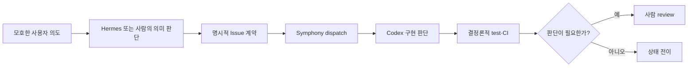

좋은 구조는 LLM을 제거하지 않는다. LLM이 잘하는 해석과 탐색, 시스템이 강제할 상태와 검증을 나눈다.

### Codex App과 Symphony의 차이

둘 다 Codex를 사용하지만 감독 단위가 다르다.

| 기준 | Codex App 중심 | Symphony 중심 |
|---|---|---|
| 시작 | 사람이 project와 thread에서 요청 | tracker의 eligible Issue를 polling |
| 격리 | 내장 worktree와 thread | Issue별 workspace와 Codex App Server process |
| 감독 | 사람이 여러 thread를 직접 확인 | issue state와 observability surface를 상위에서 확인 |
| 반복 | 사람이 후속 지시 또는 Automation | worker continuation, retry, tracker reconciliation |
| 적합 | 모호하거나 상호작용이 많은 작업 | 계약이 명확한 반복 구현 작업 |
| 비용 | 사람의 context switching | daemon, tracker workflow, workspace·secret 운영 |

모든 작업을 Symphony로 보내면 오히려 손해다. 공식 발표도 모호한 문제나 강한 전문 판단이 필요한 작업은 interactive Codex가 더 적합하다고 설명한다.

---

## 6. 관점이 바뀐 과정

### Stage 1 — Codex와 저장소 문서

개인 프로젝트의 기본값이다.

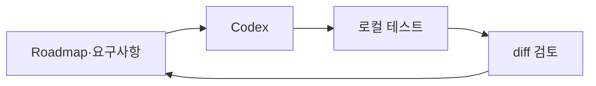

작업 하나를 사용자가 직접 시작하고 끝까지 확인할 수 있다면 별도 오케스트레이터는 필요하지 않다.

### Stage 2 — Codex, GitHub Issue, PR, Actions

협업과 독립 검증이 필요하면 GitHub 객체를 추가한다.

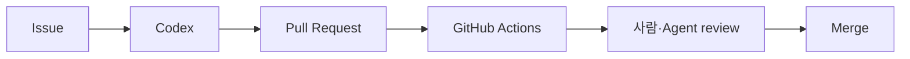

GitHub는 계약과 변경 이력을, Actions는 독립 검증을 맡는다. 이 단계까지는 사용자가 Codex run을 직접 시작한다.

### Stage 3 — Symphony로 Issue 실행 자동화

Issue가 쌓이고 여러 Codex session을 직접 감독하는 일이 병목이 될 때 Symphony를 추가한다.

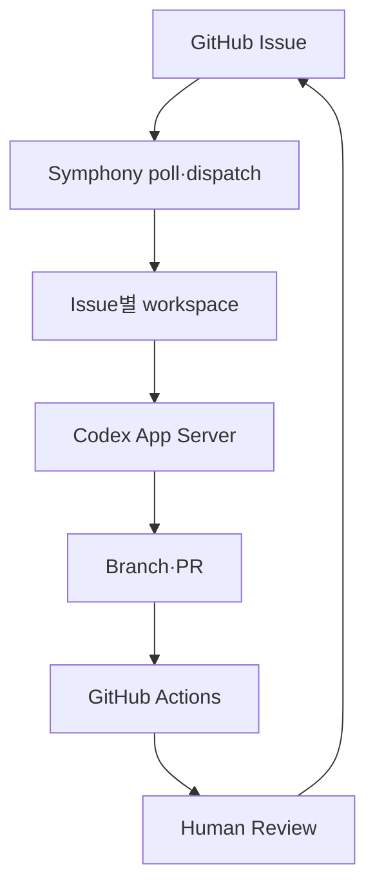

Symphony는 GitHub Issues adapter를 통해 repository Issue를 읽을 수 있다. 하지만 GitHub의 단순 `open/closed`만으로 실제 개발 workflow를 충분히 표현할지는 별도 설계 문제다. label, project field, handoff convention 중 무엇을 상태로 삼을지 파일럿에서 검증해야 한다.

### Stage 4 — Hermes를 intake·판단·설명 계층으로 추가

Discord에서 요청을 받고 여러 프로젝트와 문서를 함께 판단해야 하면 Hermes를 추가한다.

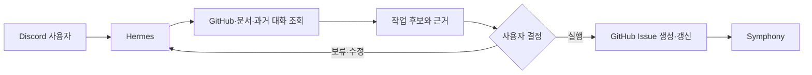

Hermes는 Symphony worker를 흉내 내지 않는다. 요구사항을 구조화하고 중복 Issue를 확인하며, 사용자가 실행하기로 한 일을 tracker에 반영하고 결과를 설명한다.

### Stage 5 — 필요한 경우에만 Orchestra 또는 다른 workflow engine

코딩 Issue가 아니라 데이터 수집, 정규화, batch evaluation, 배포 승인 등 결정론적 DAG가 중요해지면 별도의 workflow engine을 검토한다. Orchestra는 이 단계의 후보 중 하나다.

```text
Symphony: 어떤 coding Issue에 Codex를 배정할까?
Workflow engine: 어떤 데이터·평가·배포 단계를 어떤 순서로 실행할까?
```

두 문제를 하나의 상태 머신에 억지로 합치지 않는다.

### 계층별 확장 기준

| 단계 | 새로 얻는 것 | 새로 부담하는 것 | 다음 단계로 넘어갈 조건 |
|---|---|---|---|
| Codex + repository docs | 가장 짧은 구현 loop | 사람이 실행과 우선순위 관리 | 협업·독립 검증 필요 |
| + GitHub + Actions | Issue·PR·CI 이력 | template와 branch rule 관리 | session 감독이 병목 |
| + Symphony | Issue 자동 dispatch, workspace 격리, retry | daemon, tracker state, credential, observability | 여러 업무·채널의 판단 필요 |
| + Hermes | Discord intake, 조사, 승인 대화, 결과 설명 | project routing과 role별 Skill | 데이터·업무 DAG 필요 |
| + workflow engine | 반복 pipeline과 운영 제어 | 또 하나의 상태·credential·운영면 | 실제 편익이 복잡도를 초과할 때 |

앞 단계에서 실제 병목을 측정하기 전에 다음 계층을 추가하지 않는다.

---

## 7. 제품 팀용 참조 구조

이 절은 **추천 설계**다. 공식 제품이 이 구조를 그대로 제공한다고 주장하지 않는다. schema와 flow는 학습을 위한 참조 구조이며 실제 프로젝트 진행 상태가 아니다.

### 7.1 유일한 상태 소유자

| 정보 | 유일한 원본 | 다른 시스템의 역할 |
|---|---|---|
| 작업 요구사항·수용 기준 | GitHub Issue | Hermes는 작성·요약, Symphony는 읽기 |
| 사용자 결정 | GitHub Issue 상태·label 또는 별도 approval 기록 | Discord 메시지는 근거가 될 수 있지만 실행 상태 원본은 아님 |
| dispatch·retry·running | Symphony orchestrator | Hermes는 조회해 보여주기만 함 |
| Agent 대화·tool event | Codex thread와 Symphony log | Issue에는 필요한 handoff만 투영 |
| 코드 변경 | branch와 PR | 다른 시스템은 URL과 SHA 참조 |
| 독립 검증 | GitHub Actions check | Agent의 로컬 test는 사전 증거 |
| 제품 우선순위 | Roadmap 또는 product tracker | 실행 상태와 분리 |
| 데이터 pipeline run | 선택한 workflow engine | coding Issue 상태와 분리 |

같은 `running`, `retrying`, `done`을 Hermes와 Symphony가 동시에 소유하면 장애 시 어느 쪽을 믿어야 할지 알 수 없다.

### 7.2 Issue를 실행 가능한 계약으로 만든다

좋은 Issue는 Agent가 범위와 검증을 추측하지 않게 한다.

```text
Goal
- 검색 결과에 법령 출처와 시행일을 표시한다.

Background
- 사용자가 결과의 최신성과 근거를 판단하기 어렵다.

In scope
- API 응답에 source_url과 effective_date 추가
- 결과 카드에 두 필드 표시
- API와 UI 회귀 test 추가

Out of scope
- ranking algorithm 변경
- 관리자 page 개편

Acceptance criteria
- 모든 검색 결과에 source_url이 존재
- effective_date가 없으면 명시적인 fallback 표시
- repository가 신뢰하는 검증 profile 통과
```

Issue body, comment, repository 문서는 외부 입력일 수 있다. 자유 형식의 shell command를 그대로 실행 정책으로 사용하지 않는다. 저장소가 version 관리하는 script나 고정 verification profile을 호출한다.

### 7.3 Symphony의 공식 확장 지점

Symphony를 확장할 때 core scheduler를 크게 바꾸기 전에 공식 경계를 사용한다.

#### `WORKFLOW.md`

- tracker kind와 provider scope
- required label과 active·terminal state
- polling interval
- workspace root
- lifecycle hook
- global·state별 concurrency
- Codex command, timeout, sandbox·approval policy
- issue와 attempt를 받는 prompt template

#### Tracker adapter

현재 Elixir 참조 구현은 Linear, GitHub Issues, Jira Cloud, Asana, GitLab을 포함한다. 다른 tracker가 필요하면 read kernel과 provider-native tool을 adapter로 추가한다.

- candidate issue fetch
- issue ID refresh와 normalization
- provider별 dispatchability 판단
- host-side authentication
- 필요한 경우 agent에 제공할 provider-native tool

#### Workspace hook

- `after_create`: clone과 최초 dependency setup
- `before_run`: run 전 동기화·준비
- `after_run`: 결과 정리와 best-effort 기록
- `before_remove`: workspace 삭제 전 정리

Hook은 arbitrary shell이므로 trusted repository config로 취급하고 timeout, output 제한, secret 접근을 통제한다.

#### Codex App Server와 dynamic tool

Symphony는 Codex App Server protocol을 사용한다. tracker tool을 host process에서 실행하면 child process에 raw tracker token을 넘기지 않을 수 있다. protocol field는 Symphony 글을 보고 추측하지 않고 대상 Codex version의 generated schema와 App Server 문서를 기준으로 구현한다.

#### Observability surface

SPEC은 structured log를 최소 조건으로 두고, 참조 구현은 선택적인 dashboard와 JSON API를 제공한다. 상태 화면은 orchestrator state의 projection이어야 하며 scheduler의 별도 상태 원본이 되어서는 안 된다.

### 7.4 GitHub Issue 기반 최소 파일럿

처음부터 모든 repository와 Issue를 연결하지 않는다.

1. scratch 또는 작은 repository 하나를 선택한다.
2. `tracker.kind: github`의 공식 adapter 범위와 token 권한을 확인한다.
3. `required_labels`에 전용 label을 사용해 자동 dispatch 대상을 제한한다.
4. 최대 동시 Agent 수를 1로 시작한다.
5. Issue별 workspace가 source repository와 분리됐는지 확인한다.
6. Codex sandbox를 `workspace-write` 수준에서 시작한다.
7. 자동 merge와 production deploy를 제외한다.
8. PR 생성과 CI 통과까지만 자동화한다.
9. crash, timeout, restart, Issue close를 의도적으로 시험한다.
10. 운영 증거가 쌓인 뒤 동시 실행 수와 repository 범위를 늘린다.

### 7.5 Hermes와 Symphony 연결 방법

Hermes가 Symphony 내부 scheduler를 직접 조종하기보다 tracker와 status surface를 통해 느슨하게 연결한다.

```text
Discord 요청
→ Hermes가 project·중복 Issue·요구사항 확인
→ 사용자와 실행 범위 결정
→ GitHub Issue 생성 또는 label 적용
→ Symphony가 공식 GitHub adapter로 polling
→ Codex가 branch·PR·검증 수행
→ GitHub Actions 결과 기록
→ Hermes가 Issue·PR·CI·Symphony 상태를 읽어 사용자에게 설명
```

- **추천:** tracker를 실행 계약의 경계로 사용한다.
- **추천:** Hermes의 GitHub tool은 Issue 생성·조회와 결과 설명에 제한한다.
- **추천:** Symphony의 optional API를 연결할 때는 read-only 상태 조회부터 시작한다.
- **비추천:** Hermes가 Symphony process의 in-memory state를 복제한다.
- **비추천:** 같은 Issue를 Hermes Kanban worker와 Symphony가 동시에 claim한다.

### 7.6 독립 CI

Agent가 로컬 test를 실행해도 보호된 CI에서 같은 핵심 검증을 다시 수행한다.

- PR event에서 실행한다.
- default permission은 read로 시작한다.
- action version을 고정하고 정기적으로 갱신한다.
- fork와 untrusted code에는 secret과 write permission을 주지 않는다.
- merge와 deploy는 Symphony run 성공이 아니라 required check와 repository rule로 보호한다.

---

## 8. `law-rag`에 적용하면 무엇이 달라지는가

`law-rag`에는 coding workflow와 data·evaluation workflow가 함께 있다. 둘을 같은 오케스트레이터 문제로 보지 않는다.

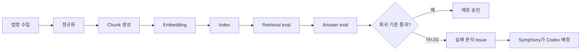

### 세 종류의 하니스

| 하니스 | 입력 | 평가 기준 | 적합한 주체 |
|---|---|---|---|
| 코딩 하니스 | Issue, repository, test | build·test·diff·review | Codex + Symphony |
| 데이터 하니스 | 원천 법령, schema, lineage | 완전성·신선도·중복·복구 | script·CI·필요 시 workflow engine |
| RAG 평가 하니스 | 질의셋, 정답 근거, 응답 | recall, citation, groundedness, regression | 평가 코드 + CI + 사람 판단 |

Hermes는 이 세 하니스를 대신하지 않는다. Discord에서 결과를 읽고 "검색 회귀를 먼저 고칠지 새 기능을 진행할지"를 사용자와 판단한다.

### 단계별 적용

#### 1단계 — Codex와 평가 가능한 repository

- 짧은 `AGENTS.md`와 architecture map
- 법령 fixture와 deterministic parser test
- retrieval 평가셋
- answer citation 검사
- 한 명령으로 실행되는 lint·test·eval

이 기반이 없으면 Symphony는 실패를 더 빠르게 반복할 뿐이다.

#### 2단계 — GitHub Issue와 PR 계약

- Issue에 goal, scope, out-of-scope, acceptance criteria
- PR에 issue 연결과 validation evidence
- Actions에서 parser, API, retrieval regression 검사
- human review 전 required check

#### 3단계 — Symphony 파일럿

- `symphony` 같은 전용 label이 있는 Issue만 dispatch
- 동시 실행 1개
- workspace hook으로 repository clone과 dependency bootstrap
- Codex가 PR을 만들고 CI feedback을 처리하도록 `WORKFLOW.md`에 handoff 규칙 기록
- merge는 사람이 결정

#### 4단계 — Hermes 연결

- Discord 요구사항을 바로 실행하지 않고 Issue 후보로 구조화
- 기존 Roadmap·Issue·PR 중복 확인
- 사용자가 승인한 작업만 label 또는 active 상태로 이동
- run, PR, CI 결과를 요약하지 말고 acceptance criteria별로 설명

#### 5단계 — 데이터 pipeline 분리

법령 수집과 index rebuild가 정기 실행·부분 재시도·lineage를 요구하면 Orchestra, GitHub Actions, Prefect 등 별도의 workflow 후보를 평가한다. 선택 기준은 제품명이 아니라 다음과 같다.

- 단계별 재시도와 artifact 보존이 필요한가?
- data lineage와 credential 관리가 필요한가?
- 사람이 아닌 schedule·event가 시작하는가?
- coding Agent 판단 없이 결정론적으로 실행할 수 있는가?

현재 관련 프로젝트는 [yjs000/law-rag](https://github.com/yjs000/law-rag)이다. 프로젝트 진행에 Codex를 활용했지만 Symphony와 Hermes를 함께 적용해 검증한 것은 아니다.

---

## 9. 언제 무엇을 선택할까

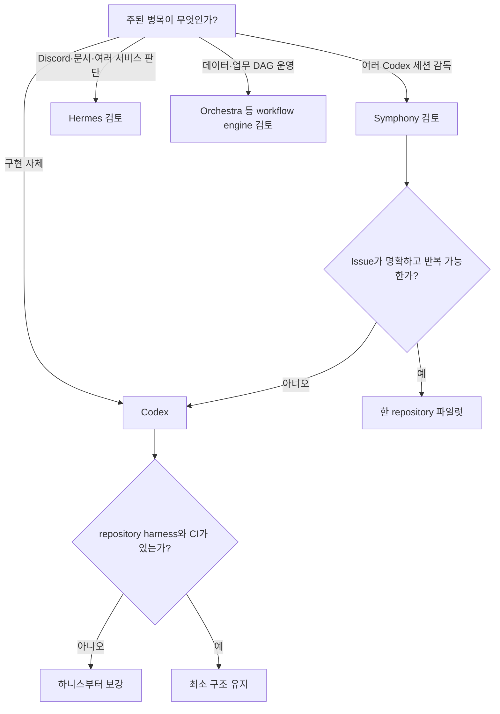

### 개인 사이드프로젝트

기본값은 Codex와 저장소 문서다. Issue가 없어도 사용자가 직접 한 작업을 관리할 수 있다면 더 단순한 구조가 낫다.

### 여러 코딩 작업을 병렬로 관리

먼저 Codex App의 project, thread, worktree가 충분한지 본다. 사람이 여러 session을 감시하는 시간이 병목이고 Issue가 충분히 명확할 때 Symphony를 검토한다.

### Discord에서 여러 업무를 운영

개발 외에 문서, 일정, 고객 문의와 과거 대화가 우선순위에 영향을 주면 Hermes를 추가한다. 코딩 실행 상태는 Symphony나 GitHub에서 읽고, Hermes가 별도로 다시 만들지 않는다.

### 데이터·업무 pipeline을 운영하는 팀

Orchestra 같은 workflow control plane은 다음 조건에서 검토할 수 있다.

- data integration과 pipeline이 중심이다.
- 조직별 credential과 audit가 필요하다.
- serverless Agent execution과 기존 pipeline 결합이 필요하다.
- 상용 플랫폼의 운영 비용을 감수할 이유가 있다.

### Symphony를 도입하지 말아야 할 신호

- Issue가 한두 개뿐이고 사용자가 Codex를 직접 시작하는 것이 더 빠르다.
- repository에 test와 명확한 acceptance criteria가 없다.
- 모호한 연구 문제까지 unattended run으로 넘기려 한다.
- reference implementation을 production-grade durable scheduler로 간주한다.
- Issue tracker 입력을 모두 신뢰한다.
- 자동 merge와 넓은 token 권한부터 켜려 한다.
- Hermes Kanban과 Symphony가 같은 작업을 동시에 dispatch한다.

---

## 10. 실패 복구는 "계속"이 아니라 상태 전이다

"끝날 때까지 계속"은 운영 정책이 아니다. claim, run, retry, handoff와 종료 조건이 필요하다.

### Symphony의 공식 runtime 개념

Symphony 내부 orchestration state와 tracker state는 같은 것이 아니다.

```text
Tracker state: open, active, review, done 등 업무 상태
Runtime state: unclaimed, claimed, running, retry queued, released
```

- orchestrator 한 곳만 scheduling state를 변경한다.
- poll tick마다 running issue를 reconciliation한 뒤 새 dispatch를 검토한다.
- crash와 agent error는 exponential backoff retry로 전환한다.
- stall timeout은 worker를 종료하고 retry를 예약한다.
- terminal issue는 실행을 중단하고 workspace를 정리할 수 있다.
- 재시작 시 tracker와 filesystem에서 다시 작업을 찾지만 live session과 retry timer를 그대로 복원하지 않는다.

### 제품 팀에서 추가로 정할 handoff

다음은 **추천 상태 예시**다. GitHub adapter가 이 상태를 기본 제공한다는 뜻이 아니다.

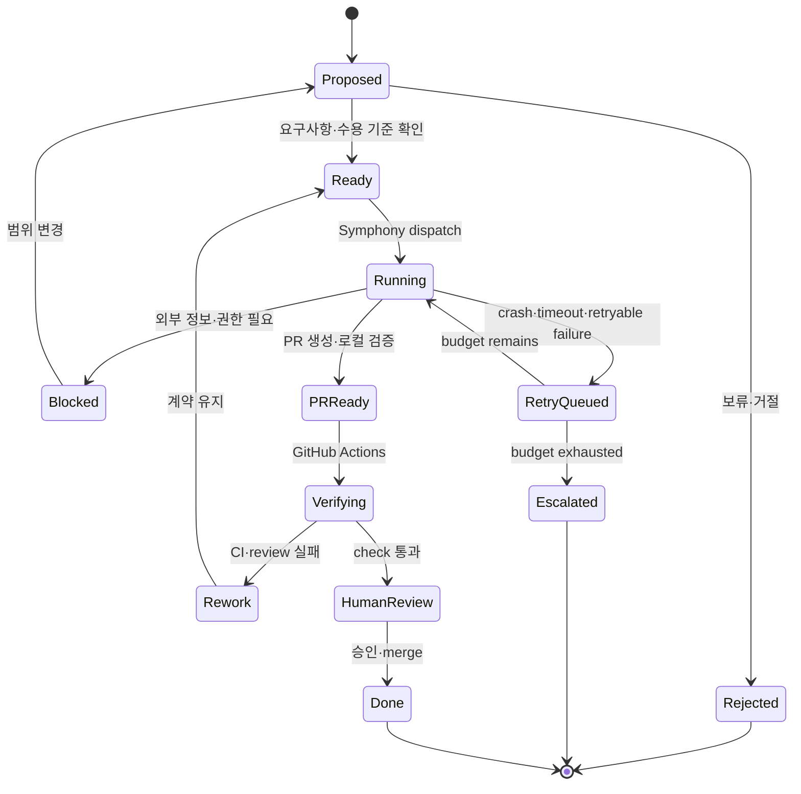

GitHub Issue의 open·closed와 label만으로 이를 표현할지, GitHub Project field를 사용할지, 다른 tracker를 사용할지는 파일럿에서 선택한다. 상태 이름보다 중요한 것은 전이 소유자와 retry budget이다.

### 실패 기록

```json
{
  "project": "law-rag",
  "issue": "GH-142",
  "workspace": "<workspace-key>",
  "primary_failure_class": "code",
  "contributing_factors": [],
  "observed_at_layer": "github_actions",
  "owned_by": "coding_agent",
  "retryable": true,
  "attempt": 1,
  "max_attempts": 3,
  "last_successful_boundary": "pull_request_created",
  "evidence": {
    "head_sha": "<full-sha>",
    "check_run": "<check-run-url>"
  }
}
```

이 JSON은 **비실행 설계 예시**다. Symphony의 공식 API response schema가 아니다.

---

## 11. 보안과 권한

자율성은 검증과 권한 경계가 함께 커질 때만 확대한다.

### Symphony 공식 문서가 보장하지 않는 것

- reference implementation은 trusted environment 평가용이다.
- SPEC은 하나의 강제 approval·sandbox 정책을 정하지 않는다.
- workspace path 격리는 중요하지만 완전한 sandbox의 대체물이 아니다.
- scheduler state의 durable persistence를 보장하지 않는다.
- tracker의 raw tool은 설정된 credential이 접근 가능한 범위까지 갈 수 있다.
- `WORKFLOW.md` hook은 trusted arbitrary shell configuration이다.

따라서 공개 Issue나 외부 기여자가 있는 repository를 그대로 자동 실행 대상으로 연결하면 안 된다.

### 최소 운영 정책

| 위험 | 기본 정책 |
|---|---|
| dispatch 대상 | repository·project·label allowlist |
| 저장소 쓰기 | issue workspace와 작업 branch만 허용 |
| default branch | 직접 push 금지 |
| network | 기본 차단, 필요한 domain만 허용 |
| tracker token | host-side injection, child environment에서 제거 |
| GitHub token | 최소 repository scope, merge·admin 권한 제외 |
| Issue·comment | 명령이 아닌 비신뢰 data로 취급 |
| `WORKFLOW.md` hook | trusted branch에서 review된 내용만 실행 |
| PR merge | required CI와 사람 승인 뒤 별도 경계 |
| production deploy | 환경별 승인과 rollback 필요 |
| retry | class별 owner 한 곳, 횟수와 비용 상한 |

### Issue 입력과 prompt injection

Issue 본문, comment, log, repository 문서는 system policy가 아니다.

- 허용 field와 길이를 제한한다.
- Issue가 sandbox와 credential policy를 바꾸지 못하게 한다.
- free-form verification command를 shell에 그대로 전달하지 않는다.
- repository가 관리하는 고정 script·profile ID로 검증한다.
- tracker tool의 mutation 범위를 token permission과 adapter에서 제한한다.

### workspace와 secret

- coding agent의 `cwd`가 해당 issue workspace와 정확히 일치하는지 확인한다.
- workspace path가 configured root 밖으로 나가지 못하게 한다.
- issue identifier를 path에 쓸 때 sanitize와 collision 방지를 적용한다.
- token literal을 agent가 읽는 `WORKFLOW.md`에 넣지 않는다.
- dedicated OS user, container 또는 VM, network egress 제한을 risk에 따라 추가한다.

### 자동화의 기본 종점

첫 운영 단계의 종점은 PR 생성과 CI 통과다. 자동 merge와 배포는 별도 실험과 승인 없이 Symphony의 기본 책임으로 두지 않는다.

---

## 12. 무엇을 배웠는가

### 12.1 모델 품질과 시스템 품질을 분리해야 한다

같은 모델 이름만 맞춘 비교는 부족하다. context, tool, cwd, sandbox, test, retry, completion criteria를 함께 맞춰야 한다.

### 12.2 장기 대화가 장기 실행 상태는 아니다

Discord 기록은 사람에게 유용하지만 dispatch queue가 아니다. Issue, Symphony runtime, workspace, PR, CI처럼 외부에서 다시 읽을 수 있는 객체가 필요하다.

### 12.3 GitHub Issue 기반 코딩 오케스트레이터는 Symphony였다

기존 글은 이름이 비슷하고 Agent·Pipeline 기능이 있는 Orchestra를 해당 역할에 연결했다. 공식 자료를 다시 확인한 결과 사용자가 말한 구조는 OpenAI Symphony의 문제 정의와 일치했다.

### 12.4 Symphony와 Codex는 경쟁 제품이 아니다

Symphony의 핵심 실행력은 Codex와 App Server에서 나온다. Symphony는 어떤 Issue에 언제 workspace와 Codex run을 배정할지를 관리한다.

### 12.5 Hermes와 Symphony도 같은 역할이 아니다

Hermes는 사용자 접점, memory, 여러 tool과 channel을 연결하는 범용 agent다. Symphony는 issue tracker를 읽는 좁은 coding scheduler/runner다. 둘을 연결할 수 있지만 같은 작업을 동시에 claim해서는 안 된다.

### 12.6 오케스트레이션은 복잡성을 없애지 않는다

session 감독 부담은 줄지만 daemon, tracker workflow, token, workspace, retry, observability를 운영해야 한다. 자동화 계층은 복잡성을 다른 위치로 옮긴다.

### 12.7 하니스가 먼저다

test와 context가 부족한 repository에 Symphony를 붙이면 잘못된 작업을 병렬로 더 빠르게 수행한다. repository가 agent-readable하고 결과를 기계적으로 검증할 수 있어야 한다.

### 12.8 가장 좋은 구조는 가장 적은 구조일 수 있다

개인 프로젝트에 `Issue 또는 Roadmap → Codex → Test → PR`이 충분하다면 그 구조를 유지한다. 하니스 엔지니어링은 모든 도구를 붙이는 일이 아니라 현재 실패를 막는 최소 환경을 만드는 일이다.

---

## 13. 한계와 검증이 남은 주장

이 글은 공식 문서와 설계 분석을 바탕으로 한 학습 기록이지 실제 Symphony 운영 benchmark가 아니다.

1. Codex App, CLI, Hermes의 체감 차이는 동일 조건 benchmark로 검증하지 않았다.
2. `law-rag`에 Symphony와 Hermes를 함께 연결해 end-to-end로 운영하지 않았다.
3. GitHub Issues adapter는 공식 참조 구현에 있지만, `law-rag`의 상태·label·review 흐름에 맞는지는 live test가 필요하다.
4. Symphony의 Elixir implementation은 평가용 prototype이고 운영 안정성을 보장하지 않는다.
5. restart 뒤 tracker·filesystem 기반 재배정과 durable run resume는 다르다.
6. OpenAI 내부 팀의 처리량 증가는 특정 repository harness와 조직 조건의 결과이며 일반화할 수 없다.
7. Orchestra는 공식 문서상 data team과 business operation에 강하지만, 이 글에서 실제 계정을 사용해 비교하지 않았다.
8. 도구 기능과 문서는 빠르게 바뀐다. `updated` 날짜 이후에는 공식 문서와 대상 commit을 다시 확인해야 한다.

다음 단계는 더 큰 자동화 구조가 아니라 한 repository, 한 label, 동시 실행 1개로 실패 경계를 측정하는 것이다.

---

## Related Projects

| 프로젝트 | 이 글과의 관계 | 활용 도구 |
|---|---|---|
| [yjs000/law-rag](https://github.com/yjs000/law-rag) | 법률 RAG를 개발하며 코딩 에이전트의 context·tool·검증 문제를 관찰한 프로젝트 | Codex |

Symphony와 Hermes를 `law-rag`에서 함께 사용했다는 의미는 아니다. 실제 적용과 검증이 끝난 뒤에만 활용 도구를 갱신한다.

---

## 14. 다음 학습

학습 목표는 [AI 시스템 학습 목표](../../TODO.md)에 간단히 기록한다.

1. `law-rag`에서 Codex로 구현한 흐름을 직접 추적하고 repository harness를 보강한다.
2. GitHub Issues adapter의 공식 live test와 `WORKFLOW.md` 계약을 읽는다.
3. scratch repository에서 Symphony를 label allowlist와 동시 실행 1개로 시험한다.
4. crash, timeout, Issue close, process restart 때 상태와 workspace가 어떻게 변하는지 기록한다.
5. Hermes는 Issue 후보 작성과 결과 조회에만 연결해 Symphony와 상태가 겹치지 않는지 확인한다.
6. coding orchestration과 data pipeline orchestration을 분리해 비교한다.

---

## 참고 자료

공식 기능 확인일은 2026년 7월 23일이다.

### OpenAI Harness와 Codex

- OpenAI, [하네스 엔지니어링: 에이전트 우선 세계에서 Codex 활용하기](https://openai.com/ko-KR/index/harness-engineering/)
- OpenAI, [Introducing the Codex app](https://openai.com/index/introducing-the-codex-app/)
- OpenAI Developers, [Codex CLI](https://developers.openai.com/codex/cli/)
- OpenAI Developers, [Codex App Server](https://developers.openai.com/codex/app-server/)
- OpenAI Developers, [AGENTS.md guide](https://developers.openai.com/codex/guides/agents-md)
- OpenAI Cookbook, [Codex Exec Plans](https://cookbook.openai.com/articles/codex_exec_plans)

### OpenAI Symphony

- OpenAI, [Codex 오케스트레이션을 위한 오픈소스 사양: Symphony](https://openai.com/ko-KR/index/open-source-codex-orchestration-symphony/)
- OpenAI, [Symphony GitHub Repository](https://github.com/openai/symphony)
- OpenAI, [Symphony Service Specification](https://github.com/openai/symphony/blob/main/SPEC.md)
- OpenAI, [Symphony Elixir Reference Implementation](https://github.com/openai/symphony/tree/main/elixir)
- OpenAI, [Symphony Elixir README](https://github.com/openai/symphony/blob/main/elixir/README.md)
- OpenAI, [Symphony WORKFLOW.md Example](https://github.com/openai/symphony/blob/main/elixir/WORKFLOW.md)

조사 시점의 Symphony source 기준 commit은 `1f3219bb1ea5f69a1305dc594e79b0db57c113c5`다.

### Hermes Agent

- Nous Research, [Hermes Agent Documentation](https://hermes-agent.nousresearch.com/docs/)
- Nous Research, [Hermes Agent GitHub Repository](https://github.com/NousResearch/hermes-agent)
- Nous Research, [Tools](https://hermes-agent.nousresearch.com/docs/user-guide/features/tools)
- Nous Research, [Skills](https://hermes-agent.nousresearch.com/docs/user-guide/features/skills)
- Nous Research, [Memory](https://hermes-agent.nousresearch.com/docs/user-guide/features/memory)
- Nous Research, [Delegation](https://hermes-agent.nousresearch.com/docs/user-guide/features/delegation)
- Nous Research, [Kanban](https://hermes-agent.nousresearch.com/docs/user-guide/features/kanban)
- Nous Research, [Messaging](https://hermes-agent.nousresearch.com/docs/user-guide/messaging/)
- Nous Research, [Webhooks](https://hermes-agent.nousresearch.com/docs/user-guide/messaging/webhooks)

### Orchestra

- Orchestra, [Orchestra Runtime Overview](https://docs.getorchestra.io/docs/ai-agents/overview)
- Orchestra, [AI Agents](https://docs.getorchestra.io/docs/ai-agents/agents)
- Orchestra, [Pipelines](https://docs.getorchestra.io/docs/core-concepts/pipelines)

### GitHub

- GitHub Docs, [Understanding GitHub Actions](https://docs.github.com/en/actions/get-started/understand-github-actions)
- GitHub Docs, [Syntax for GitHub's form schema](https://docs.github.com/en/communities/using-templates-to-encourage-useful-issues-and-pull-requests/syntax-for-githubs-form-schema)
