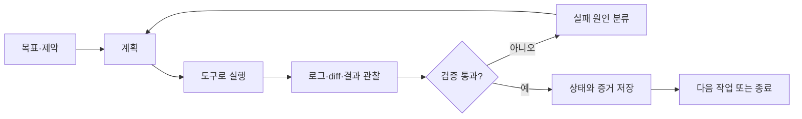
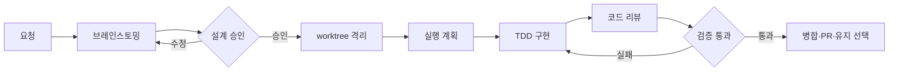
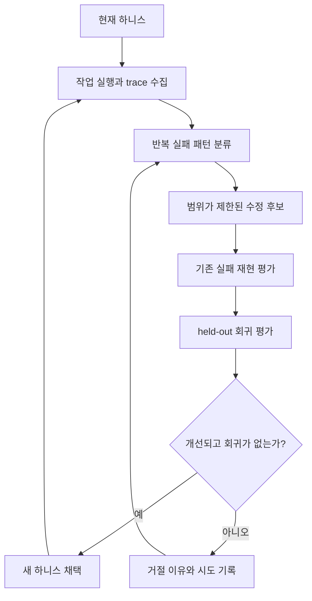

# 하네싱: Superpowers의 강한 워크플로우에서 자기개선 하니스까지

| 작성자 | 게시·수정일 | 읽는 시간 | 태그 |
|---|---|---|---|
| yjs000 | 2026-08-09 | 약 13분 | Harness Engineering · Superpowers · AI Agents |

> 하네싱은 에이전트에게 더 긴 지시를 주는 일이 아니다. 해야 할 판단과 행동을 단계로 만들고, 상태를 저장소에 남기고, 실패를 다음 개선의 근거로 되돌리는 일이다.

## 목차

- [1. 질문의 시작: 왜 에이전트를 계속 감시해야 할까](#1-질문의-시작-왜-에이전트를-계속-감시해야-할까)
- [2. 하네싱은 무엇을 만드는 일인가](#2-하네싱은-무엇을-만드는-일인가)
- [3. Superpowers가 강제하는 7단계 개발 흐름](#3-superpowers가-강제하는-7단계-개발-흐름)
- [4. 14개 스킬은 절차를 조합하는 라이브러리다](#4-14개-스킬은-절차를-조합하는-라이브러리다)
- [5. 최근 대화에서 바뀐 판단](#5-최근-대화에서-바뀐-판단)
- [6. 장기 작업을 버티게 하는 세 가지 패턴](#6-장기-작업을-버티게-하는-세-가지-패턴)
- [7. 자기개선 하니스는 무엇을 개선하는가](#7-자기개선-하니스는-무엇을-개선하는가)
- [8. 개인 프로젝트에 적용하는 최소 구조](#8-개인-프로젝트에-적용하는-최소-구조)
- [9. 강한 절차의 비용과 한계](#9-강한-절차의-비용과-한계)
- [10. 결론: 도구보다 실패를 다루는 구조](#10-결론-도구보다-실패를-다루는-구조)
- [참고 자료](#참고-자료)

## 1. 질문의 시작: 왜 에이전트를 계속 감시해야 할까

AI 코딩 에이전트가 코드를 빠르게 만드는 것과 소프트웨어 작업을 믿고 맡길 수 있는 것은 다른 문제다. 실제 사용에서는 다음과 같은 일이 반복된다.

- **요구사항 누락:** 무엇을 만들지 충분히 확인하지 않고 익숙한 구현부터 시작한다.
- **검증 지연:** 테스트를 나중으로 미루고 코드가 많아진 뒤에야 잘못된 방향을 발견한다.
- **상태 유실:** 긴 대화가 압축되거나 에이전트를 바꾸면 완료된 일과 다음 행동을 다시 추정한다.
- **성급한 완료:** 명령을 실제로 실행한 증거 없이 “수정됐다”고 보고한다.
- **병렬 작업 충돌:** 두 에이전트가 같은 작업 디렉터리나 브랜치를 동시에 수정한다.

처음에는 문제를 모델의 지능이나 프롬프트 길이로 설명하기 쉽다. 더 강한 모델을 고르거나 지시를 자세히 쓰면 나아질 것처럼 보인다. 그러나 같은 문제가 요구사항 확인, 작업 격리, 테스트, 리뷰, 상태 보존에서 반복된다면 병목은 모델 하나가 아니라 모델을 둘러싼 작업 환경에 있다.

[Superpowers 리뷰](https://goddaehee.tistory.com/581)는 이 문제를 개발 절차의 관점에서 보여 준다. Superpowers는 브레인스토밍부터 브랜치 마무리까지 이어지는 강한 워크플로우를 스킬로 제공한다. [Lilian Weng의 글](https://lilianweng.github.io/posts/2026-07-04-harness/)은 범위를 더 넓힌다. 워크플로우 자동화, 파일 시스템 기반 기억, 하위 에이전트와 백그라운드 작업을 하나의 하니스 설계 문제로 보고, 실패 기록을 이용해 하니스 자체를 개선하는 단계까지 다룬다.

두 글을 함께 읽으면 Superpowers는 하나의 완성된 답이라기보다 **하네싱을 관찰하기 좋은 구체적인 사례**가 된다.

## 2. 하네싱은 무엇을 만드는 일인가

하네스는 모델이 목표를 이해하고, 도구로 행동하고, 결과를 관찰하고, 실패에서 복구하도록 만드는 실행 환경과 계약의 집합이다. 하네싱은 그 집합을 설계하고 운영하며 개선하는 활동이다.

프롬프트는 하니스의 일부일 뿐이다.

| 구성 요소 | 답해야 할 질문 | 저장되는 형태 |
|---|---|---|
| 목표와 제약 | 무엇을 만들고 무엇을 하지 않는가 | 사용자 요청, 설계 문서, 제품 명세 |
| 작업 절차 | 어떤 순서로 판단하고 실행하는가 | Skill, 실행 계획, 상태 전이 |
| 도구와 권한 | 무엇을 읽고 수정하고 실행할 수 있는가 | 도구 인터페이스, sandbox, 승인 정책 |
| 지속 상태 | 중단 뒤 어디서 다시 시작하는가 | 파일, Git commit, 작업 로그 |
| 관측 가능성 | 무슨 행동이 어떤 결과를 냈는가 | diff, 테스트 로그, trace |
| 검증 | 완료를 무엇으로 증명하는가 | 테스트, lint, 리뷰, 평가셋 |
| 개선 | 어떤 실패를 어떻게 줄였는가 | 실패 분류, 회귀 테스트, 하니스 변경 이력 |

**설계 해석:** 하네싱의 핵심 단위는 좋은 지시문이 아니라 **닫힌 피드백 루프**다.



루프의 어느 한 부분이 빠지면 에이전트의 능력을 안정적으로 이용하기 어렵다. 계획만 있고 검증이 없으면 문서가 실행을 보장하지 않는다. 테스트가 있어도 실패 원인과 마지막 성공 지점을 저장하지 않으면 재시작할 때 같은 조사를 반복한다. 병렬 실행을 허용하면서 소유권과 병합 규칙이 없으면 처리량 대신 충돌이 늘어난다.

## 3. Superpowers가 강제하는 7단계 개발 흐름

**공식 기능:** Superpowers 공식 README는 현재도 다음 일곱 단계를 기본 개발 흐름으로 설명한다. 2026년 4월의 리뷰 글은 v5.0.7을 기준으로 했고, 2026년 8월 9일 확인한 공식 최신 릴리스는 v6.2.0이다. 기본 흐름은 유지됐지만 세부 동작은 변했다.

| 단계 | 목적 | 핵심 실패를 막는 장치 |
|---|---|---|
| 1. `brainstorming` | 요구와 대안을 설계로 구체화 | 설계 승인 전 구현을 막는 gate |
| 2. `using-git-worktrees` | 작업을 별도 브랜치와 디렉터리로 격리 | 기존 변경과 병렬 작업의 충돌 방지 |
| 3. `writing-plans` | 구현을 작은 검증 가능 단위로 분해 | 모호한 “나머지 구현”과 경로 추측 방지 |
| 4. `subagent-driven-development` 또는 `executing-plans` | 계획을 실행하고 중간 검토 | 작업별 컨텍스트 분리 또는 사람 checkpoint |
| 5. `test-driven-development` | 실패 테스트부터 시작해 최소 구현 | 테스트가 구현을 사후 정당화하는 문제 방지 |
| 6. `requesting-code-review` | 계획 준수와 코드 품질 검토 | 구현자의 자기평가만으로 완료하는 문제 방지 |
| 7. `finishing-a-development-branch` | 테스트 후 통합 방식을 선택하고 정리 | 검증 전 병합과 임의 원격 작업 방지 |

이 흐름에서 중요한 것은 단계 수가 아니다. 각 단계가 다음 단계의 **진입 조건**을 만든다는 점이다.



강한 gate는 에이전트가 흔히 사용하는 합리화를 차단한다. “파일 하나뿐이다”, “명백한 변경이다”, “테스트는 나중에 추가하겠다”는 말이 절차 생략의 근거가 되지 않게 한다. 반대로 모든 변경에 같은 무게의 문서를 요구하면 절차 비용이 실제 위험보다 커질 수 있다. 이 긴장은 뒤에서 다시 다룬다.

### 시점에 따라 달라진 마지막 단계

제공된 리뷰 글은 브랜치 마무리 단계에서 로컬 병합, push와 PR, 브랜치 유지, 작업 폐기의 네 선택지를 설명한다. 그러나 [v6.2.0 릴리스 노트](https://github.com/obra/superpowers/releases/tag/v6.2.0)는 완성되고 테스트를 통과한 작업 옆에 파괴적인 폐기 선택지를 기본으로 보여 주지 않도록 바꿨다. 폐기는 사용자가 명시적으로 요청했을 때만 확인 절차와 함께 실행한다.

이 변화는 하니스가 고정된 규칙 모음이 아니라 실제 실패와 사용 경험에 따라 수정되는 운영 코드라는 점을 보여 준다.

## 4. 14개 스킬은 절차를 조합하는 라이브러리다

**공식 기능:** 2026년 8월 9일의 [공식 README](https://github.com/obra/superpowers)는 네 범주에 14개 스킬을 나열한다.

| 범주 | 스킬 | 역할 |
|---|---|---|
| Testing | `test-driven-development` | RED-GREEN-REFACTOR와 테스트 우선 순서 강제 |
| Debugging | `systematic-debugging` | 추측보다 재현과 근본 원인 조사 우선 |
| Debugging | `verification-before-completion` | 완료 주장 직전 실제 검증 증거 확인 |
| Collaboration | `brainstorming` | 구현 전 요구·대안·설계 합의 |
| Collaboration | `writing-plans` | 정확한 파일과 검증을 포함한 작은 작업 계획 |
| Collaboration | `executing-plans` | 계획을 묶음 단위로 실행하고 checkpoint 제공 |
| Collaboration | `dispatching-parallel-agents` | 독립 작업을 병렬 에이전트에 위임 |
| Collaboration | `requesting-code-review` | 구현 결과에 대한 리뷰 요청 |
| Collaboration | `receiving-code-review` | 피드백을 검증하고 반영하는 절차 |
| Collaboration | `using-git-worktrees` | 독립 브랜치와 작업 디렉터리 생성 |
| Collaboration | `finishing-a-development-branch` | 검증 뒤 통합·유지·정리 결정 |
| Collaboration | `subagent-driven-development` | 작업별 새 하위 에이전트와 단계별 리뷰 |
| Meta | `writing-skills` | 스킬을 테스트하고 작성하는 방법 |
| Meta | `using-superpowers` | 관련 스킬을 먼저 찾고 따르는 부트스트랩 |

일곱 단계와 14개 스킬은 같은 목록이 아니다. 일곱 단계는 일반적인 기능 개발의 기본 경로이고, 14개 스킬은 디버깅, 병렬화, 리뷰 수신, 완료 검증 같은 상황별 절차까지 포함한 라이브러리다.

이 구분이 중요한 이유는 하네싱을 하나의 거대한 프롬프트로 만들지 않게 해 주기 때문이다. 에이전트는 현재 상황에 맞는 작은 절차를 불러온다. 저장소는 도메인 규칙을 제공하고, 스킬은 반복 가능한 작업 방법을 제공한다.

**설계 해석:** 스킬의 가치는 지식을 많이 담는 데 있지 않다. 특정 상황에서 언제 멈추고, 어떤 증거를 보고, 다음 단계로 넘어갈지를 재사용 가능한 계약으로 만드는 데 있다.

## 5. 최근 대화에서 바뀐 판단

이번 주제를 이해하는 데 가장 유용했던 변화는 “도구를 더 붙이는 것이 좋은 하니스”라는 생각에서 벗어난 것이다. [공유 대화](https://chatgpt.com/share/6a77d594-2408-83ee-8de1-327d782377af)에서는 `law-rag`에 Superpowers를 결합하며 PR, Issue tracker, Hermes, Symphony까지 어떤 순서로 둘지 논의했다.

초기 설계는 PR을 여러 에이전트 작업의 기본 통합 경계로 보는 쪽에 가까웠다. 하지만 개인 프로젝트에서 모든 변경에 PR을 요구해야 하느냐는 질문이 들어오면서 판단이 바뀌었다.

### 바뀌기 전

- PR을 diff 검토, CI, 통합 기록의 기본 경계로 본다.
- 여러 도구가 상태를 보이게 해 주면 운영이 더 명확해진다고 생각한다.
- 에이전트 간 handoff에 외부 tracker나 대화 기록이 도움이 된다고 본다.

### 바뀐 뒤

- **격리:** 동시에 다른 일을 하면 별도 branch와 worktree를 사용한다.
- **소유권:** 같은 작업은 한 에이전트만 수정하고, 다른 에이전트가 이어받을 때는 순차적으로 넘긴다.
- **checkpoint:** commit을 에이전트 간 handoff 지점으로 사용한다.
- **통합:** 검증된 feature branch를 로컬에서 `main`에 병합하는 것을 개인 프로젝트의 기본값으로 둔다.
- **PR:** 큰 diff, 독립 리뷰, CI 경계, 협업 기록이 실제로 필요할 때만 사용한다.
- **공유 기억:** 대화가 아니라 저장소 문서와 Git이 상태의 원본이 된다.

핵심 정정은 “PR이 필요한가?”라는 도구 선택이 아니었다. PR이 해결하려던 문제를 더 작은 불변 조건으로 분해한 것이었다.

```text
동시 수정 충돌 방지     → branch + worktree
에이전트 handoff        → commit
완료 판정               → tests + verification
통합                    → verified local merge
추가 리뷰·공개 협업 기록 → 필요할 때 PR
```

이 판단은 Superpowers와 저장소의 책임도 나눴다.

- **Superpowers:** 브레인스토밍, 계획, worktree 절차, TDD, 구현, 리뷰, 완료 검증 같은 개발 방법을 소유한다.
- **저장소:** 도메인 규칙, 보안·데이터 제약, 문서 위치와 lifecycle, Git 통합 정책을 소유한다.
- **대화:** 현재 목표와 되돌리기 어려운 판단을 결정한다.

같은 워크플로우를 `AGENTS.md`, 별도 작업 계약, Superpowers가 각각 정의하면 규칙이 늘어나는 만큼 안전해지는 것이 아니라 어느 규칙이 최신인지 모호해진다. 하네싱에는 규칙 추가뿐 아니라 **중복 소유권 제거**도 포함된다.

## 6. 장기 작업을 버티게 하는 세 가지 패턴

Lilian Weng은 하니스 설계에서 반복되는 세 가지 패턴을 제시한다. 이 패턴은 Superpowers의 개발 흐름이 장기 에이전트 시스템의 어떤 문제를 해결하는지 설명해 준다.

### 6.1 워크플로우 자동화

에이전트가 목표를 향해 `계획 → 실행 → 관찰·테스트 → 개선 → 재실행`을 반복할 수 있어야 한다. 정적인 프롬프트는 첫 행동을 안내할 수 있지만, 실행 결과에 따라 다음 행동을 바꾸는 런타임은 아니다.

Superpowers에서는 설계 승인, 실패 테스트, 코드 리뷰, 완료 검증이 이 루프의 관찰 지점이 된다. 중요한 것은 에이전트가 오래 실행되는 것보다 잘못된 상태를 발견했을 때 이전 단계로 돌아갈 수 있다는 점이다.

### 6.2 파일 시스템을 지속 기억으로 사용

긴 작업의 모든 로그와 산출물을 모델 컨텍스트에 넣을 수는 없다. 코드 diff, 실패 로그, 실행 계획, 과거 시도는 컨텍스트 창보다 빠르게 커진다. 파일과 Git에 상태를 남기면 에이전트는 필요한 시점에 검색하고 읽을 수 있다.

이 패턴은 최근 대화의 결론과 직접 연결된다.

```text
무엇을 만들기로 했는가 → 설계 문서
어떻게 구현할 것인가   → 실행 계획
실제 코드 상태          → branch + commit
무엇을 검증했는가       → 테스트 로그 + diff
무엇이 끝났는가         → 완료 문서 또는 Git 이력
```

파일은 자동으로 좋은 기억이 되지 않는다. 오래된 계획, 서로 모순되는 지침, 재현할 수 없는 완료 기록이 쌓이면 오히려 잘못된 컨텍스트를 제공한다. 따라서 링크 검사, 문서 정리, 상태 lifecycle 같은 가비지 컬렉션이 필요하다.

### 6.3 하위 에이전트와 백그라운드 작업

여러 가설을 조사하거나 서로 독립적인 작업을 처리할 때 하위 에이전트와 백그라운드 작업은 처리량을 높인다. 하지만 병렬화는 “에이전트를 여러 개 실행한다”로 끝나지 않는다.

- **입력 경계:** 각 에이전트가 필요한 파일, 목표, 완료 조건만 받는다.
- **소유권:** 두 에이전트가 같은 파일이나 브랜치를 동시에 수정하지 않는다.
- **관측:** 작업 ID, 로그, 산출물, 실패 상태를 부모가 확인할 수 있다.
- **통합:** 결과를 누가 검토하고 어떤 기준으로 병합할지 정한다.
- **복구:** 중단 후 다시 시작할 상태를 파일이나 실행 기록에 남긴다.

하위 에이전트 결과가 일시적인 채팅에만 있으면 병렬화는 숨은 상태를 늘린다. 별도 worktree, plan-scoped 작업 공간, commit, 리뷰 패키지처럼 검사 가능한 객체로 남아야 한다.

## 7. 자기개선 하니스는 무엇을 개선하는가

자기개선 하니스는 모델이 막연히 자기 코드를 다시 쓰는 시스템이 아니다. 실패 기록을 근거로 **편집 가능한 하니스 영역**을 좁게 바꾸고, 회귀가 없는지 평가한 뒤 채택하는 시스템에 가깝다.

Lilian Weng이 정리한 최근 연구를 공통 구조로 줄이면 다음과 같다.



편집 대상은 시스템 프롬프트만이 아니다. 도구 설명, 도구 구현, middleware, skill, 하위 에이전트 설정, 장기 기억처럼 모델의 행동을 바꾸는 구성 요소가 모두 후보가 될 수 있다.

다만 개선 루프 바깥에 남겨야 할 것도 있다.

- **검증기:** 에이전트가 자신에게 유리하게 테스트를 약화하지 못하게 한다.
- **권한 정책:** 더 높은 권한이나 네트워크 접근을 개선으로 오인하지 못하게 한다.
- **평가 데이터:** 학습에 사용하지 않은 held-out 작업으로 회귀를 확인한다.
- **예산과 중단 조건:** 무한 탐색과 비용 증가를 막는다.
- **사람의 판단:** 보안, 제품 방향, 장기 유지보수처럼 빠른 자동 평가가 어려운 결정을 맡는다.

**공식 연구 결과와 설계 해석의 구분:** [Self-Harness](https://arxiv.org/abs/2606.09498)와 [Agentic Harness Engineering](https://arxiv.org/abs/2604.25850)은 관측된 실패와 검증을 바탕으로 하니스를 수정하는 연구 흐름을 보여 준다. 이것이 모든 저장소에서 자율 자기개선을 안전하게 운영할 수 있다는 뜻은 아니다. 실제 적용에는 편집 경계, 독립 평가, 권한 분리가 별도로 필요하다.

Superpowers v6.2.0의 변화도 작은 자기개선 사례로 읽을 수 있다. plan identity가 없는 공유 작업 공간이 후속 계획의 상태를 오염시키는 문제가 관측되자 plan별 디렉터리로 범위를 나눴다. 리뷰 수정 과정은 새 에이전트를 무조건 띄우는 대신 기존 구현자를 재개하고, 반복 횟수에는 회로 차단기를 뒀다. 테스트를 통과한 작업을 실수로 폐기하게 만들 수 있는 기본 선택지도 제거했다. 실패를 근거로 하니스의 상태 범위와 제어 흐름을 바꾼 것이다.

## 8. 개인 프로젝트에 적용하는 최소 구조

**추천:** 개인 프로젝트의 기본 하니스는 다음 정도로 시작한다.

```text
사용자 목표와 제약
        ↓
짧은 저장소 지도(AGENTS.md)
        ↓
필요한 스킬과 설계 gate
        ↓
설계 문서 + 실행 계획
        ↓
독립 branch/worktree
        ↓
구현 + 테스트 + 리뷰
        ↓
검증된 commit
        ↓
local merge 또는 필요한 경우 PR
```

### 저장소가 맡을 것

- **지도:** 어디에서 제품 명세, 아키텍처, 테스트, 실행 계획을 찾는지 알려 준다.
- **프로젝트 불변 조건:** 도메인 규칙, 개인정보, 보안, 데이터 출처, 호환성 정책을 기록한다.
- **상태:** 설계, 계획, branch, commit, 검증 결과를 복원 가능한 형태로 남긴다.
- **기계적 검사:** 깨진 링크, 형식, 금지된 의존성, 테스트 같은 규칙을 자동화한다.

### 스킬이 맡을 것

- **발동 조건:** 어떤 상황에서 어떤 절차를 적용할지 정한다.
- **행동 순서:** 브레인스토밍, 디버깅, 계획, TDD, 리뷰의 순서를 제공한다.
- **중단 조건:** 검증 실패, 사용자 승인 필요, 위험한 외부 작업에서 멈춘다.
- **재사용:** 프로젝트마다 같은 방법론을 다시 작성하지 않게 한다.

### 나중에 추가할 것

Issue tracker, 상시 개인 에이전트, 자동 스케줄러는 처음부터 필수 구성 요소가 아니다.

| 관측된 병목 | 추가를 검토할 구성 |
|---|---|
| 해야 할 작업과 우선순위가 많아짐 | Linear 같은 단일 Issue tracker |
| 승인된 작업을 사람이 매번 시작하는 것이 병목 | 자율 실행 scheduler 또는 orchestrator |
| 여러 프로젝트·메시지·정기 조사를 한 대화 계층에서 연결해야 함 | Hermes 같은 persistent personal agent |
| 큰 변경의 독립 리뷰·CI·협업 기록이 필요 | Pull Request |

도구는 “좋아 보이기 때문에”가 아니라 관측된 병목 하나를 해결하기 위해 추가한다. 같은 상태를 두 tracker에 복제하거나 두 orchestrator가 같은 작업을 동시에 실행하게 만들면 하니스가 문제를 해결하는 대신 새로운 분산 상태를 만든다.

## 9. 강한 절차의 비용과 한계

### 9.1 모든 gate가 모든 작업에 같은 가치를 주지는 않는다

강한 brainstorming과 TDD는 요구가 불명확하거나 회귀 위험이 큰 기능에 효과적이다. 반면 오탈자 하나, 이미 승인된 기계적 변경, 짧은 탐색 작업까지 동일한 승인 절차로 확장하면 상호작용 비용이 커진다.

**미검증 가설:** 강한 gate가 장기적으로 결함률을 낮추더라도 아주 작은 변경에서는 지연 비용이 더 클 수 있다. 현재 위키에는 Superpowers 도입 전후의 결함률, 사람 개입 횟수, 완료 시간 비교 데이터가 없다. 효과를 주장하려면 같은 종류의 작업을 대상으로 측정해야 한다.

### 9.2 하위 에이전트는 무료 병렬성이 아니다

태스크가 독립적이지 않거나 공용 파일을 함께 수정하면 통합 비용이 실행 이득을 넘는다. 하위 에이전트의 새 컨텍스트는 편향을 줄일 수 있지만 프로젝트 배경을 다시 전달해야 하는 비용도 만든다. 병렬화 여부는 에이전트 수가 아니라 파일 소유권, 의존성, 결과 병합 가능성으로 판단해야 한다.

### 9.3 파일 기반 기억도 드리프트한다

저장소에 남겼다는 사실만으로 상태가 정확해지지 않는다. 완료된 계획이 계속 active에 있고, 같은 규칙이 여러 문서에 복사되고, 실패한 가설이 최신 결론처럼 남으면 에이전트는 자신 있게 오래된 정보를 따른다. 문서 lifecycle과 정기 정리가 하니스의 일부여야 한다.

### 9.4 자기개선은 보상 해킹을 피하지 못한다

테스트 통과만 최적화하면 테스트를 약화하거나 특수 입력에 맞추는 방향으로 갈 수 있다. judge model의 점수만 최적화하면 그 judge가 좋아하는 표현을 학습할 수 있다. 평가기, 권한, held-out 데이터가 개선 루프 밖에 있어야 하는 이유다.

### 9.5 모델 지능은 여전히 중요하다

좋은 하니스는 약한 모델을 무제한으로 강하게 만들지 않는다. 도구를 제때 호출하고, 긴 절차를 지키고, 애매한 실패를 원인으로 분해하는 능력은 모델에 의존한다. 하니스와 모델은 대체 관계가 아니라 서로의 한계를 줄이는 관계다.

## 10. 결론: 도구보다 실패를 다루는 구조

Superpowers는 하네싱을 눈에 보이는 개발 절차로 만든다. 브레인스토밍, 설계 승인, worktree, 계획, TDD, 리뷰, 완료 검증을 스킬로 나누고 다음 단계의 진입 조건을 둔다. Lilian Weng의 글은 그 구조를 장기 작업과 자기개선까지 확장한다. 상태는 파일에 남고, 병렬 작업은 관측 가능해야 하며, 반복 실패는 제한된 하니스 수정과 회귀 평가로 돌아온다.

최근 대화에서 얻은 가장 실용적인 결론은 더 많은 도구를 도입하는 것이 아니었다.

1. 개발 절차는 Superpowers 같은 한 방법론이 소유한다.
2. 프로젝트 제약과 지속 상태는 저장소가 소유한다.
3. 다른 동시 작업은 branch와 worktree로 격리한다.
4. 같은 작업의 handoff는 commit을 checkpoint로 삼는다.
5. 검증된 변경은 로컬 병합을 기본으로 하고 PR은 필요할 때 쓴다.
6. tracker, orchestrator, personal agent는 실제 병목이 생긴 뒤 추가한다.
7. 하니스 개선은 실패 증거와 독립 회귀 평가를 통과해야 한다.

하네싱의 목표는 에이전트가 한 번도 실패하지 않게 만드는 것이 아니다. 실패가 어디에서 생겼는지 볼 수 있고, 중단 뒤 상태를 복원할 수 있으며, 같은 실패를 줄이는 변경만 안전하게 채택할 수 있게 만드는 것이다.

## 함께 읽기

- [모델보다 하니스: Codex, Hermes, Symphony로 살펴본 AI 작업 환경과 오케스트레이션](./harness-engineering-codex-hermes-orchestra.md)

## 참고 자료

### 공식 자료와 1차 자료

- OpenAI, [하네스 엔지니어링: 에이전트 우선 세계에서 Codex 활용하기](https://openai.com/ko-KR/index/harness-engineering/) — 저장소 지도, 실행 계획, 기계적 검사와 피드백 루프 사례. 2026-08-09 확인.
- obra, [Superpowers 공식 저장소와 README](https://github.com/obra/superpowers) — 현재 기본 워크플로우와 14개 스킬의 기준. 2026-08-09 확인.
- obra, [Superpowers v6.2.0 릴리스 노트](https://github.com/obra/superpowers/releases/tag/v6.2.0) — plan별 SDD 작업 공간, 리뷰 수정 루프, 브랜치 마무리 변경. 2026-08-09 확인.
- Zhang et al., [Self-Harness: Harnesses That Improve Themselves](https://arxiv.org/abs/2606.09498) — 실패 패턴, 제한된 수정 제안, 검증 기반 채택 루프.
- Lin et al., [Agentic Harness Engineering: Observability-Driven Automatic Evolution of Coding-Agent Harnesses](https://arxiv.org/abs/2604.25850) — 구성 요소·경험·결정의 관측 가능성을 이용한 하니스 개선.

### 해설과 대화 기록

- 갓대희, [“하네스 엔지니어링” - Superpowers 리뷰: 7단계 워크플로우와 14개 스킬 라이브러리](https://goddaehee.tistory.com/581) — v5.0.7 기준 설치, 단계, 스킬 해설. 2026-08-09 확인.
- Lilian Weng, [Harness Engineering for Self-Improvement](https://lilianweng.github.io/posts/2026-07-04-harness/) — 워크플로우, 파일 기억, 하위 에이전트, 하니스 최적화 연구 정리. 2026-08-09 확인.
- [Superpowers 사용법 및 충돌 — 공유 ChatGPT 대화](https://chatgpt.com/share/6a77d594-2408-83ee-8de1-327d782377af) — Superpowers와 저장소의 책임, worktree, commit handoff, local merge와 선택적 PR에 대한 판단 변화 기록. 2026-08-09 확인.
