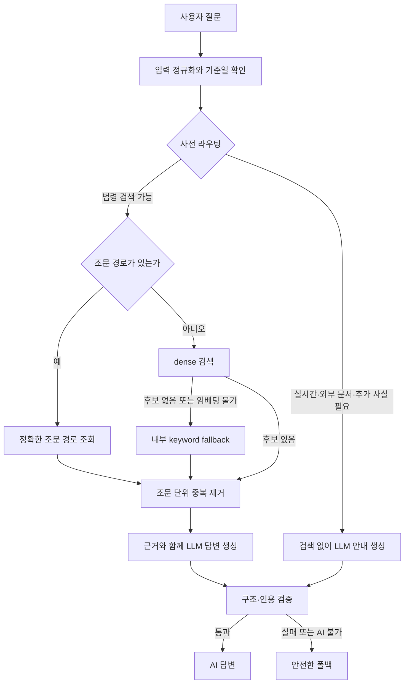

# 법률 RAG 질문 파이프라인 적용 기록: 근거 경계와 생성 경로의 결정

| 작성자 | 게시·수정일 | 읽는 시간 | 태그 |
|---|---|---|---|
| yjs000 | 2026-08-11 | 약 9분 | Law RAG · Learning Evidence · Retrieval · Grounding · Routing |

처음의 RAG 개념 설명을 실제 법률 질문 경로에 적용하면서, "모델이 답하게 할 것"과 "근거 없는 법률 주장을 막을 것"을 같은 파이프라인 안에서 어떻게 분리했는지 기록한다.

## 목차

- [학습 맥락과 증거 수준](#학습-맥락과-증거-수준)
- [최종 질문 경로](#최종-질문-경로)
- [핵심 결정과 근거](#핵심-결정과-근거)
- [키워드 검색 경로의 변화](#키워드-검색-경로의-변화)
- [추후 확장 방향: LangGraph와 LangChain](#추후-확장-방향-langgraph와-langchain)
- [한계와 다음 검증](#한계와-다음-검증)
- [확인한 자료](#확인한-자료)

## 학습 맥락과 증거 수준

이 글은 [RAG 전체 경로 개념 게이트: 첫 설명과 정정 기록](2026-07-22-rag-pipeline-concept-gate.md)의 후속 기록이다. 당시에는 파싱·청킹·임베딩·검색·답변 생성·인용 표시를 구분하고, 검색 결과와 모델 답변을 따로 평가해야 한다는 점을 학습했다. 이 글은 그 개념을 실제 프로젝트의 질문 처리 흐름에 적용한 뒤의 기록이다.

- **현재 증거 수준:** 프로젝트 적용. 아래의 설계 문서, 파이프라인 지도, 공개 커밋을 서로 대조했다.
- **구분할 내용:** 현재 구현과 검증된 설계 결론은 프로젝트 근거로 적고, 프레임워크 확장은 아직 채택하지 않은 후속 방향으로 적는다.
- **보존할 경계:** 학습자의 초기 원문은 앞선 개념 게이트에 그대로 남긴다. 이 글은 그 원문을 매끄럽게 고쳐 쓰지 않고, 이후에 확인한 설계 판단과 적용 결과를 덧붙인다.

## 최종 질문 경로

현재 질문 경로의 목표는 질문에 어울리는 법령 원문을 찾고, 그 원문을 벗어난 법률 주장을 답변에 넣지 않는 것이다. 모델 호출 여부와 법적 주장 허용 여부를 같은 조건으로 묶지 않은 것이 핵심이다.

### 질문 유형은 검색 전에 나눈다

`제1조 제2항`처럼 원문 위치를 명시한 질문은 의미 유사도보다 정확 경로 조회가 우선이다. 반면 일반 자연어 질문은 문서와 질문을 같은 임베딩 계약으로 비교하는 dense 검색을 기본 경로로 사용한다. 검색 후보를 그대로 생성 모델에 넣지 않고, 같은 조문에 속한 하위 청크의 중복을 줄인 뒤 서로 다른 조문을 제한된 문맥으로 전달한다.

또 다른 분기는 검색 전에 생긴다. 실시간 정보, 사용자가 올린 문서의 대조, 개인별 사실이 더 필요한 질문은 법령 corpus만으로 답을 확정할 수 없다. 이 경우 검색을 억지로 실행해 무관한 법령을 근거처럼 보이게 하지 않는다.

### 웹에서는 LLM 답변만 선택한다

웹 UI의 답변 모드는 현재 `terra` 하나다. 그래서 AI가 가용한 Terra 요청은 검색 근거가 0건이어도 즉시 고정된 검색 전용 문구로 끝내지 않고 LLM 생성 단계까지 간다. 사전 라우팅에서 차단된 질문도 검색은 건너뛰지만, 질문에 맞춰 왜 답할 수 없는지 또는 어떤 사실이 더 필요한지를 LLM이 설명한다.

이 변경은 "모든 질문에 법률 답을 만든다"는 뜻이 아니다. 빈 근거에서 구조 검증을 통과할 수 있는 결과는 두 경우뿐이다.

- **`unanswerable`:** 본문 섹션과 체크리스트가 비어 있어야 한다. 즉, 근거가 없다는 설명은 하되 법적 결론을 채우지 않는다.
- **`clarification_required`:** 필요한 추가 사실이 명시돼야 한다. 시스템은 그 사실을 채운 재제출 형식을 안내한다.

AI 호출·생성·구조 검증이 실패하거나 AI가 가용하지 않으면 기존의 안전한 폴백을 사용한다. LLM을 호출했다는 사실만으로 근거 검증을 생략하지 않는 경계다.

## 핵심 결정과 근거

### 검색 알고리즘보다 corpus와 법률 계층을 먼저 고쳤다

**설계 판단:** 검색 품질이 낮을 때 먼저 새로운 검색 기법을 붙이지 않았다. Open API 원문에서 조문인지 구조 표지인지 구분하고, `조 → 항 → 호 → 목`의 부모 경로를 복원하는 검증을 먼저 적용했다.

그 이유는 모델이나 검색기가 corpus에 빠진 문장을 찾을 수 없기 때문이다. 조문 ID가 맞아도 필요한 본문이 누락되면 답변 근거로는 불충분하다. 이 판단은 Article Recall과 Evidence Recall을 분리해 확인한 실험 기록에 근거한다. 따라서 BM25, hybrid, RRF, reranker는 현재의 dense 기준선보다 직접 근거 품질을 높인다는 별도 평가 증거가 생길 때만 다시 검토한다. HNSW는 이 프로젝트의 운영·실험 경로에 도입하지 않는다.

### route와 action은 다른 시점의 판단이다

**공식 구현 사실:** `route`는 검색 전에 무엇을 할지 결정한다. `legal_search`는 법령 검색을 진행하고, `realtime_required`·`external_document_required`·`clarification_required`는 검색을 멈추거나 추가 사실을 요청한다. 반대로 `action`은 검색·생성 뒤 답변이 얼마나 완결됐는지를 나타낸다.

따라서 `route=legal_search`이면서 생성 뒤 `action=clarification_required`가 될 수 있다. 전자는 검색을 실행해 볼 만큼 질문이 열려 있었다는 뜻이고, 후자는 검색해도 개인별 사실이 부족했다는 뜻이다. 둘을 하나의 값으로 덮어쓰면 어느 경계에서 답변이 좁아졌는지 추적할 수 없다.

### LLM에게 설명을 맡기되 근거 허용은 코드가 맡긴다

초기 검증기는 답변 문장만 보고 확신 있는 법률 주장인지, 조심스러운 한계 설명인지 정규식으로 추측했다. 한국어의 "할 수 없다"처럼 법적 금지와 인식론적 한계가 같은 표면형을 가질 수 있어 이 방식은 오탐을 만들었다.

그래서 모델이 `fully_answerable`, `partially_answerable`, `clarification_required`, `unanswerable` 중 어느 상태인지 구조 필드로 직접 선언하게 하고, 서버가 상태별로 검증 강도를 다르게 적용한다. 인용 ID가 실제 제공된 근거에 속하는지, 무근거 숫자나 규범어가 섞이지 않았는지는 여전히 결정론적 코드가 확인한다. 이는 LLM의 설명 능력과 법률 근거의 허용 경계를 분리한 선택이다.

## 키워드 검색 경로의 변화

초기 지도에는 검색 전용 사용자 경로의 다단계 keyword 검색 설명이 더 크게 들어가 있었다. 현재 웹 UI는 LLM 답변 모드 하나로 정리했고, 최신 지도에서는 그 과거 사용자 경로를 중심 흐름에서 제거했다.

다만 keyword 검색이 시스템에서 완전히 사라진 것은 아니다. 일반 자연어 질문에서 dense 후보가 0건이거나 임베딩을 만들 수 없을 때만, 점수를 합치지 않는 독립적인 내부 fallback으로 실행된다. 즉, 사용자에게 노출되는 별도 search-only 경험은 정리했지만, 근거 후보를 찾기 위한 안전 경로는 남아 있다. 이 둘을 같은 "키워드 검색 제거"로 표현하지 않는 것이 정확하다.

## 추후 확장 방향: LangGraph와 LangChain

현재 법률 RAG는 고정된 입력 검증·라우팅·검색·생성·인용 검증 파이프라인이며, LangGraph나 LangChain을 도입한 상태가 아니다. [LangGraph·LangChain 실전 코드 읽기](../ai-agent-systems/agent-service-toolkit-langgraph-langchain-walkthrough.md)에서 확인한 내용은 향후 확장 후보를 평가하는 학습 근거이지, 현재 프로젝트의 구현 약속이 아니다.

확장이 필요해지는 조건은 다음처럼 구체적이어야 한다.

- 여러 도구를 순서와 조건에 따라 호출해야 한다.
- 사용자의 추가 사실을 받은 뒤 중단된 작업을 안전하게 재개해야 한다.
- 여러 단계의 상태, 재시도, 사람 검토를 요청 단위로 보존해야 한다.

그때 **LangChain**은 모델·프롬프트·도구를 같은 호출 인터페이스로 묶는 후보이고, **LangGraph**는 도구 호출 순서·조건부 분기·상태·중단/재개를 명시하는 후보가 될 수 있다. 그러나 프레임워크가 들어와도 법률 근거 선택과 인용 검증을 LLM의 재량으로 바꾸지는 않는다. 조문 경로, 출처 버전, 인용 ID 검증, 근거 부족 표시 같은 안전 경계는 결정론적 계층에 남겨야 한다.

## 한계와 다음 검증

- **비용과 지연:** 근거 0건과 사전 차단 경로도 LLM 호출을 시작했으므로 호출량·응답 시간·quota 소진 빈도는 배포 후 관측해야 한다. 이 글은 그 수치를 확정하지 않는다.
- **검색 일반화:** 현재 dense-only 선택은 제한된 평가 증거에 근거한다. 더 다양한 질문과 독립적인 사람 판정 없이 hybrid나 reranker의 우열을 단정할 수 없다.
- **에이전트화:** LangGraph·LangChain은 현재의 부족함이 아니라 가능한 확장 도구다. 위의 상태·도구·사람 개입 요구가 실제로 생기기 전에는 도입하지 않는다.

## 확인한 자료

- [기존 RAG 개념 게이트](2026-07-22-rag-pipeline-concept-gate.md) — 이 기록의 학습 출발점
- [RAG 파이프라인 설계](https://github.com/yjs000/law-rag/blob/0f05137ebae8260cf822ccb8b41761134442794d/docs/design-docs/rag-pipeline.md) — 구조 질의, dense 검색, 내부 keyword fallback, 답변 계약
- [근거 우선 검색 품질 설계](https://github.com/yjs000/law-rag/blob/0f05137ebae8260cf822ccb8b41761134442794d/docs/design-docs/evidence-first-retrieval-quality.md) — corpus·법률 계층 우선과 검색 알고리즘 채택 기준
- [질문 사전 라우팅 설계](https://github.com/yjs000/law-rag/blob/0f05137ebae8260cf822ccb8b41761134442794d/docs/design-docs/pre-retrieval-question-routing.md) — tier1/tier2와 route 계약
- [답변 근거 검증 설계](https://github.com/yjs000/law-rag/blob/0f05137ebae8260cf822ccb8b41761134442794d/docs/design-docs/answer-grounding-validation.md) — action 신호와 결정론적 검증
- [Terra 모드의 항상 생성 설계](https://github.com/yjs000/law-rag/blob/0f05137ebae8260cf822ccb8b41761134442794d/docs/design-docs/always-generate-answer.md) — 근거 0건·사전 라우팅 차단에서도 LLM으로 설명을 생성하는 경로
- [질문 파이프라인 지도](https://github.com/yjs000/law-rag/blob/0f05137ebae8260cf822ccb8b41761134442794d/docs/generated/law-rag-question-pipeline-map.html) — 현재 경로를 시각화한 생성 문서
- [LangGraph·LangChain 코드 읽기](../ai-agent-systems/agent-service-toolkit-langgraph-langchain-walkthrough.md) — 후속 확장 후보를 평가하기 위한 별도 학습 기록
