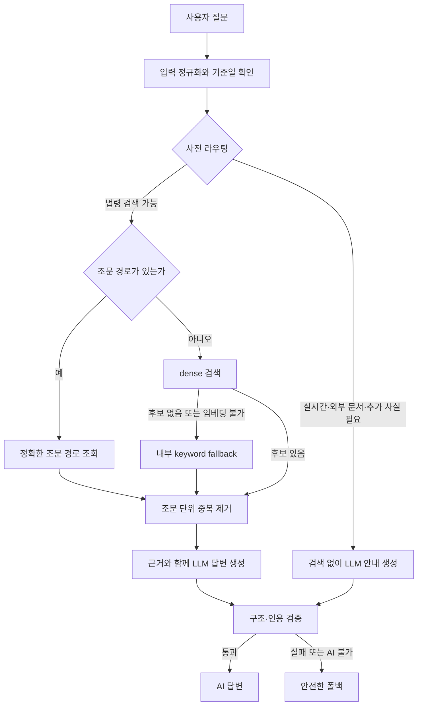

# law-rag 로드맵 1블록 점검: 구현 진도, 파이프라인 결정과 학습 증거

| 작성자 | 게시·수정일 | 읽는 시간 | 태그 |
|---|---|---|---|
| yjs000 | 게시 2026-08-11 · 수정 2026-08-12 | 약 10분 | Law RAG · Learning Evidence · Study Roadmap · Retrieval · Grounding · Evaluation |

오늘은 [RAG 시스템 학습계획](../../learning-plans/rag-system/README.md)의 1블록 종료일이다. law-rag는 MVP를 넘어 검색·근거 검증·사전 라우팅까지 구현했지만, 구현량과 계획이 요구한 학습 증거는 같은 것이 아니다. 이 기록은 현재 질문 파이프라인의 결정까지 한곳에 모으되, 구현 성과와 학습 증거를 섞지 않고 현재 위치를 판정한다.

## 목차

- [기록의 범위와 증거 수준](#기록의-범위와-증거-수준)
- [1블록 판정: 부분 충족](#1블록-판정-부분-충족)
- [구현으로 확인한 것](#구현으로-확인한-것)
- [현재 질문 파이프라인과 결정](#현재-질문-파이프라인과-결정)
- [초기 개념 게이트: 원문과 정정](#초기-개념-게이트-원문과-정정)
- [학습자 재설명과 판정](#학습자-재설명과-판정)
- [로드맵보다 앞서 시도한 것](#로드맵보다-앞서-시도한-것)
- [아직 통과했다고 말할 수 없는 것](#아직-통과했다고-말할-수-없는-것)
- [다음 검증](#다음-검증)
- [확인한 자료](#확인한-자료)

## 기록의 범위와 증거 수준

이 글은 2026-07-22 초기 RAG 개념 게이트의 학습자 원문과 정정, 그리고 그 개념을 실제 질문 라우팅·검색·생성·검증 경로에 적용하며 내린 결정을 통합한 기록이다.

- **학습자 원문:** 2026-08-12에 질문 경로를 다시 설명한 원문을 추가했다. 맞춤법과 용어를 고치지 않고 그대로 보존하며, AI의 정리는 별도 판정으로 분리한다.
- **학습 계획 위치:** [학습계획 → RAG 시스템](../../learning-plans/rag-system/README.md) → 1블록 → RAG 전체 경로 → 데이터 준비·검색·근거 검증
- **프로젝트 적용 근거:** 완료 계획, 활성 평가 계획, 설계 문서, 생성된 실험 보고서와 커밋 이력을 대조했다.
- **판정 기준:** 로드맵의 날짜가 아니라 각 블록의 달성 조건이다. 구현이 있어도 사용자 설명·비교·수동 판정 증거가 없으면 통과로 쓰지 않는다.

## 1블록 판정: 부분 충족

1블록의 목표는 "에너지 법령 RAG MVP를 배포하고, 법령 원문이 답변 근거가 되기까지의 전체 경로를 코드와 DB를 보며 설명"하는 것이다. 다음 표는 현재 확인한 증거만 반영한다.

| 로드맵 요구 | 확인한 근거 | 판정 |
|---|---|---|
| 구현 전 RAG 개념 게이트 | 2026-07-22에 입력·출력·저장 위치·실패 증상을 직접 적은 기존 기록이 있다. | 충족 |
| 청킹·임베딩·검색의 독립 실험 | 실험 A, B, C 완료 계획과 생성 결과가 있다. | 충족 |
| 법령 RAG의 검색·생성·인용 경로 | 현재 파이프라인은 구조 질의, dense 검색, 근거 문맥, 생성, 인용 검증을 분리한다. | 구현 충족 |
| 질문 입력부터 최종 답변까지 경로 추적 | 2026-08-12에 본인 말로 다시 설명하고 정정할 경계를 기록했다. 전체 흐름은 설명했지만 route와 action, 질문 임베딩·정확 조문 조회, 생성 후 코드 검증이 섞이거나 빠졌다. | 부분 충족 |
| 대표 질문 20개 수동 판정 | D-10은 10문항을 실제 실행하고 10/10 사용자 검토까지 끝냈다. 로드맵의 20문항과 동일하지 않다. | 부분 충족 |
| 질문형 학습노트 10개, 실패 사례 5개, 다음 가설 3개 | 현재 위키의 학습증거는 기존 개념 게이트와 파이프라인 적용 기록 두 건이다. 이 세 묶음의 독립 증거는 찾지 못했다. | 미충족 |
| 배포된 MVP의 현재 동작 확인 | 배포 여부·현재 운영 상태를 이 감사에서 재검증하지 않았다. | 미판정 |

따라서 1블록은 **핵심 구현과 실험은 충족했지만, 학습자가 다시 설명하고 대표 질문을 더 넓게 판정하는 회고 증거가 부족한 상태**다. 기능이 많다는 이유로 완료라고 쓰면 로드맵이 막으려던 "프로젝트는 커졌지만 무엇을 배웠는지는 모르는 상태"를 재현하게 된다.

## 구현으로 확인한 것

### 독립 실험은 실제 프로젝트 경계와 분리돼 있었다

**실험 A**는 전기사업법 텍스트를 기존 파서로 연결해 제7조부터 제12조까지 6개 조문 청크를 관찰했다. 운영 API·DB·외부 API를 건드리지 않고 텍스트 입력 어댑터와 CLI만 사용한 점이 중요하다.

**실험 B**는 NVIDIA NIM으로 두 한국어 문장의 임베딩과 코사인 유사도를 실제 호출로 확인했다. 질문 벡터와 문서 벡터가 같은 모델·차원·정규화 계약을 써야 비교 가능하다는 조건도 이 실험에서 분명해졌다.

**실험 C**는 선택한 법령 범위의 205개 청크를 대상으로 exhaustive cosine 검색과 고정 질문 평가를 만들었다. 이후 실험 D는 구조 표지가 실제 조문을 덮어쓰는 corpus 결함과 평탄화된 목의 부모 경로 문제를 고치고, Article Recall과 Evidence Recall을 분리했다. 이 순서는 검색 알고리즘을 먼저 바꾸기보다 원문·계층·근거 경계를 먼저 검증한 선택이다.

### 수동 진단과 Gold는 작은 규모에서 더 엄격해졌다

D-10은 10문항의 현재 DB 검색 결과를 raw top 10과 조문 문맥으로 기록하고, 사용자가 10/10 검토를 완료한 수동 진단이다. 이 결과를 곧바로 일반 성능으로 부르지 않고, 뒤이어 10문항 × 3,066개 후보의 30,660개 판정을 분리해 D-10 calibration Gold로 봉인했다. 이 Gold는 조정에 사용한 소표본이므로 held-out 성능이나 운영 release gate가 아니라는 한계도 함께 남겼다.

## 현재 질문 파이프라인과 결정

현재 질문 경로의 목표는 질문에 어울리는 법령 원문을 찾고, 그 원문을 벗어난 법률 주장을 답변에 넣지 않는 것이다. 모델 호출 여부와 법적 주장 허용 여부를 같은 조건으로 묶지 않은 것이 핵심이다.



### 질문 유형에 따라 검색 전에 경로를 나눈다

`제1조 제2항`처럼 원문 위치를 명시한 질문은 의미 유사도보다 정확 경로 조회가 우선이다. 일반 자연어 질문은 문서와 질문을 같은 임베딩 계약으로 비교하는 dense 검색을 기본으로 사용한다. 검색 후보를 그대로 생성 모델에 넣지 않고, 같은 조문에 속한 하위 청크의 중복을 줄인 뒤 서로 다른 조문을 제한된 문맥으로 전달한다.

실시간 정보, 사용자가 올린 문서의 대조, 개인별 사실이 더 필요한 질문은 법령 corpus만으로 답을 확정할 수 없다. 이 경우 검색을 억지로 실행해 무관한 법령을 근거처럼 보이게 하지 않는다. 웹 UI의 답변 모드는 현재 `terra` 하나이므로 AI가 가용하면 검색 근거가 0건이거나 사전 라우팅에서 차단된 질문도 LLM 생성 단계까지 보낸다. 다만 빈 근거에서 구조 검증을 통과할 수 있는 결과는 본문과 체크리스트가 비어 있는 `unanswerable` 또는 필요한 추가 사실을 명시한 `clarification_required`뿐이다. AI 호출·생성·구조 검증이 실패하거나 AI를 사용할 수 없으면 기존의 안전한 폴백을 사용하며, LLM을 호출했다는 사실만으로 근거 검증을 생략하지 않는다.

### 검색 알고리즘보다 corpus와 법률 계층을 먼저 고쳤다

**설계 판단:** 검색 품질이 낮을 때 새로운 검색 기법부터 붙이지 않았다. Open API 원문에서 조문인지 구조 표지인지 구분하고 `조 → 항 → 호 → 목`의 부모 경로를 복원하는 검증을 먼저 적용했다.

모델이나 검색기는 corpus에서 빠진 문장을 찾을 수 없다. 조문 ID가 맞아도 필요한 본문이 누락되면 답변 근거로는 불충분하다. 이 판단은 Article Recall과 Evidence Recall을 분리한 실험 기록에 근거한다. BM25, hybrid, RRF, reranker는 현재 dense 기준선보다 직접 근거 품질을 높인다는 별도 평가 증거가 생길 때만 다시 검토한다. HNSW는 현재 프로젝트의 운영·실험 경로에 도입하지 않는다.

### route와 action은 서로 다른 시점의 판단이다

**공식 구현 사실:** `route`는 검색 전에 무엇을 할지 결정한다. `legal_search`는 법령 검색을 진행하고, `realtime_required`·`external_document_required`·`clarification_required`는 검색을 멈추거나 추가 사실을 요청한다. 반대로 `action`은 검색과 생성 뒤 답변이 얼마나 완결됐는지를 나타낸다.

따라서 `route=legal_search`이면서 생성 뒤 `action=clarification_required`가 될 수 있다. 전자는 검색을 실행해 볼 만큼 질문이 열려 있었다는 뜻이고, 후자는 검색해도 개인별 사실이 부족했다는 뜻이다. 둘을 하나의 값으로 덮어쓰면 어느 경계에서 답변이 좁아졌는지 추적할 수 없다.

### LLM은 설명하고 코드는 근거 허용을 판정한다

초기 검증기는 답변 문장만 보고 확신 있는 법률 주장인지 조심스러운 한계 설명인지 정규식으로 추측했다. 한국어의 `할 수 없다`처럼 법적 금지와 인식론적 한계가 같은 표면형을 가질 수 있어 이 방식은 오탐을 만들었다.

현재는 모델이 `fully_answerable`, `partially_answerable`, `clarification_required`, `unanswerable` 중 어느 상태인지 구조 필드로 선언하고, 서버가 상태별로 검증 강도를 다르게 적용한다. 인용 ID가 실제 제공된 근거에 속하는지, 무근거 숫자나 규범어가 섞이지 않았는지는 결정론적 코드가 확인한다. LLM의 설명 능력을 사용하되 법률 근거의 허용 경계를 모델의 재량에 맡기지 않는 선택이다.

### keyword 검색은 제거된 것이 아니라 내부 fallback으로 남았다

초기 지도에서는 검색 전용 사용자 경로의 다단계 keyword 검색이 중심 흐름에 가까웠다. 현재 웹 UI는 LLM 답변 모드 하나로 정리돼 과거의 사용자 노출 경로를 최신 지도에서 제거했다.

그러나 keyword 검색 자체가 시스템에서 사라진 것은 아니다. 일반 자연어 질문에서 dense 후보가 0건이거나 임베딩을 만들 수 없을 때만, 점수를 합치지 않는 독립적인 내부 fallback으로 실행된다. 사용자에게 노출되는 search-only 경험의 제거와 근거 후보를 찾는 내부 안전 경로의 유지는 서로 다른 변화다.

## 초기 개념 게이트: 원문과 정정

2026-07-22에 작성한 초기 개념 게이트의 학습자 원문과 AI 피드백을 이 문서로 통합했다. 아래 세 원문 블록은 당시 표현과 오탈자를 고치거나 요약하지 않고 보존한다. 이후의 정정은 답안을 다시 쓰는 것이 아니라, 현재 law-rag 설계에 적용할 판단 기준을 구조화한 것이다.

### RAG 단계별 첫 설명

```text
법령 원문

→ 파싱
“입력” : 원문데이터
“출력” : 원문의 조각. (정규화된 원문)
“저장 위치” : DB의 원문 테이블. (파싱된 원문을 DB에 저장해도 되는건가)
“실패하면 보이는 증상” : 저장되지 않음. 로그가 남음.


→ 청킹

“입력” : 파싱된 원문 데이터
“출력” : 원문의 조각.(원문의 조각이 정확히 뭐지..) 형태소들. 조문, 시점, 제목, 키워드, 등의 메타데이터.
“저장 위치” : DB. 청킹 테이블.
“실패하면 보이는 증상” : 저장된 원문으로 파싱을 다시함.


→ 임베딩

“입력” : 청킹
“출력” : 벡터
“저장 위치” : db 벡터 테이블.
“실패하면 보이는 증상” : 저장된 청크로 다시 임베딩.
여기서 AI가 왜 사용되는지 모르겠음.

→ 벡터 저장소

“입력” : 임베딩된 벡터데이터
“출력” : X
“저장 위치” : db 벡터 테이블.
“실패하면 보이는 증상” : 임베딩부터 저장을 다시함.

→ 질문 임베딩

“입력” : 사용자 질문
“출력” : 질문을 임베딩하여 벡터로 출력
“저장 위치” : 질문 이력의 벡터정보 테이블.
“실패하면 보이는 증상” : 질문 이력만 쌓이고 시스템 로그로 실패 정보가 남음.


→ 유사도 검색

“입력” : 임베딩된 사용자 질문과 저장된 벡터데이터들
“출력” : 질문과 저장된 데이터의 유사도를 검색하여 topk를 출력.
“저장 위치” : 질문이력의 유사도 topk테이블
“실패하면 보이는 증상” : 문맥에 맞는 결과값이 나오지 않음.


→ 검색 문맥 구성

“입력” : 유사도 topk결과와 임베딩된 질문
“출력” : 유사도 topk결과, 임베딩한 질문, 관련 원문 index위치
“저장 위치” : 저장하지 않고 모델에게 반환.
“실패하면 보이는 증상” : 문맥에 맞는 결과값이 나오지 않음.

→ 모델 답변

“입력” : 검색문맥
“출력” : 사용자 친화적인 답변과 근거데이터
“저장 위치” : 질문이력테이블에 답변으로 저장.
“실패하면 보이는 증상” : 문맥에 맞는 결과값이 나오지 않음.

→ 근거 조문 표시

“입력” : 모델답변과 근거 위치데이터
“출력” : 근거 원문
“저장 위치” : 저장하지 않음.
“실패하면 보이는 증상” : 근거 원문을 볼 수 없음
```

### 개념 게이트 네 질문에 대한 답변

```text
문서를 왜 청킹하는가? : 임베딩의 효율을 위해?
임베딩은 무엇을 비교 가능하게 만드는가? : 질문과 유사한 근거데이터를 비교할 수 있게 한다.
검색 결과와 모델 답변은 왜 따로 평가해야 하는가? : 검색결과로 유사한 topk가 나왔다고 하더라도, 모델이 답변을 잘못 추론할 수 있다.
법령에서 조문 번호와 제목을 메타데이터로 남겨야 하는 이유는 무엇인가? : 조금 더 정확한 근거의 계층화를 위해서
```

### 이어서 생긴 질문

```text
그러면 1항이 원문문서라면 1항을 통째로 청킹해? 아니면 전기사업을 하려는 자/전기사업의 종류/산업통상자원부장관의 허가 이런식으로 청킹해?
```

```text
파싱, 청킹은,유사도 검색, 검색문맥 구성, 근거 조문 표시는 코드로해? ai 모델로해?
```

### 기억해야 할 정정 기준

- **파싱과 청킹:** 파싱은 조·항·호·제목·본문을 기계가 다룰 수 있게 정규화하는 단계이고, 청킹은 검색·근거로 반환할 단위를 결정하는 단계다. 형태소는 청크가 아니다.
- **청킹의 목적:** 임베딩 비용 절감은 부수 효과다. 중심 목적은 질문과 비교할 수 있을 만큼 주제를 좁히면서도 주체·행위·조건·예외를 잃지 않는 검색·근거 단위를 만드는 것이다.
- **임베딩의 한계:** 질문과 청크를 같은 벡터 공간에서 비교해 후보 순위를 만들지만, 법적 정답이나 인용의 정확성을 판정하지는 않는다.
- **질문 문자열과 질문 벡터:** 벡터는 검색용이다. 생성 모델에는 원래 질문 문자열, 청크 본문, 법령명·조문 번호·인용 ID 같은 텍스트 근거를 전달한다.
- **재시도 경계:** 이전 단계의 정상 산출물이 있으면 실패한 단계부터 다시 수행한다. 원문·청킹 규칙·임베딩 모델 버전과 안정적인 ID를 남겨 중복과 혼선을 막는다.
- **실패 분류:** 파서·DB·API 오류는 기술적 실패이고, top-k 누락·문맥 손상·근거 밖 생성·화면 인용 오류는 각각 검색·문맥·생성·표시 품질 실패다. 그래서 검색과 답변을 따로 평가한다.
- **메타데이터:** 장·절·조·항·호는 계층화만을 위한 값이 아니다. 같은 문구를 식별하고, 정확한 조문을 인용하고, 원문·시점·버전을 확인하며, 검색 범위를 필터링하는 검증 기준이다. 임시 배열 `index` 대신 안정적인 문서·조문 ID와 원문 URL을 사용한다.

이 기준은 아래의 현재 질문 파이프라인에서 구체화된다. 특히 코드가 맡는 구조·검색·인용 검증과 LLM이 맡는 의미 비교·설명 생성을 분리해야 한다.

## 학습자 재설명과 판정

### 학습자 원문

아래는 2026-08-12에 문서를 읽은 뒤 다시 설명한 원문이다.

```text
1 다시설명하기.
데이터 준비 : 법률원문 -> 정규화 -> 청킹 -> 임베딩
질문 : 질문 정규화 -> 사전 라우팅 (keyword -> LLM answerable, unaswerable, clarification_reqruied) -> dense retrieval -> 근거 출처, 중복, 토큰예산 필터링 -> 검색문맥을 LLM에게 전달 -> LLM판단 (clarifiaction_reqruied를 추가로 판단) ->
clarfication_required : 템플릿에따라 사용자에게 추가정보를 질문한다.
answerable : 근거내에서만 답변한다.
unaswerable : 어떤 이유로 답변할 수 없음을 말한다.
```

### 간단 판정

- **정확히 설명한 부분:** 데이터 준비와 질문 처리를 분리했고, 검색 문맥을 LLM에 전달한 뒤 근거 범위 안에서 답하거나 추가 정보·답변 불가 상태로 나누는 흐름을 설명했다.
- **놓친 경계:** 사전 `route`와 생성 후 `action`이 섞였고, 정확 조문 조회와 질문 임베딩이 빠졌으며, dense 검색 뒤 keyword fallback과 생성 뒤 결정론적 구조·인용 검증의 위치가 드러나지 않았다.
- **현재 판단:** `현재 경로를 다시 설명하고 초기 설명과 달라진 지점을 기록한다`는 작업은 완료했다. 다만 교정된 전체 경로를 10분 안에 설명하는 달성 조건은 아직 부분 충족으로 유지한다.

## 로드맵보다 앞서 시도한 것

### 2블록의 준비는 일부 했지만, 2블록을 통과한 것은 아니다

로드맵의 2블록은 같은 20문항으로 키워드·벡터·하이브리드 검색을 비교하라고 한다. law-rag는 dense-only 기준선을 만들고, dense 후보가 없거나 임베딩이 불가할 때만 keyword fallback을 독립 경로로 유지한다. 두 점수를 합쳐 순위를 만드는 hybrid/RRF는 평가 증거가 생길 때까지 도입하지 않았다.

따라서 D-10 Gold와 검색 진단은 2블록의 좋은 입력이지만, 최소 세 방식의 같은 조건 비교와 20문항 분류·평가표가 없으므로 **선행 준비**다. 특히 로드맵의 HNSW 탐색 언급은 현재 law-rag의 HNSW 도입 금지 정책과 충돌한다. 이 기록에서는 HNSW를 미래 비교 후보로 취급하지 않는다.

### 3블록의 모델 평가도 초기 진단 단계다

E-10은 D-10 문맥으로 실제 NVIDIA 호출을 수행했다. 라우팅은 10문항 Gold와 일치했지만, 생성 6건 중 완전 성공 답변은 0건이었다. 1건은 503, 1건은 timeout, 4건은 grounding 검증에서 거부됐고, 안전 gate는 모두 통과해 근거 없는 답변을 사용자에게 노출하지 않았다.

이는 "현재 안전 폴백은 작동한다"는 증거다. 반면 로드맵 3블록이 요구하는 2~3개 모델의 동일 입력 비교, 20문항 수동 판정, 비용·지연을 근거로 한 모델 선택은 아직 없다. **안전성 진단을 모델 선택 완료로 바꾸어 말하지 않는다.**

### 오픈소스 읽기는 달력보다 앞섰다

[LangGraph·LangChain 실전 코드 읽기](../../readings/agent-systems/agent-service-toolkit-langgraph-langchain-walkthrough.md)는 계획의 4블록보다 이른 시점에 이미 작성됐다. 진입점, 그래프 등록, 상태, 도구 호출, RAG 검색 도구의 흐름을 실제 파일·함수·상태로 추적한 기록이다.

하지만 로드맵 4블록의 달성 조건에는 핵심 동작의 축소 재구현과 현재 RAG에 채택·비채택 판단이 포함된다. 이 두 증거가 없으므로, 이 글은 "4블록을 통과했다"가 아니라 **코드 읽기 선행 학습 기록이 있다**고만 판정한다.

현재 law-rag는 고정된 입력 검증·라우팅·검색·생성·인용 검증 파이프라인이며 LangGraph나 LangChain을 도입한 상태가 아니다. 다음 요구가 실제로 생길 때만 프레임워크 도입을 다시 평가한다.

- 여러 도구를 순서와 조건에 따라 호출해야 한다.
- 사용자의 추가 사실을 받은 뒤 중단된 작업을 안전하게 재개해야 한다.
- 여러 단계의 상태, 재시도, 사람 검토를 요청 단위로 보존해야 한다.

그때 LangChain은 모델·프롬프트·도구를 같은 호출 인터페이스로 묶는 후보이고, LangGraph는 도구 호출 순서·조건부 분기·상태·중단과 재개를 명시하는 후보가 될 수 있다. 프레임워크가 들어와도 조문 경로, 출처 버전, 인용 ID 검증, 근거 부족 표시 같은 안전 경계는 결정론적 계층에 남긴다.

## 아직 통과했다고 말할 수 없는 것

- **20문항 회고:** D-10의 10문항은 엄격한 calibration 자료이지만 로드맵의 대표 질문 20개를 대체하지 않는다.
- **본인 설명의 재검증:** 재설명 원문과 정정할 경계는 기록했다. 교정된 전체 경로를 그림 없이 10분 동안 다시 설명한 증거는 아직 없다.
- **검색 비교:** dense-only 선택은 현재 평가 범위에서는 근거가 있지만, keyword·hybrid를 같은 조건에서 비교했다는 증거는 아니다.
- **모델 선택:** 안전 gate가 실패 답변을 막았다는 사실은 모델 품질·비용·지연의 상대적 우열을 말해 주지 않는다.
- **운영 배포:** 이 글은 배포 상태나 실제 사용자 트래픽을 검사하지 않았다. 설계 문서의 예정·로컬 테스트를 운영 사실로 쓰지 않는다.

## 다음 검증

이 기록 시점의 다음 작업은 새 기능이나 에이전트 프레임워크를 추가하는 일이 아니라, 1블록의 증거를 닫는 일이었다.

1. 로드맵 범주에 맞는 대표 질문 20개를 고정하고, 검색 성공·문맥 구성·답변 충실도·출처 정확성·답변 거부를 각각 수동 판정한다.
2. 그 과정에서 나온 5개 실패를 입력, corpus, 검색, 문맥, 생성, 표시 중 어느 경계의 문제인지 분류한다.
3. 다음 검색 실험에서 확인할 가설 3개를 작성한다. 가설은 "hybrid가 더 좋다" 같은 결론이 아니라, 같은 입력·지표·채택 조건을 가진 질문이어야 한다.
4. **기록 완료(2026-08-12):** 학습자가 현재 질문 경로를 다시 설명하고, 기존 개념 게이트 이후 이해한 부분과 정정할 경계를 기록했다.

앞의 세 증거와 교정된 10분 설명이 생긴 뒤에야 1블록을 완료로 바꾸고, 2블록의 검색 방식 비교를 시작한다는 것이 당시의 판정이었다. 이후 학습자는 [law-rag 현재 기준점과 프레임워크 확장 계획](2026-08-12-law-rag-current-state-and-framework-expansion.md)에서 LlamaIndex·LangChain·LangGraph의 실행 경로 분석을 다음 계획으로 정했다. 이 변경은 이 문서의 `부분 충족` 판정을 소급해 완료로 바꾸지 않는다.

## 확인한 자료

- [RAG 시스템 학습계획](../../learning-plans/rag-system/README.md) — 1~4블록의 달성 조건
- [실험 A 완료 계획](https://github.com/yjs000/law-rag/blob/0f05137ebae8260cf822ccb8b41761134442794d/docs/exec-plans/completed/0016-experiment-a-plain-text-chunking.md) — 조문 청킹 관찰
- [실험 B 완료 계획](https://github.com/yjs000/law-rag/blob/0f05137ebae8260cf822ccb8b41761134442794d/docs/exec-plans/completed/0017-experiment-b-sentence-embeddings.md) — 임베딩·코사인 관찰
- [실험 C 완료 계획](https://github.com/yjs000/law-rag/blob/0f05137ebae8260cf822ccb8b41761134442794d/docs/exec-plans/completed/0019-experiment-c-retrieval-observability.md) — dense 기준선과 고정 평가
- [실험 D 완료 계획](https://github.com/yjs000/law-rag/blob/0f05137ebae8260cf822ccb8b41761134442794d/docs/exec-plans/completed/0020-experiment-d-search-context.md) — corpus 검증·근거 문맥·검색 선택
- [D-10 수동 진단](https://github.com/yjs000/law-rag/blob/0f05137ebae8260cf822ccb8b41761134442794d/docs/exec-plans/completed/0026-experiment-d-10-manual-review.md) — 실제 10문항 검토와 진단 한계
- [D-10 calibration Gold](https://github.com/yjs000/law-rag/blob/0f05137ebae8260cf822ccb8b41761134442794d/docs/exec-plans/completed/0030-d-10-full-corpus-qrels-adjudication.md) — 전 후보 판정과 사용자 adjudication
- [E-10 활성 평가 계획](https://github.com/yjs000/law-rag/blob/0f05137ebae8260cf822ccb8b41761134442794d/docs/exec-plans/active/0032-experiment-e-10-ai-answer-evaluation.md) — 생성 안전성 진단과 미완료 모델 비교
- [RAG 파이프라인 설계](https://github.com/yjs000/law-rag/blob/0f05137ebae8260cf822ccb8b41761134442794d/docs/design-docs/rag-pipeline.md) — 현재 검색·답변 계약
- [근거 우선 검색 품질 설계](https://github.com/yjs000/law-rag/blob/0f05137ebae8260cf822ccb8b41761134442794d/docs/design-docs/evidence-first-retrieval-quality.md) — corpus·법률 계층 우선과 검색 알고리즘 채택 기준
- [질문 사전 라우팅 설계](https://github.com/yjs000/law-rag/blob/0f05137ebae8260cf822ccb8b41761134442794d/docs/design-docs/pre-retrieval-question-routing.md) — tier1/tier2와 검색 전 route 계약
- [답변 근거 검증 설계](https://github.com/yjs000/law-rag/blob/0f05137ebae8260cf822ccb8b41761134442794d/docs/design-docs/answer-grounding-validation.md) — 생성 후 action 신호와 결정론적 검증
- [Terra 모드의 항상 생성 설계](https://github.com/yjs000/law-rag/blob/0f05137ebae8260cf822ccb8b41761134442794d/docs/design-docs/always-generate-answer.md) — 근거 0건·사전 라우팅 차단에서도 설명을 생성하는 경로
- [질문 파이프라인 지도](https://github.com/yjs000/law-rag/blob/0f05137ebae8260cf822ccb8b41761134442794d/docs/generated/law-rag-question-pipeline-map.html) — 현재 경로를 시각화한 생성 문서
- [LangGraph·LangChain 코드 읽기](../../readings/agent-systems/agent-service-toolkit-langgraph-langchain-walkthrough.md) — 후속 확장 후보를 평가하기 위한 별도 학습 기록
