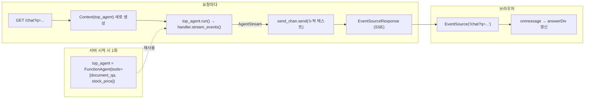

# LlamaIndex sec-insights 재현 8단계: Stage 7 SSE 스트리밍 질문·판정 증거

| 작성자 | 게시·수정일 | 읽는 시간 | 태그 |
|---|---|---|---|
| yjs000 | 게시 2026-08-18 · 수정 2026-08-18 | 약 7분 | LlamaIndex · RAG · SSE · FastAPI · Agent Workflow · Learning Evidence |

학습 계획 위치: [RAG 학습계획](../../learning-plans/rag-system/README.md) → LlamaIndex를 이용해 RAG를 구현한다 → sec-insights 8단계 재현 (Stage 7: 스트리밍 웹 데모)

증거 수준: **독립 실험 + 프로젝트 적용** — [yjs000/sec-insights-study](https://github.com/yjs000/sec-insights-study) 저장소에 실제 코드로 구현하고 실행했으며, [run-llama/sec-insights](https://github.com/run-llama/sec-insights) 원본 코드와 직접 대조해 판정했다.

## 목차

- [구조 개요 (forest)](#구조-개요-forest)
- [Q1. EventSource 미연결 버그 — 실제 코드에서 발견](#q1-eventsource-미연결-버그--실제-코드에서-발견)
- [Q2. 세션은 쿠키에 저장하는가, DB에 저장하는가](#q2-세션은-쿠키에-저장하는가-db에-저장하는가)
- [Q3~4. 체크포인트 자체 판정: "모른다"](#q34-체크포인트-자체-판정-모른다)
- [Q5. Stage 6~7 전체 흐름을 스스로 설명](#q5-stage-67-전체-흐름을-스스로-설명)
- [기억해야 할 기준](#기억해야-할-기준)
- [다음 검증](#다음-검증)

## 구조 개요 (forest)

Stage 7은 Stage 6의 멀티툴 에이전트를 FastAPI + SSE로 감싸 브라우저에서 실시간으로 답을 받는 최소 데모다. 구성 요소는 세 층이다.

`document_qa` 도구는 에이전트가 아니라 `SubQuestionQueryEngine`을 감싼 `QueryEngineTool`이고, `stock_price` 도구만 내부에 별도 `FunctionAgent`(`stock_agent`)를 갖는다 — 이 구분이 Q5의 핵심 정정 사항이다. sec-insights 원본에서는 이 세 층이 각각 [main.py](https://github.com/run-llama/sec-insights/blob/main/backend/app/main.py)의 `lifespan()`(1회 초기화), [conversation.py](https://github.com/run-llama/sec-insights/blob/main/backend/app/api/endpoints/conversation.py) + [messaging.py](https://github.com/run-llama/sec-insights/blob/main/backend/app/chat/messaging.py)(요청별 SSE), [\[id\].tsx](https://github.com/run-llama/sec-insights/blob/main/frontend/src/pages/conversation/%5Bid%5D.tsx)(브라우저 `EventSource`)에 대응한다. 확인 시점: 2026-08-18, `run-llama/sec-insights` main 브랜치.

## Q1. EventSource 미연결 버그 — 실제 코드에서 발견

**학습자 원문:** "질문하면 fetch가 안날라가"

**판정:** 정확한 관찰. `static/chat.html`의 41번째 줄이 TODO 상태로 `const es = null;`이었고 `onmessage` 핸들러도 주석 처리돼 있어, `EventSource` 자체가 생성되지 않았다. `starter.py`(서버 쪽)는 이미 다 채워져 있어서 서버 로그만 보면 "정상 동작"처럼 보였는데, 실제 요청이 안 나가는 원인은 프론트엔드 쪽 TODO 누락이었다.

**놓친 부분:** 서버 로그가 정상이라고 해서 클라이언트 코드까지 완성됐다고 넘겨짚기 쉬운 지점이다. `chat_solution.html`과 직접 diff해서 `const es = new EventSource(...)`와 `es.onmessage = (event) => { answerDiv.textContent = event.data; }`를 채워 해결했다 (커밋 [9995f64](https://github.com/yjs000/sec-insights-study/commit/9995f64ec12e4cf9641f342940080e4ea70a7b32)).

**기억해야 할 기준:** SSE/스트리밍 데모가 "요청이 안 나간다"고 할 때는 서버 로그보다 먼저 프론트엔드 쪽 연결 코드(`EventSource`/`fetch` 생성 여부)부터 확인한다.

## Q2. 세션은 쿠키에 저장하는가, DB에 저장하는가

**학습자 원문:** "왜 세션쿠키에 저장해? db에저장하면안돼? 세션쿠키에 저장하면 껐다키면 날라가잖아" / 이어서 "이거 플로우 설명해"

**AI 초기 답변 (오답):** README의 힌트 문구("브라우저 세션/쿠키별로 Context를 저장해야 함")를 그대로 따라가 "대화 내용은 DB에, 쿠키에는 `conversation_id`만 담는다"는 일반적인 웹 세션 패턴으로 답했다. **이 답은 sec-insights 실제 구현과 다르다.**

**정정 근거:** [\[id\].tsx](https://github.com/run-llama/sec-insights/blob/main/frontend/src/pages/conversation/%5Bid%5D.tsx)를 직접 열어 확인하니 **쿠키를 전혀 쓰지 않는다.** `conversation_id`는 Next.js 라우트 파라미터로 URL 경로(`/conversation/{id}`) 자체에 들어있다. `POST /api/conversation/`으로 id를 발급받으면 그 페이지로 `router.push`하고, 이후 메시지 전송도 `GET /api/conversation/{conversation_id}/message?...`처럼 id가 경로에 박혀 나간다([conversation.py](https://github.com/run-llama/sec-insights/blob/main/backend/app/api/endpoints/conversation.py)의 `message_conversation`). "Share" 버튼과 `ShareLinkModal`이 있는 이유도 이 때문 — 세션 식별자가 URL이라 링크 자체가 공유 가능한 세션이 된다.

**판정:** 학습자의 문제 제기("쿠키는 껐다 키면 날아가잖아")는 결과적으로 맞는 방향의 의심이었다. 다만 정답은 "쿠키 대신 DB"가 아니라 "쿠키 자체를 안 쓰고 URL 라우팅으로 세션을 표현한다"였다.

**기억해야 할 기준:** README 힌트나 일반적인 웹 패턴("세션은 보통 쿠키")을 근거로 특정 프로젝트의 설계를 단정하지 않는다. 프레임워크에 종속된 구현 디테일은 실제 소스를 열어서 확인한 뒤에 답한다 — 이번 건은 그 원칙을 어기고 답했다가 정정한 사례로 남긴다.

## Q3~4. 체크포인트 자체 판정: "모른다"

**학습자 원문:**
- "왜 에이전트/도구/인덱스를 요청마다 새로 만들면 안 되는지 설명할 수 있다 -> 몰라"
- "`EventSource`가 SSE 응답을 어떻게 소비하는지 설명할 수 있다 -> ?"

**판정:** 두 체크포인트 모두 학습자가 스스로 "모른다"고 정확히 표시했다 — 짐작으로 채우지 않은 것 자체가 올바른 태도다.

**AI 설명 (학습자 답변 아님, 참고용 정리):**
- 인덱스 빌드(PDF 파싱 + 임베딩 계산)는 초 단위가 아니라 수 초~수십 초 걸리는 무거운 작업이라 요청마다 반복하면 응답 지연·비용·리소스가 모두 낭비된다. 그래서 `top_agent`는 모듈 로드 시점(서버 프로세스 시작)에 한 번만 만들고, 요청마다는 가벼운 `Context(top_agent)`만 새로 만든다.
- `EventSource`는 HTTP 연결 하나를 열어둔 채로 서버가 `data: ...\n\n` 형식으로 보내는 텍스트를 자동 파싱해 `message` 이벤트로 흘려보낸다. `fetch`처럼 한 번에 응답을 받는 게 아니라 연결이 열려 있는 동안 여러 번 `onmessage`가 호출되고, 연결이 끊기면 자동 재연결도 시도한다.

**놓친 부분:** 이 두 항목은 아직 학습자 자신의 말로 설명된 적이 없다 — 아래 Q5에서 유사한 내용을 스스로 시도했지만, 정확히 이 두 체크포인트 문장을 재구성하는 연습은 남아 있다.

## Q5. Stage 6~7 전체 흐름을 스스로 설명

**학습자 원문:** "최상위 에이저트 -> context -> tool로 두개의 에이전트를 돌리고 -> 합쳐서 SEE로 응답"

**판정:** 큰 그림(최상위 에이전트가 `Context`를 쓰고, 도구를 거쳐, 결과를 합쳐 스트리밍한다)은 맞다. 두 가지는 부정확했다.

1. **"두 개의 에이전트를 돌린다"는 과장.** `top_agent`가 가진 도구는 두 개(`document_qa`, `stock_price`)이지만, 실제로 "에이전트"인 건 `stock_price` 하나뿐이다 — `build_stock_price_tool` 안에서 `stock_agent = FunctionAgent(...)`로 감싼 것. `document_qa`는 에이전트가 아니라 `SubQuestionQueryEngine`을 감싼 `QueryEngineTool`이다. 질문을 쪼개 여러 인덱스에 묻고 합치긴 하지만, LLM이 매 단계 도구를 "선택"하는 에이전트 루프는 아니다.
2. **오타:** SEE → SSE (Server-Sent Events).

**정정한 전체 흐름:** 브라우저가 질문 전송 → `EventSource`로 `/chat?q=...` 연결 → FastAPI가 `Context(top_agent)` 생성 → `top_agent.run(user_msg=question, ctx=ctx)`로 handler 획득 → top_agent가 질문을 보고 필요한 도구(`document_qa`와/또는 `stock_price`)를 골라 호출 → 결과를 top_agent가 다시 종합해 최종 답변 토큰 생성 → `handler.stream_events()`가 `AgentStream` 이벤트로 토큰을 흘릴 때마다 누적 텍스트를 `send_chan.send()` → FastAPI가 SSE로 응답 → 브라우저 `EventSource.onmessage`가 받아 화면 갱신.

**기억해야 할 기준:** "도구가 여러 개 = 에이전트가 여러 개"가 아니다. `QueryEngineTool`(질의 엔진을 감싼 도구)과 `FunctionTool`이 내부에 에이전트를 감싼 경우를 구분해서 세야 한다 — 이 구분이 이후 멀티에이전트 설계(에이전트 프레임워크 학습계획)에서도 그대로 재사용되는 판단 기준이다.

## 기억해야 할 기준

- SSE 데모가 "요청이 안 나간다"면 서버 로그보다 프론트엔드 연결 코드(`EventSource`/`fetch` 생성 여부)부터 확인한다.
- 특정 프로젝트의 설계(세션 저장 방식 등)는 일반적인 웹 패턴이나 힌트 문구로 단정하지 않고 실제 소스로 확인한다.
- "도구 개수"와 "에이전트 개수"는 다르다. `QueryEngineTool`은 에이전트가 아니고, `FunctionTool`이 내부에 에이전트를 감쌀 수도 있다 — 도구를 셀 때 내부 구현을 봐야 한다.

## 다음 검증

- 체크포인트 Q3~4를 학습자 자신의 말로 직접 다시 써 보고, 이 기록의 "AI 설명"과 비교한다.
- sec-insights 실제 대화 페이지에서 브라우저 개발자도구 Network 탭을 열어 `/api/conversation/{id}/message` 요청이 실제로 `eventsource` 타입으로 잡히는지, `[id].tsx`의 URL 기반 세션 설계가 실제 배포본에서도 동일하게 동작하는지 직접 확인한다 (현재는 소스 코드 대조만 했고 실행 확인은 안 됨).
- 에이전트 프레임워크 학습계획으로 넘어가면, "도구 내부에 에이전트가 중첩된 경우"를 LangGraph의 서브그래프/멀티에이전트 패턴과 비교해 같은 판단 기준이 적용되는지 검증한다.
