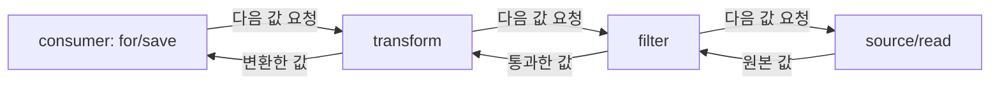

# Python 문법을 넘어: 지연 평가·재개 가능한 실행·함수 객체로 이해하는 프로그래밍 패턴

| 작성자 | 게시·수정일 | 읽는 시간 | 태그 |
|---|---|---|---|
| yjs000 | 2026-08-21 | 약 12분 | Python · JavaScript · Generator · Coroutine · Lazy Evaluation |

Python 문법은 목록으로 외우기보다, 값을 언제 만들고 실행을 어디에서 멈추며 함수와 객체를 어떻게 연결하는지로 이해할 때 다른 언어의 코드까지 함께 읽힌다.

## 목차

- [문법의 문제를 실행 모델의 문제로 바꾸기](#문법의-문제를-실행-모델의-문제로-바꾸기)
- [값, 이름, 타입: Python 객체 모델의 출발점](#값-이름-타입-python-객체-모델의-출발점)
- [Iterable과 lazy evaluation: 필요할 때 하나를 받는 규약](#iterable과-lazy-evaluation-필요할-때-하나를-받는-규약)
- [Generator: 중단 지점을 기억하는 함수](#generator-중단-지점을-기억하는-함수)
- [Coroutine과 event loop: 기다리는 동안 다른 일을 하는 실행 모델](#coroutine과-event-loop-기다리는-동안-다른-일을-하는-실행-모델)
- [함수 객체, closure, decorator: 호출을 감싸는 구조](#함수-객체-closure-decorator-호출을-감싸는-구조)
- [클래스와 메서드 binding](#클래스와-메서드-binding)
- [Python과 JavaScript 비교](#python과-javascript-비교)
- [현업 적용과 선택 기준](#현업-적용과-선택-기준)
- [한계, 오해, 결론](#한계-오해-결론)
- [참고 자료](#참고-자료)

## 문법의 문제를 실행 모델의 문제로 바꾸기

처음 Python을 다시 배울 때는 yield, 별표 인자, decorator, async def가 각각 독립적인 문법처럼 보인다. 하지만 이들은 다음 네 질문으로 연결된다.

1. **값은 지금 만들어지는가, 나중에 요청될 때 만들어지는가?**
2. **실행 중인 함수는 끝나야만 하는가, 중간에서 멈췄다가 재개할 수 있는가?**
3. **함수는 호출만 가능한 문법인가, 전달·저장·반환할 수 있는 객체인가?**
4. **메서드를 호출할 때 객체나 클래스를 어떤 규칙으로 함수에 연결하는가?**

이 질문은 Python에만 속하지 않는다. JavaScript의 iterator, generator, Promise, async/await, closure, middleware도 같은 문제를 다른 규약으로 다룬다. 이 글에서 말하는 패턴은 특정 알고리즘이 아니라 **실행과 데이터 흐름을 조직하는 재사용 가능한 방식**이다.

## 값, 이름, 타입: Python 객체 모델의 출발점

### 이름은 상자가 아니라 객체를 가리키는 binding이다

Python의 변수는 값을 담는 독립 상자보다 객체에 붙이는 이름으로 이해하는 편이 정확하다.

    users = ["kim", "lee"]
    other_name = users
    users.append("park")

    assert other_name == ["kim", "lee", "park"]

두 이름이 같은 변경 가능한 list 객체를 가리킨다. 따라서 같은 이름을 오른쪽에서 먼저 평가해 새 객체를 만들면, 새 객체가 이전 객체를 참조하는 한 이전 객체는 사라지지 않는다. 이 원리는 generator pipeline을 이해하는 핵심이다.

**공식 기능:** Python의 namespace는 이름에서 객체로의 연결이며, 대입은 데이터를 복사하는 대신 이름을 객체에 binding한다. 변경 가능한 객체가 여러 이름으로 공유되는 현상을 aliasing이라고 한다. [Python classes tutorial](https://docs.python.org/3/tutorial/classes.html#a-word-about-names-and-objects)

### 동적 타입과 타입 힌트는 다른 층이다

    def calculate(price: float, count: int) -> float:
        return price * count

여기서 매개변수와 반환 타입은 annotation이다. Python 인터프리터는 기본적으로 annotation을 보고 인자를 거절하지 않는다. 정적 검사기, IDE, Pydantic 같은 별도 도구가 annotation을 읽어 검사·검증을 추가할 수 있다.

    calculate("ha", 3)  # "hahaha"

위 호출은 annotation과 다르지만 문자열 곱셈이 정의되어 있으므로 Python 자체는 실행한다. 즉 “Python은 타입이 없다”가 아니라 **실행 시 타입을 가진 객체를 다루며, 타입 힌트는 별도 계약으로 덧붙일 수 있다**가 정확하다.

**공식 기능:** annotation은 함수의 런타임 의미를 바꾸지 않는다. [함수 정의와 annotation](https://docs.python.org/3/reference/compound_stmts.html#function-definitions)

### 컬렉션은 임의 객체를 참조할 수 있다

list와 tuple에는 서로 다른 타입의 객체를 넣을 수 있다.

    values = [1, "two", None]
    name, age = ["jigu", 27]  # list도 unpacking 가능

언패킹은 tuple 전용 기능이 아니다. 요소를 순서대로 제공하는 iterable이라면 list, tuple, generator, zip 결과를 모두 언패킹할 수 있다. 다만 sum 같은 연산은 각 값 사이의 덧셈이 실제로 정의되어야 한다. 숫자와 문자열을 더할 수 없는 이유는 list가 막아서가 아니라 int와 str의 덧셈이 정의되어 있지 않기 때문이다.

## Iterable과 lazy evaluation: 필요할 때 하나를 받는 규약

### iterable과 iterator를 분리하면 많은 문법이 단순해진다

- **iterable:** 처음부터 순회할 수 있는 대상. Python에서는 iter(x)가 iterator를 돌려주는 대상이다. list, tuple, dict, range, 파일 객체가 대표적이다.
- **iterator:** 다음 값 하나를 돌려주다가 끝을 알리는 대상. Python에서는 next(it)으로 진행하며 끝이면 StopIteration이 발생한다.

    names = ["kim", "lee"]
    it = iter(names)

    next(it)  # "kim"
    next(it)  # "lee"
    # next(it) -> StopIteration

for 문은 개념상 iter와 반복적인 next를 대신 써 준다. 실제 for는 iterator protocol을 사용하므로 list뿐 아니라 generator와 zip에도 같은 문법을 적용할 수 있다.

### lazy evaluation은 “늦게 계산”이 아니라 “수요가 계산을 당긴다”는 뜻이다

    pairs = zip([1, 2, 3], [4, 5, 6])
    # 아직 세 pair를 전부 만들지 않는다.

    list(pairs)  # 여기서 요청하며 소비: [(1, 4), (2, 5), (3, 6)]

zip은 iterator를 반환한다. 따라서 요소는 for, next, list처럼 실제로 순회할 때 만들어진다. 이것이 lazy evaluation 또는 lazy iteration이다.

이 방식은 생산자가 앞에서 전부 밀어 넣는 push 방식과 다르다. 마지막 소비자가 하나를 요청하면, 그 요청이 앞 단계까지 올라가 원천에서 하나를 얻고 결과가 다시 내려온다. 이를 **pull-based pipeline**이라고 부를 수 있다.

**설계 해석:** lazy evaluation의 가장 큰 이점은 메모리 절약만이 아니다. 앞 단계의 전체 결과를 만들지 않으므로, 뒤의 filter가 빨리 탈락시키면 불필요한 변환·I/O도 피할 수 있다.

### zip과 별표는 행과 열을 뒤집는 언패킹이다

    x = [1, 2, 3]
    y = [4, 5, 6]

    rows = zip(x, y)          # (1, 4), (2, 5), (3, 6)
    x2, y2 = zip(*rows)       # zip((1, 4), (2, 5), (3, 6))

    assert list(x2) == x
    assert list(y2) == y

안쪽 zip은 두 열을 행 tuple로 묶고, 별표는 각 행을 바깥 zip의 위치 인자로 푼다. 바깥 zip이 행을 다시 열로 바꾼다. 단, 입력이 비어 있으면 풀어 줄 열이 없으므로 두 변수 대입은 성립하지 않는다.

**공식 기능:** zip은 여러 iterable을 병렬 순회해 tuple iterator를 만들며 lazy하다. [내장 함수 zip](https://docs.python.org/3/library/functions.html#zip)

## Generator: 중단 지점을 기억하는 함수

### generator는 재개 가능한 iterator를 쓰기 쉽게 만드는 문법이다

    def numbers():
        print("start")
        yield 1
        print("middle")
        yield 2

    g = numbers()  # 본문은 아직 실행되지 않는다.

    next(g)  # start 출력, 1 반환
    next(g)  # middle 출력, 2 반환

yield가 있는 함수는 호출 시 일반 반환값 대신 generator object를 만든다. next가 호출되면 yield까지 실행하고, 지역 변수와 다음 실행 위치를 보존한다. 다음 next는 처음부터가 아니라 그 지점 다음에서 재개한다.

이것은 상태 기계(state machine)를 손으로 구현하는 일을 줄인다. generator가 없다면 현재 인덱스, 끝났는지, 다음 상태를 가진 iterator 객체를 직접 작성해야 한다.

    def active_upper_names():
        for name in ["kim", "lee", "park"]:
            if name != "lee":
                yield name.upper()

    assert list(active_upper_names()) == ["KIM", "PARK"]

**공식 기능:** generator는 yield에서 실행 상태와 지역 변수를 보존하고 next로 재개한다. [Python functional programming HOWTO](https://docs.python.org/3/howto/functional.html#generators)

### generator pipeline에서 같은 변수명을 다시 쓰는 이유

    def read_users():
        for user in ["kim", "lee", "park"]:
            yield user

    def valid_users(users):
        for user in users:
            if user != "lee":
                yield user

    def transform_users(users):
        for user in users:
            yield user.upper()

    users = read_users()             # A
    users = valid_users(users)       # B는 A를 입력으로 참조
    users = transform_users(users)   # C는 B를 입력으로 참조

    assert list(users) == ["KIM", "PARK"]

마지막 users는 C를 가리키지만 C는 B를, B는 A를 가리킨다. for가 C에 다음 값을 요청하면 C는 B, B는 A에 요청한다. A가 kim 하나를 내면 filter와 transform을 거쳐 KIM이 소비자에 도착한다. lee는 filter에서 탈락하므로 transform 단계에 도달하지 않는다.

    변수 이름: users -> Generator C -> Generator B -> Generator A
    값의 흐름:   source -> filter -> transform -> consumer
    요청의 흐름: consumer -> transform -> filter -> source

### yield from은 하위 iterator로의 위임이다

    def all_numbers():
        yield from [1, 2, 3]
        yield from [4, 5, 6]

    assert list(all_numbers()) == [1, 2, 3, 4, 5, 6]

단순 값 전달만 보면 for value in iterable: yield value와 비슷하다. 하지만 yield from은 generator의 send, throw, close 같은 제어 동작도 하위 generator에 위임할 수 있으므로, 정확히는 단순 반복문의 축약보다 넓은 위임 문법이다.

### 다른 언어에서의 같은 패턴

    function* activeUpperNames() {
      for (const name of ["kim", "lee", "park"]) {
        if (name !== "lee") yield name.toUpperCase();
      }
    }

    console.log([...activeUpperNames()]); // ["KIM", "PARK"]

두 언어 모두 generator는 한 번 소비하면 보통 소진되는 stateful iterator다. 다만 JavaScript에서는 iterable을 만들려면 Symbol.iterator, iterator라면 next가 value와 done을 반환하는 protocol을 따른다는 점이 표면적으로 더 드러난다. Python의 종료 신호는 StopIteration 예외다.

**공식 기능:** JavaScript generator object도 iterator이면서 iterable이며, function-star 호출은 즉시 본문을 실행하지 않는다. [MDN iteration protocols](https://developer.mozilla.org/en-US/docs/Web/JavaScript/Reference/Iteration_protocols)

## Coroutine과 event loop: 기다리는 동안 다른 일을 하는 실행 모델

### generator와 coroutine은 “멈춤”을 공유하지만 목적이 다르다

| 구분 | Generator | Coroutine |
|---|---|---|
| 주된 목적 | 값의 순차 생산 | 완료를 기다리는 동안 협력적으로 양보 |
| 멈춤 지점 | yield | await |
| 소비 방식 | for, next | await, task, event loop |
| 대표 사용처 | 파일·대용량 데이터·streaming | HTTP·DB·Redis·외부 API I/O |

generator의 호출자는 다음 값 하나를 요청한다. coroutine은 I/O가 끝날 때까지 기다리는 동안 event loop가 다른 준비된 작업을 실행하도록 협력한다. 둘 다 실행 상태를 보존하고 재개한다는 공통점이 있지만, 데이터 흐름과 동시성 문제를 해결하는 방식은 다르다.

### Python coroutine은 호출만으로 실행되지 않는다

    import asyncio

    async def lookup():
        await asyncio.sleep(0)
        return 42

아래는 동시 시작과 순차 대기의 차이를 보이는 **의사코드**다. fetch_one과 fetch_two는 실제 async I/O 함수로 바꿔야 한다.

    async def main():
        assert await lookup() == 42

    asyncio.run(main())

일반적인 async def 함수 호출은 coroutine object를 만든다. await, asyncio.run, asyncio.create_task 같은 방법으로 실행을 맡겨야 한다.

중요한 경계가 있다. await를 썼다고 자동으로 여러 작업이 동시에 시작되는 것은 아니다. 독립 작업을 task로 스케줄하지 않고 순서대로 await하면 순차 실행이다. 또한 CPU를 오래 점유하는 일반 함수는 event loop에 제어권을 반환하지 않으므로 async로 감싼다고 해결되지 않는다.

    async def main():
        # 순차: 두 호출을 차례로 기다린다.
        first = await fetch_one()
        second = await fetch_two()

        # 병행할 독립 I/O라면 task를 먼저 만들고 함께 기다린다.
        task_one = asyncio.create_task(fetch_one())
        task_two = asyncio.create_task(fetch_two())
        first, second = await task_one, await task_two

**공식 기능:** event loop는 cooperative scheduling으로 한 번에 하나의 task를 실행하고, task가 Future를 기다리는 동안 다른 task, callback, I/O를 처리한다. [Python asyncio tasks](https://docs.python.org/3/library/asyncio-task.html)

### JavaScript async/await와의 공통점과 차이

JavaScript의 async function도 호출하면 즉시 최종 값이 아니라 Promise를 반환하고, await는 Promise의 결과를 기다리는 구문이다. 둘 다 I/O 대기 중 메인 실행을 불필요하게 막지 않도록 설계되었으며, CPU-bound 작업을 해결하지 못한다는 점도 같다.

그러나 세부 실행 모델은 같지 않다.

- **Python asyncio:** 명시적인 event loop와 Task, Future 개념이 중심이다. asyncio.create_task로 coroutine을 스케줄한다.
- **브라우저 JavaScript:** event loop가 task queue와 microtask queue를 다룬다. Promise 후속 처리와 await 재개는 microtask와 관련된다. 한 task가 끝나면 microtask queue를 비운 뒤 렌더링 등 다음 event loop 단계로 진행한다.

따라서 “둘 다 event loop이므로 완전히 같다”는 설명은 부정확하다. 특히 JavaScript에는 Promise microtask 순서라는 관찰 가능한 규칙이 있고, Python에는 asyncio의 task scheduling, cancellation, TaskGroup 같은 별도 API 경계가 있다.

**공식 기능:** JavaScript의 microtask는 현재 실행 stack이 비고 event loop로 넘어가기 전에 실행된다. [MDN microtask guide](https://developer.mozilla.org/en-US/docs/Web/API/HTML_DOM_API/Microtask_guide)
**공식 기능:** Python coroutine을 단순 호출하면 실행이 스케줄되지 않는다. [Python coroutines and tasks](https://docs.python.org/3/library/asyncio-task.html#coroutines)

## 함수 객체, closure, decorator: 호출을 감싸는 구조

### 함수는 전달·저장·반환 가능한 객체다

    def apply_twice(func, value):
        return func(func(value))

    assert apply_twice(lambda n: n * 2, 3) == 12

함수를 인자로 전달할 수 있기 때문에 정렬 기준, callback, retry 정책, validator, middleware를 조합할 수 있다. 이 점은 JavaScript의 callback과 고차 함수에도 공통적이다.

### closure는 함수가 바깥 변수를 기억하는 구조다

    def multiplier(factor):
        def multiply(value):
            return factor * value
        return multiply

    double = multiplier(2)
    assert double(10) == 20

multiplier 호출은 끝났지만 반환된 multiply는 자신이 참조하는 factor binding을 계속 사용할 수 있다. 이것이 closure다.

    function multiplier(factor) {
      return (value) => factor * value;
    }

    console.log(multiplier(2)(10)); // 20

**공식 기능:** JavaScript closure는 선언된 바깥 scope가 종료된 뒤에도 그 변수를 참조하는 함수의 특성이다. [MDN Functions guide](https://developer.mozilla.org/en-US/docs/Web/JavaScript/Guide/Functions#closures)

### decorator는 원래 호출을 바꾸지 않고 호출 경로를 감싼다

    from functools import wraps

    def log_call(func):
        @wraps(func)
        def wrapper(*args, **kwargs):
            print(f"calling {func.__name__}")
            return func(*args, **kwargs)
        return wrapper

    @log_call
    def add(a, b):
        return a + b

    assert add(10, 20) == 30

decorator 표기는 개념상 add = log_call(add)이다. wrapper가 필요한 이유는 decorator 적용 시점에 원래 함수를 실행하는 것이 아니라, **나중의 add 호출을 가로채 전후 동작을 추가한 새 callable**을 반환해야 하기 때문이다.

    add(10, 20)
      -> wrapper(10, 20)
          -> 로그
          -> 원래 add(10, 20)
          -> 결과 반환

별표 인자와 키워드 인자를 쓰면 원래 함수의 다양한 호출 형태를 wrapper가 그대로 전달할 수 있다. wraps는 이름, 문서화, annotation 같은 주요 메타데이터를 보존해 디버깅과 프레임워크 introspection을 돕는다.

JavaScript의 middleware는 보통 decorator 문법보다 함수 조합이나 next callback으로 같은 목적을 달성한다. 예를 들어 Express middleware, fetch wrapper, higher-order function이 호출 전후에 인증, 로깅, 오류 처리를 넣는다.

**공식 기능:** Python decorator expression은 함수가 정의될 때 평가되고, 반환값이 원래 함수 이름에 binding된다. [Python function definitions](https://docs.python.org/3/reference/compound_stmts.html#function-definitions)

## 클래스와 메서드 binding

### self, cls, staticmethod는 자동으로 무엇을 전달하는가의 차이다

    class User:
        kind = "member"

        def __init__(self, name):
            self.name = name

        def describe(self):
            return f"{self.name}: {self.kind}"

        @classmethod
        def from_dict(cls, data):
            return cls(data["name"])

        @staticmethod
        def is_valid_name(name):
            return bool(name.strip())

    user = User.from_dict({"name": "jigu"})
    assert user.describe() == "jigu: member"
    assert User.is_valid_name("jigu") is True

- **instance method:** user.describe는 개념상 User.describe(user)다. 호출한 인스턴스가 첫 인자 self로 자동 전달된다.
- **classmethod:** User.from_dict는 클래스가 첫 인자 cls로 자동 전달된다. 상속된 클래스에서도 해당 subclass를 만들어야 하는 factory에 유용하다.
- **staticmethod:** self와 cls를 자동 전달하지 않는다. 클래스 namespace 안에 둘 이유는 있지만 객체·클래스 상태는 필요 없는 보조 함수에 쓴다.

init, iter, str처럼 양쪽에 밑줄이 두 개인 이름은 special method 또는 dunder method라고 부른다. Python이 객체 생성, 순회, 문자열화 같은 문법을 해당 메서드와 연결한다.

Python은 Java 같은 강제 private 접근 제어자를 제공하지 않는다. name은 public이고, _name은 내부 API라는 관례이며, __name은 subclass 이름 충돌을 줄이기 위한 name mangling이다. 진짜 비밀 보호가 아니다. 단순 public 데이터는 getter/setter부터 만들기보다 필요해질 때 property로 동작을 추가하는 편이 Python 관례에 맞는다.

**공식 기능:** Python class instance의 함수 attribute는 instance를 첫 인자로 받는 method로 변환된다. [Python classes tutorial](https://docs.python.org/3/tutorial/classes.html#method-objects)

### JavaScript의 this는 Python의 self와 닮았지만 binding 규칙이 다르다

Python의 self는 관례적인 이름일 뿐, method lookup이 instance를 첫 인자로 넣는 규칙이 핵심이다. JavaScript의 일반 함수 this는 보통 **어떻게 호출됐는지**에 따라 정해진다. 반면 arrow function은 바깥 lexical scope의 this를 캡처하고 자신만의 this를 만들지 않는다.

그래서 JavaScript arrow function은 callback에서 this를 보존하는 데 유용하지만, Python lambda와 같은 뜻이 아니다. Python lambda는 단일 표현식의 익명 함수 문법일 뿐 self binding 규칙을 바꾸지 않는다.

**공식 기능:** JavaScript arrow function은 자신의 this binding을 만들지 않고 바깥 this를 사용한다. [MDN arrow functions](https://developer.mozilla.org/en-US/docs/Web/JavaScript/Reference/Functions/Arrow_functions)

## Python과 JavaScript 비교

| 문제 | Python | JavaScript | 공통 판단 기준 |
|---|---|---|---|
| 순차 값 생산 | iterable / iterator, for, next | iterable / iterator, for...of, next | 전체 결과가 필요한지, 하나씩 소비해도 되는지 |
| 재개 가능한 생산자 | def와 yield | function-star와 yield | 상태를 직접 객체로 관리하지 않고 suspend/resume할지 |
| 비동기 값 | coroutine, Task, Future, await | Promise, async function, await | I/O 대기인지, 독립 작업을 함께 시작해야 하는지 |
| 함수가 상태를 기억 | closure | closure | 호출마다 독립 상태가 필요한지, 공유 mutable state가 위험한지 |
| 호출 전후 공통 처리 | decorator | middleware / higher-order function | 로깅·인증·retry를 업무 로직과 분리할지 |
| 객체 문맥 | instance method에 self binding | 호출 형태에 따라 this; arrow는 lexical this | callback으로 넘길 때 문맥이 보존되는지 |
| 타입 계약 | annotation과 검사기/라이브러리 | JavaScript는 동적, TypeScript는 별도 정적 층 | 런타임 검증과 정적 검사 책임을 구분할지 |

둘은 같은 기능을 제공하는 경우가 많지만 코드 모양이 아니라 **protocol과 scheduling 모델**을 비교해야 한다. 예를 들어 Python generator와 JavaScript generator는 둘 다 한 번 소비되는 iterator라는 점이 본질이고, Python의 StopIteration과 JavaScript의 done 값은 그 protocol을 표현하는 방식의 차이다.

## 현업 적용과 선택 기준

### 대용량 파일과 데이터 변환

아래는 처리 구조를 설명하는 **의사코드**다. process는 애플리케이션이 제공하는 실제 처리 함수다.

    def read_lines(path):
        with open(path, encoding="utf-8") as file:
            yield from file

    def non_empty(lines):
        for line in lines:
            line = line.strip()
            if line:
                yield line

    for line in non_empty(read_lines("access.log")):
        process(line)

**추천:** 한 번 순회하며 행 단위로 처리하고 전체 길이·임의 인덱스가 필요 없다면 generator pipeline을 쓴다. 수백만 행을 중간 list로 복제하지 않아도 된다.

반대로 UI 페이지네이션처럼 10번째 요소 접근, 전체 개수, 재정렬, 여러 번 반복이 필요하면 list나 데이터베이스 query처럼 materialized collection이 더 적합하다.

### HTTP·DB·LLM API 호출

**추천:** 네트워크 대기가 많은 서버에서는 해당 라이브러리가 async I/O를 제공할 때 coroutine을 사용한다. 독립 호출을 병행할 필요가 있으면 먼저 task를 만들고 함께 기다린다. CPU를 오래 점유하는 PDF 파싱·대규모 embedding 후처리에는 process worker나 적절한 별도 실행 전략을 검토한다.

### 스트리밍 응답

LLM token streaming, SSE, 파일 다운로드는 한 번에 모든 결과를 모아 반환하기보다 청크를 순차적으로 생산·전송한다. 이때 generator 또는 async generator는 생산자와 전송 계층 사이의 자연스러운 경계가 된다.

다만 generator가 자동으로 backpressure, 재시도, 취소, 클라이언트 연결 종료를 모두 해결하지는 않는다. 웹 프레임워크의 streaming API 계약과 취소 처리를 함께 확인해야 한다.

### decorator와 middleware

인증, 권한 검사, 로깅, tracing, retry처럼 여러 endpoint·서비스에 반복되는 동작은 decorator나 middleware 후보이다. 하지만 핵심 업무 규칙을 여러 decorator에 숨기면 호출 순서와 예외 흐름이 보이지 않게 된다.

**추천:** 재사용 가능한 횡단 관심사에만 적용하고, 순서에 민감한 동작은 테스트와 문서로 명시한다. 입력 검증과 권한 검사는 가능한 한 시스템 경계 가까이에 둔다.

## 한계, 오해, 결론

### 자주 생기는 오해

- **“lazy는 항상 빠르다.”** 아니다. 작은 데이터를 여러 번 순회하거나 결과를 다시 사용하면 iterator 생성·함수 호출 비용과 복잡성이 이득보다 클 수 있다.
- **“generator는 메모리 절약용 list다.”** 아니다. 핵심은 상태를 보존한 순차 생산과 pull-based 흐름이다. random access와 재사용에는 부적합하다.
- **“await는 병렬 실행이다.”** 아니다. await는 기다리는 표현식이다. 독립 작업의 병행은 task scheduling과 I/O 라이브러리의 비차단 동작까지 갖춰야 한다.
- **“Python type hint는 Java의 타입 선언이다.”** 아니다. 기본 Python에서는 annotation만으로 호출을 강제하지 않는다.
- **“double-underscore 이름은 외부 접근을 막는다.”** 아니다. name mangling은 주로 subclass와의 우발적 이름 충돌을 피한다.
- **“Python lambda와 JavaScript arrow function은 같다.”** 둘 다 짧은 함수를 만들 수 있지만 JavaScript arrow function의 lexical this는 Python lambda에 없는 의미다.

### 결론과 학습 기준

Python을 읽을 때 새 문법을 만나면 먼저 다음을 확인한다.

1. 이 값은 **지금 계산되는가**, 아니면 **소비자가 요청할 때 계산되는가**?
2. 이 함수는 호출 후 끝나는가, 아니면 **상태를 보존해 재개되는가**?
3. 이 await는 단순 순차 대기인가, 독립 작업을 task로 만들어 **병행하도록 설계했는가**?
4. 이 함수는 원래 업무 로직인가, 아니면 decorator/middleware로 **호출 경로를 감싼 것인가**?
5. 이 메서드에는 instance, class, 혹은 아무 receiver도 **자동 binding되지 않는가**?

이 다섯 질문으로 yield, zip, comprehension, async, decorator, classmethod는 흩어진 문법이 아니라 하나의 실행 모델로 연결된다. JavaScript를 함께 배울 때도 키워드 대응표보다 iterator protocol, Promise/event loop, closure, this binding이라는 실행 규칙을 비교하는 편이 더 오래 남는다.

## 참고 자료

확인일: 2026-08-21

- [Python function definitions](https://docs.python.org/3/reference/compound_stmts.html#function-definitions) — 함수 annotation, parameter 규칙, decorator 평가
- [Python functional programming HOWTO: generators](https://docs.python.org/3/howto/functional.html#generators) — generator의 suspend/resume, iterator protocol
- [Python built-in zip](https://docs.python.org/3/library/functions.html#zip) — lazy zip과 병렬 순회
- [Python asyncio: coroutines and tasks](https://docs.python.org/3/library/asyncio-task.html) — coroutine, task, cooperative scheduling
- [Python classes tutorial](https://docs.python.org/3/tutorial/classes.html) — names, objects, method binding, private 관례
- [MDN: JavaScript iteration protocols](https://developer.mozilla.org/en-US/docs/Web/JavaScript/Reference/Iteration_protocols) — iterable, iterator, generator 규약
- [MDN: JavaScript iterators and generators](https://developer.mozilla.org/en-US/docs/Web/JavaScript/Guide/Iterators_and_generators) — function-star, yield, iterator 종료
- [MDN: microtask guide](https://developer.mozilla.org/en-US/docs/Web/API/HTML_DOM_API/Microtask_guide) — browser JavaScript의 task와 microtask
- [MDN: arrow functions](https://developer.mozilla.org/en-US/docs/Web/JavaScript/Reference/Functions/Arrow_functions) — lexical this와 arrow function의 제약
- [PEP 8](https://peps.python.org/pep-0008/) — Python naming·public/internal interface 관례
